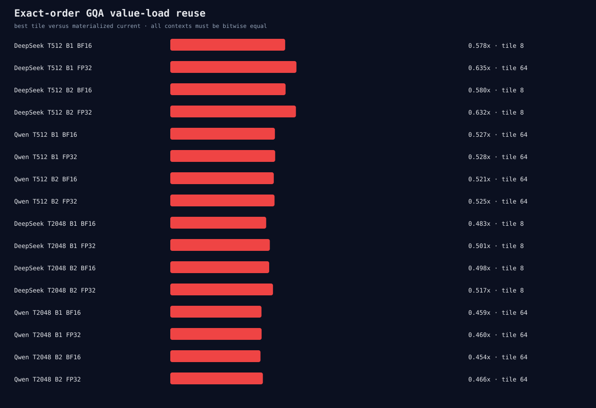

# Exact-order GQA value-load reuse matrix

This experiment retains each query head's exact position accumulation order.
Query heads sharing a KV head update independent accumulators after one value
load. Tile sizes change only the number of column blocks.

```bash
ROCR_VISIBLE_DEVICES=0 HIP_VISIBLE_DEVICES=0 python3 \
  benchmarks/single_gpu/cached_attention_gqa_value_reuse_matrix.py \
  --benchmark build/hip-release/benchmarks/microllm_bench_cached_attention_stages \
  --output-directory \
    benchmarks/results/2026-08-25-cached-attention-gqa-value-reuse \
  --models qwen2.5-0.5b,deepseek-r1-distill-qwen-1.5b \
  --sequences 512,2048 --batches 1,2 --cache-dtypes fp32,bf16 \
  --tile-columns 8,16,32,64 --runs 2 --warmup 3 --repetitions 20
```



All 128 fresh processes are bitwise equal to materialized current and warm
backend allocation remains zero. Performance fails every case. The best tile per
case ranges from 0.4540x to 0.6349x in Event time and from 0.4695x to 0.6637x
in synchronized wall time.

The target DeepSeek T2048/B2/BF16 case reaches only 0.4978x Event and 0.5113x
wall, despite reusing value loads across six query heads. Its probability Tensor
costs 196,608 bytes. Compile-time repeat specialization improves the initial
runtime-indexed pilot from about 0.099x to about 0.5x, confirming that register
spilling mattered, but it does not make the architecture competitive.

No model gate or default change is admitted. This closes the local exact-finalize
search; future work measures the retained exact route at serving batch scale.
`raw.jsonl` and `summary.json` are authoritative, with the decision and full gates
in `analysis.json` and `verification.json`.
