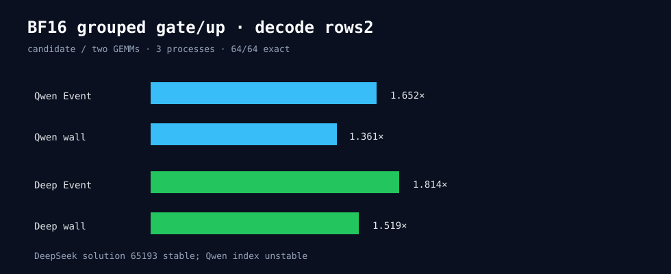

# BF16 grouped gate/up at decode rows2

Three fresh processes per model test 64 complete-output candidates. DeepSeek uses
stable solution 65193 and reaches 1.814x Event / 1.519x wall versus two GEMMs.
Qwen also improves, but its selected index changes across processes. Only DeepSeek
proceeds to an explicit T2048/B2/N64 model gate.

