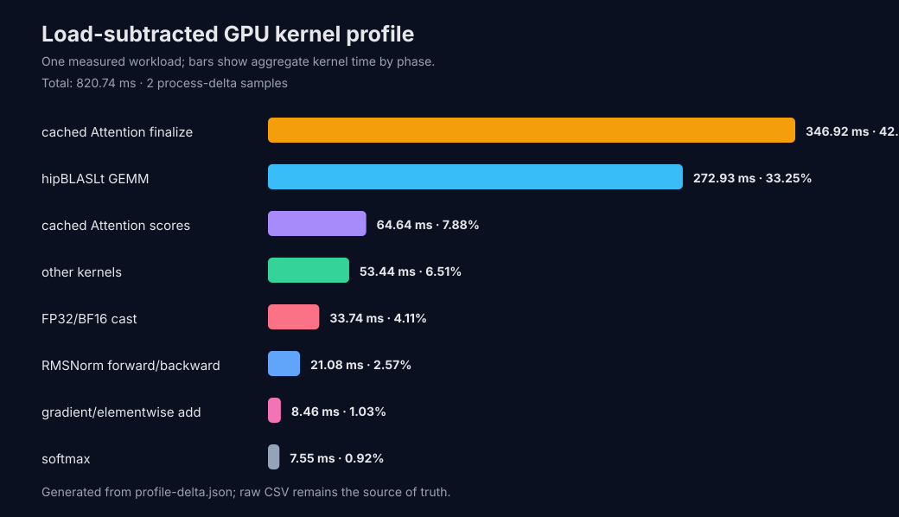

# Clean DeepSeek T2048/B2/N64 current profile

The current 1/3-generation process delta measures 820.74 ms of Kernel time per
64-token B2 generation. Cached Attention finalize is 346.92 ms/42.27%, hipBLASLt
GEMM is 272.93 ms/33.25%, and cached Attention scores are 64.64 ms/7.88%.

The next optimization target must change the finalize architecture. Trace timing is
kept separate from the paired end-to-end baseline.

