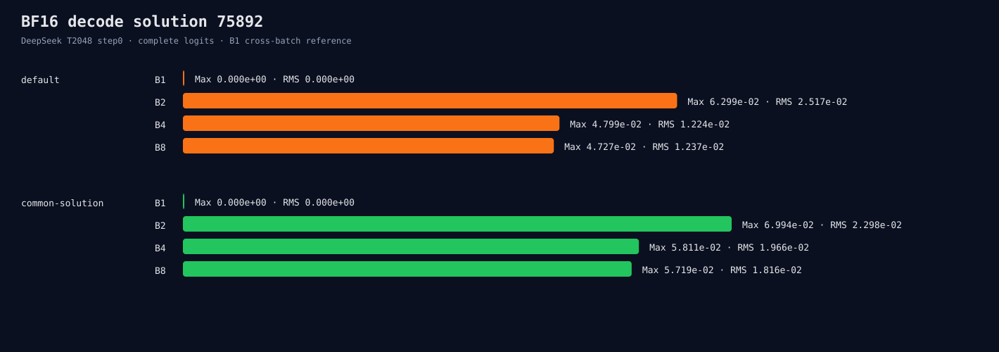

# DeepSeek BF16 decode algorithm consistency

This audit first inventories hipBLASLt BF16 gate/up solutions for
`M=1/2/4/8, K=1536, N=8960`, BF16 output, and a 32 MiB workspace limit.
It then compares the default dispatch with version-local solution 75892 using
complete DeepSeek cached step-0 logits.

```bash
ROCR_VISIBLE_DEVICES=0 HIP_VISIBLE_DEVICES=0 python3 \
  benchmarks/single_gpu/audit_bf16_decode_algorithm.py \
  --manifest /path/to/pinned-two-model-manifest.json \
  --binary build/hip-release/apps/microllm_hf_infer \
  --inventory-binary \
    build/hip-release/benchmarks/microllm_bench_bf16_algorithms \
  --output-directory \
    benchmarks/results/2026-08-26-deepseek-bf16-decode-algorithm \
  --model deepseek-r1-distill-qwen-1.5b --algorithm-index 75892 \
  --context 2048 --runs 2 --warmup 1
```



All 64 requested heuristic candidates are common to M1/2/4/8. Solution 75892
is supported at every shape and requires 4,587,520 workspace bytes.

Using the same index does not restore row invariance. Maximum cross-batch Max
error rises from `0.0629854` to `0.0699391` (1.1104x). The global maximum RMS
falls to 0.9129x only because B2 dominates that aggregate; B4/B8 RMS gets
1.6063x/1.4678x worse. Throughput is 0.9853x–0.9922x and peak rises exactly by
the solution workspace size.

All 16 processes repeat bitwise, host/device argmax agrees, and every top token
is 151643. The solution is rejected and never promoted to default. The next
experiment tests all 64 common candidates at operator level with identical rows
across M1/2/4/8, separating gate/up row invariance from the rest of the model.

`inventory.json`, `raw.jsonl`, and `summary.json` are authoritative.
