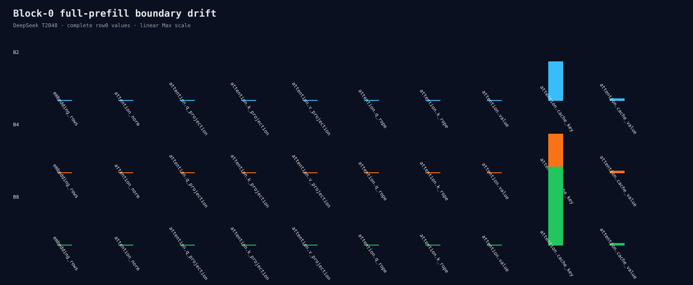

# DeepSeek block-0 full-prefill trace

This diagnostic captures the first two batch rows at ten block-0 boundaries for
the same 2048-token prompt. It uses FP32 Linear weights and BF16 KV storage, and
compares B1/B2/B4/B8 in two fresh processes.

```bash
ROCR_VISIBLE_DEVICES=0 HIP_VISIBLE_DEVICES=0 python3 \
  benchmarks/single_gpu/audit_prefill_block0_trace.py \
  --manifest /path/to/pinned-two-model-manifest.json \
  --binary build/hip-release/apps/microllm_hf_infer \
  --output-directory \
    benchmarks/results/2026-08-26-deepseek-prefill-block0-trace \
  --model deepseek-r1-distill-qwen-1.5b --context 2048 --runs 2
```



Embedding and Attention Norm are bitwise equal. The first difference appears
in FP32 Q projection. At B8, Q/K/V projection Max errors are
`9.15527e-5/3.05176e-5/5.00679e-6`. RoPE preserves the projection drift.

BF16 cache storage then magnifies boundary Max: key moves from `3.05176e-5` to
`0.03125` (1024x), and value from `5.00679e-6` to `0.0009765625` (195.05x).
This is expected quantization-bin amplification of already-different FP32
inputs, not evidence that the elementwise cast produces different output for
identical input.

All metrics repeat exactly across two fresh processes. B2 internal K/V rows
remain exact while Q rows differ; B4/B8 show internal differences in all Q/K/V
projections and cache values. The next experiment screens exact FP32 Q/K/V GEMM
solutions across M=2048/4096/8192/16384 before any policy change.

`raw.jsonl` and `summary.json` are authoritative.
