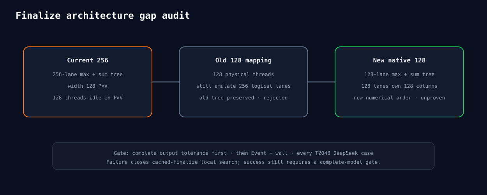

# Cached Attention finalize architecture gap audit

The current 256-thread finalizer uses a 256-lane reduction, then only 128 threads
perform DeepSeek P×V columns. The old 128-thread mapping preserved 256 logical lanes
and the old tree, so it did not test a native 128-lane reduction. Native 128 is the
only selected new operator hypothesis; it changes numerical order and must pass
complete-output tolerance before timing.

