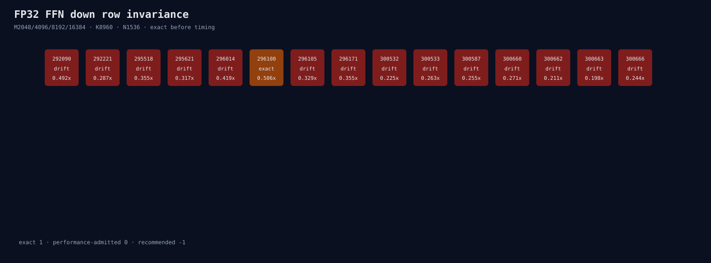

# FP32 FFN down row-invariance matrix

The real M2048/4096/8192/16384, K8960, N1536 descriptors have 15 common
candidates. Only 296100 is repeated-block bitwise invariant, but its speedups are
0.506/0.758/0.686/0.863x. It is rejected without a model route.

