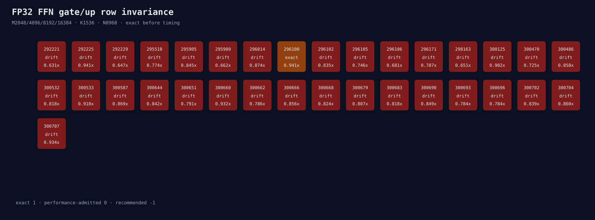

# FP32 FFN gate/up row-invariance matrix

The real M2048/4096/8192/16384, K1536, N8960 descriptors have 33 common
hipBLASLt candidates. Only 296100 is repeated-block bitwise invariant. Its per-M
speedups are 1.040/0.951/0.941/0.995x, so it fails the every-M 0.95 performance
gate at M8192 and is not admitted as a common default.

