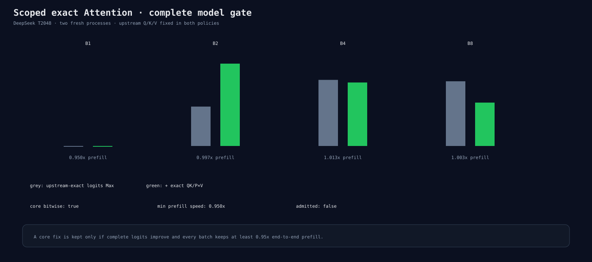

# Scoped exact prefill Attention model gate

Both policies use exact upstream Q/K/V projection solutions (Q=296100, K/V=292135).
The candidate additionally registers QK=304681 and P×V=295716 in isolated cached-prefill
scopes.

The result is rejected:

- block-0 scores, probabilities, and P×V are bitwise equal across/within B1/B2/B4/B8;
- BF16 block-0 K/V cache remains bitwise equal;
- complete-logit global Max worsens from 0.00125325 to 0.00156164;
- complete-logit global RMS worsens from 0.00029084 to 0.00031048;
- B1 prefill is 0.94954×, just below the 0.95 gate;
- peak memory and backend allocation counts are unchanged.

The precision phase uses 16 fresh processes and folds complete candidate core binaries
into the same runs. The performance phase uses another 16 processes with reversed order
on run two. No binary trace file is retained.

Reproduce:

```bash
python3 benchmarks/single_gpu/fp32_prefill_attention_model_gate.py \
  --manifest /path/to/hf-models.json \
  --binary build/hip-release/apps/microllm_hf_infer \
  --output-directory /tmp/prefill-attention-model-gate \
  --runs 2 --performance-warmup 1
```


