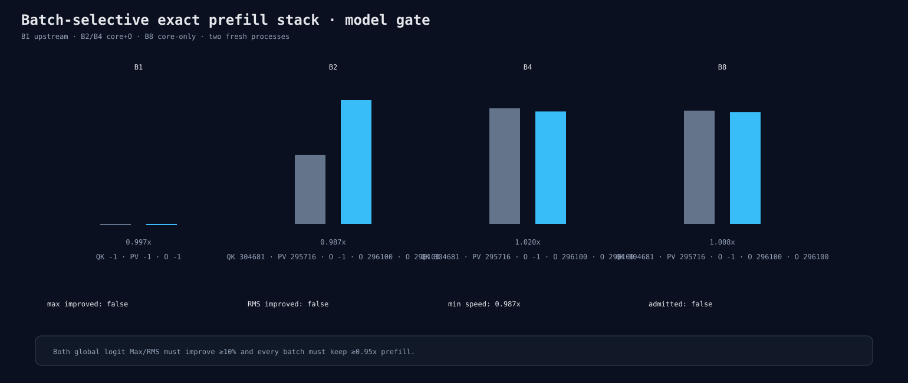

# Batch-selective exact prefill stack gate

The fixed candidate uses upstream B1, exact core plus O for B2/B4, and exact core
without O for B8. Every Release prefill ratio passes the 0.95 gate, but complete-logit
Max worsens by 6.9% and RMS improves only 2.5%. The candidate is rejected and the
exact Q/K/V/QK/P×V/O solution-composition track is closed.

The gate uses 16 precision and 16 reverse-ordered performance processes. Peak memory
and backend allocation counts are unchanged.

