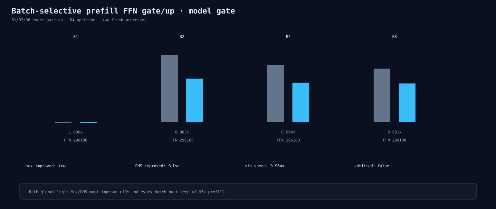

# All-batch exact prefill FFN gate/up model gate

All four batches use gate/up solution 296100. End-to-end prefill remains above the
0.95 floor at 0.964–1.000x and complete-logit Max improves 35.5%. Complete-logit
RMS worsens by 5.8%, so the candidate is rejected and the FFN vendor-solution model
route is closed.

