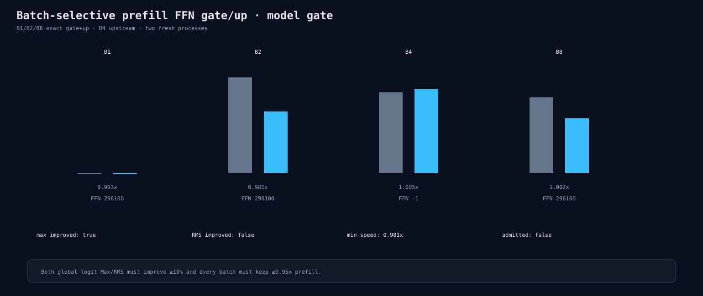

# Batch-selective prefill FFN gate/up model gate

B1/B2/B8 use exact gate/up solution 296100 while B4 stays upstream. All Release
prefill ratios pass at 0.981–1.005x and global complete-logit Max improves 12.0%.
Global RMS improves only 3.3%, below the required 10%, so the candidate is rejected.

