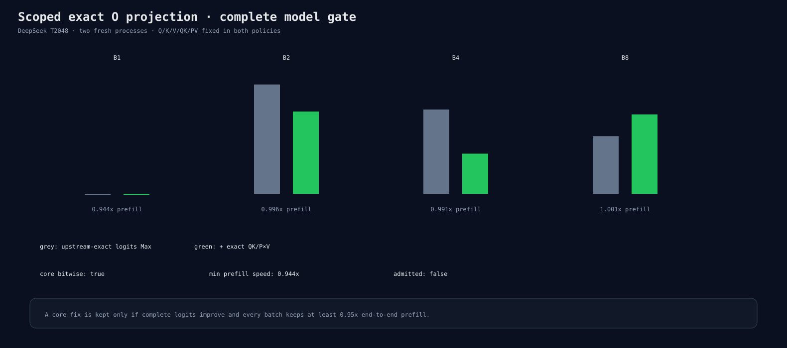

# Scoped O projection complete model gate

Baseline is exact Q/K/V/QK/P×V. Candidate adds O=296100. The candidate makes block-0
core and O bitwise equal and improves global complete-logit Max/RMS by 24.7%/32.6%, but
B1 prefill falls to 0.944×. It is rejected by the every-batch 0.95 performance gate.

The gate uses 16 precision and 16 reverse-ordered performance processes. Peak memory and
backend allocation counts are unchanged.

