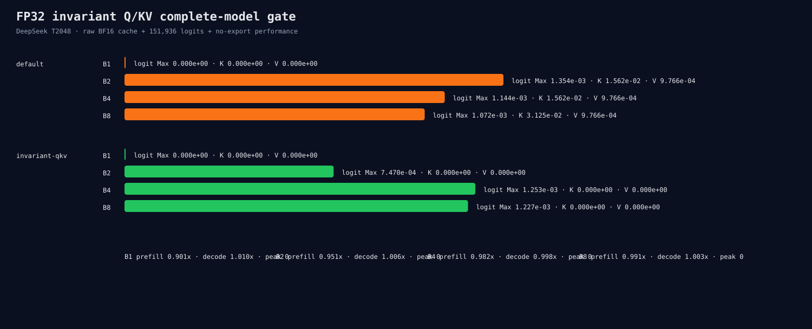

# DeepSeek invariant FP32 Q/KV complete-model gate

This gate compares default full-prefill dispatch with Q solution 296100 and
K/V solution 292135. Precision processes export raw block-0 BF16 K/V plus all
151,936 step-0 logits. Separate no-export processes measure full-prefill time,
decode throughput, and peak memory.

```bash
ROCR_VISIBLE_DEVICES=0 HIP_VISIBLE_DEVICES=0 python3 \
  benchmarks/single_gpu/fp32_qkv_model_gate.py \
  --manifest /path/to/pinned-two-model-manifest.json \
  --binary build/hip-release/apps/microllm_hf_infer \
  --output-directory \
    benchmarks/results/2026-08-26-fp32-qkv-model-gate \
  --model deepseek-r1-distill-qwen-1.5b --context 2048 \
  --runs 2 --performance-warmup 1
```



The candidate makes block-0 K/V bitwise equal across B1/B2/B4/B8 and within
every batch. The scoped registry records exactly two entries and 84 Q/K/V hits
per precision process, without routing same-shape output projections.

Complete logits do not improve robustly. Global Max falls 7.41%, but global RMS
rises 1.2677x. B2 Max improves to 0.5519x, while B4/B8 become 1.0957x/1.1443x.
The candidate also changes B1 cache and logits relative to default because it
uses a different valid reduction tree.

Full-prefill speed is 0.9014x/0.9505x/0.9816x/0.9907x at B1/B2/B4/B8. Peak
memory is unchanged; decode throughput changes by -0.16% to +1.03%, outside the
optimized region. The policy is rejected as a default.

The first formal attempt completed default workers but was discarded before
publication because the runner forgot that warmup adds another 84 projection
dispatches. Commit `c34df680` corrected the formula and this directory is a
complete fresh rerun.

`precision-raw.jsonl`, `performance-raw.jsonl`, and `summary.json` are
authoritative.
