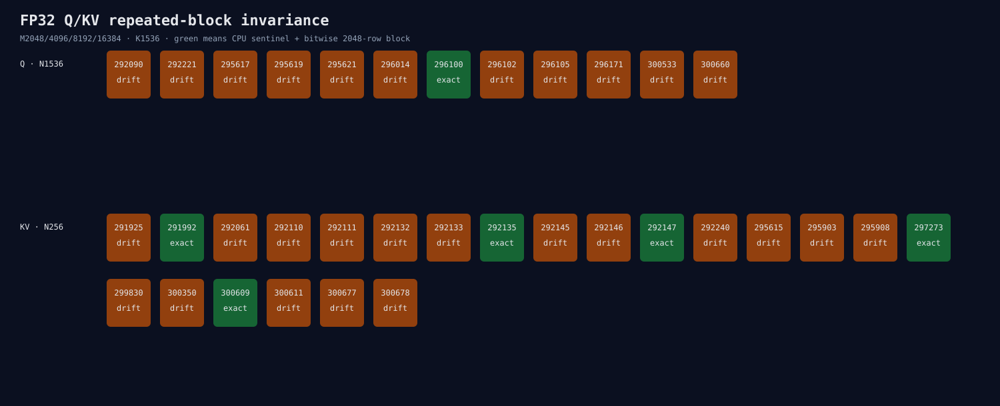

# FP32 Q/KV repeated-block row invariance

This matrix uses the exact row-major forward descriptor used by microLLM's
hipBLASLt path. A deterministic 2048-row FP32 input block is repeated to
M=2048/4096/8192/16384. Solutions must support every M, pass an independent CPU
sentinel, and produce bitwise-identical complete 2048-row output blocks.

```bash
ROCR_VISIBLE_DEVICES=0 HIP_VISIBLE_DEVICES=0 python3 \
  benchmarks/single_gpu/fp32_qkv_row_invariance_matrix.py \
  --binary \
    build/hip-release/benchmarks/microllm_bench_fp32_forward_row_invariance \
  --output-directory \
    benchmarks/results/2026-08-26-fp32-qkv-row-invariance \
  --warmup 1 --repetitions 3
```



Q (`K=N=1536`) has 12 common solutions; only 296100 is block-invariant.
K/V (`K=1536,N=256`) has 22 common solutions; five are invariant. Candidate
292135 is the fastest invariant K/V solution. Both selected candidates require
zero workspace.

Every common candidate passes the CPU sentinel. Non-invariant candidates differ
by only `2.14e-7` for Q and `3.58e-7` for K/V, but Experiment 303 shows these
small FP32 differences can cross BF16 cache rounding boundaries. The first
implementation attempt failed to compile because the installed hipBLASLt index
helper requires a mutable algorithm reference; no measurement was taken before
that fix.

The next experiment explicitly registers Q=296100 and K/V=292135 during full
prefill, then checks raw BF16 cache prefixes, complete logits, throughput, and
peak memory. Neither version-local index is promoted to default yet.

`q-inventory.json`, `kv-inventory.json`, `raw.jsonl`, and `summary.json` are
authoritative.
