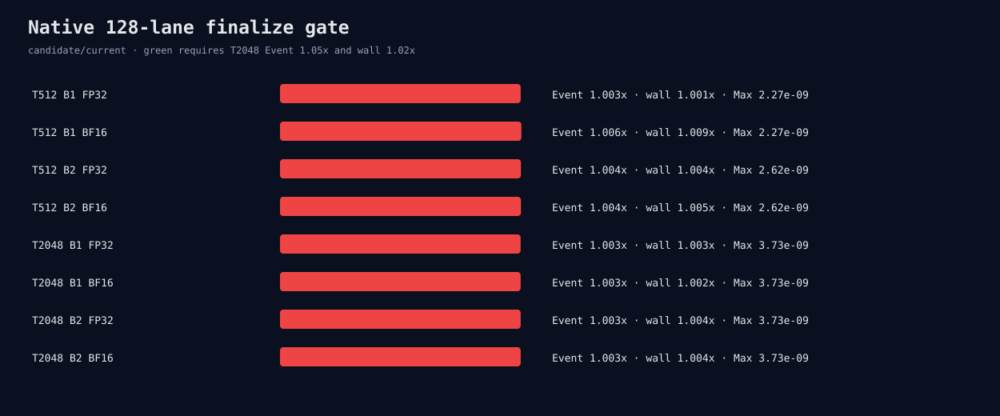

# Native 128-lane finalize matrix

All 16 complete-output processes pass, with maximum error at most 3.73e-9.
Native128 is not bitwise equal to the current 256-lane route. T2048 Event/wall
speedups are only 1.003x; zero of four T2048 cases pass the 1.05/1.02 gates.
The candidate is rejected.

