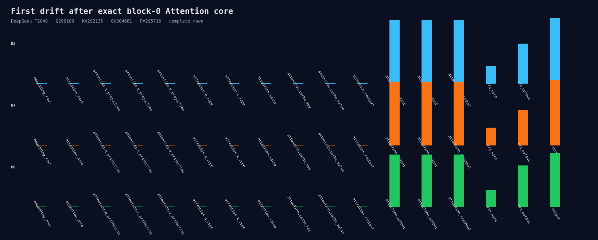

# First drift after an exact block-0 Attention core

The rejected same-index core policy is used only as a numerical microscope. Q/K/V
projection, BF16 cache, and Attention context are bitwise equal across B1/B2/B4/B8.

The first nonzero boundary is `attention.output`, the O projection:

- B2/B4 Max: 0.0000333786;
- B8 Max: 0.0000276566;
- identical rows inside each batch also diverge at O projection.

The audit uses eight fresh processes and 17 complete block-0 boundaries. It makes no
performance claim.

```bash
python3 benchmarks/single_gpu/audit_post_exact_core_block0_trace.py \
  --manifest /path/to/hf-models.json \
  --binary build/hip-release/apps/microllm_hf_infer \
  --output-directory /tmp/post-exact-core-trace --runs 2
```


