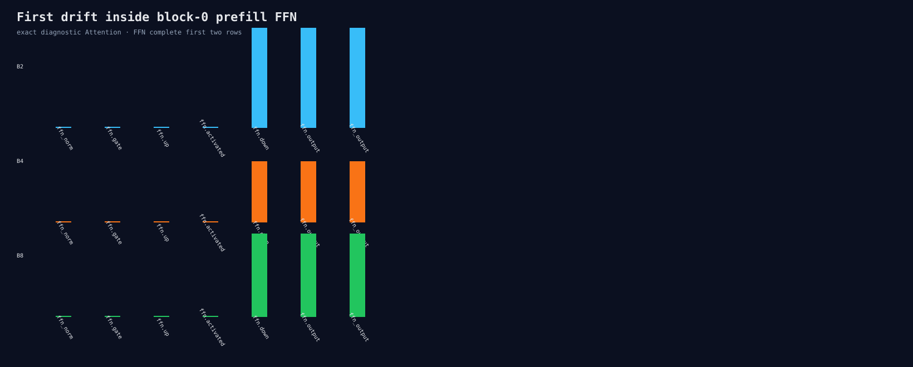

# FFN trace after exact Attention and gate/up

Eight Release processes show FFN norm, gate, up, and SwiGLU activation are bitwise
equal across and within batches. Down projection is the first renewed drift, with
cross-batch Max 1.72e-5/1.05e-5/1.43e-5 for B2/B4/B8. Temporary binary payloads
are deleted after comparison.

