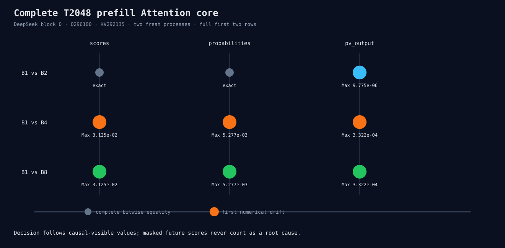

# DeepSeek T2048 prefill Attention core matrix

This result compares every block-0 QK score, causal-softmax probability, and P×V output
for B1/B2/B4/B8. Each case runs in two fresh processes with prefill Q solution 296100
and K/V solution 292135.

The trace binary files are temporary numerical evidence. The runner checks their dtype,
little-endian layout, element count, byte count, and complete values, then removes them.
No large binary is retained in this directory.

Reproduce on the recorded gfx942 environment:

```bash
python3 benchmarks/single_gpu/audit_prefill_attention_core.py \
  --manifest /path/to/hf-models.json \
  --binary build/hip-release/apps/microllm_hf_infer \
  --output-directory /tmp/prefill-attention-core \
  --runs 2
```

The important result is batch-dependent:

- B2: scores and probabilities are complete bitwise matches; P×V is the first drift.
- B4/B8: causal-visible QK scores are already different, then probabilities and P×V differ.
- Within every B2/B4/B8 process, the first two identical input rows remain bitwise equal at
  all three stages.

See [`summary.json`](summary.json), [`analysis.json`](analysis.json), and
[`verification.json`](verification.json).


