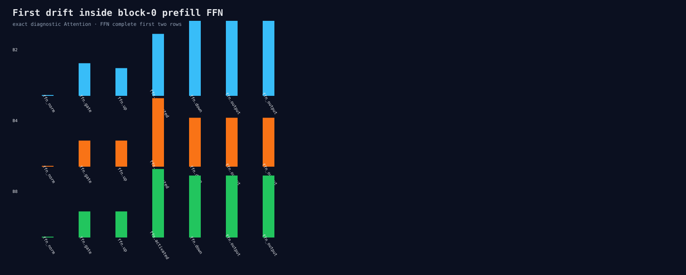

# Block-0 prefill FFN stage trace

Eight Release processes compare complete first-row values across B1/B2/B4/B8 after
the exact diagnostic Attention stack. FFN norm is bitwise equal across and within
batches. Gate is the first ordered drift; up independently drifts from the same exact
input. Temporary binary values are deleted after comparison.

This is numerical diagnosis, not a timing benchmark.

