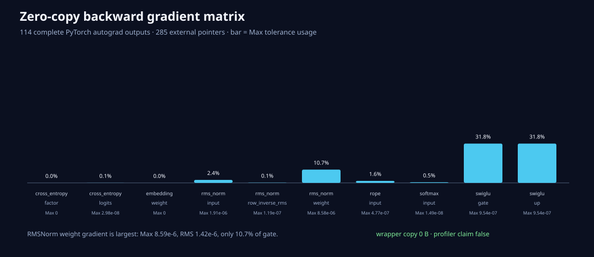

# PyTorch零复制Backward矩阵

三个seed共114条完整PyTorch autograd输出，覆盖：

- Softmax input gradient 12；
- RMSNorm input/weight gradient和row inverse-RMS workspace各12；
- SwiGLU gate/up gradient各9；
- RoPE input gradient 12；
- CrossEntropy logits gradient和factor workspace各12；
- Embedding weight gradient 12，包含重复index累加。

285/285外部指针与non-owning通过，包装约17.38MiB payload，wrapper复制0字节。

最大误差来自RMSNorm weight gradient：Max `8.59e-6`、RMS `1.42e-6`，仅使用10.7%的`8e-5`
门。Embedding和loss factor完全一致；其他梯度Max不超过`1.91e-6`。

RMSNorm row inverse-RMS、CrossEntropy row stats/factor均由调用者提供。Embedding接口是`add`语义，
调用者必须先清零或有意累加；正式矩阵使用零初始化，并通过重复index对齐PyTorch scatter-add。

此节点证明算子级backward外部输出，不等于完整Transformer Autograd已使用一整块外部梯度池。混合
进程rocprof仍不可用，所以没有训练速度或显存收益claim。
