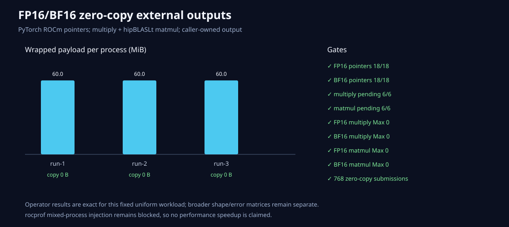

# PyTorch FP16/BF16零复制输出

外部Tensor描述符现在支持FP16和BF16。三次进程分别包装两个dtype的PyTorch输入、multiply输出、
matmul输入和matmul输出，全部使用原指针与caller-owned output。

结果：

- FP16指针18/18、BF16指针18/18一致；
- 6/6 dtype-run组合均non-owning；
- multiply和matmul记录后Event共12/12仍pending；
- FP16/BF16 multiply Max均0；
- FP16/BF16 hipBLASLt matmul相对同dtype PyTorch结果Max均0；
- 每进程包装60MiB，三次共180MiB，wrapper copy 0字节；
- 每dtype每轮64次multiply+64次matmul，总计768次零复制提交。

首个pilot只做8次BF16 matmul时，Event有一次在query前已完成，说明“pending”门的工作量太短，而不是
数值失败。正式门改为64次后3/3稳定通过；没有为了追求pending而改变算子结果或加入同步。

固定均匀输入使本次PyTorch对照完全相等。这不代表所有shape或随机输入都bitwise一致，正式结论仅是
外部dtype映射、指针、Stream、caller output和当前shape正确。rocprof混合进程冲突仍未解决，所以
没有性能加速倍数。
