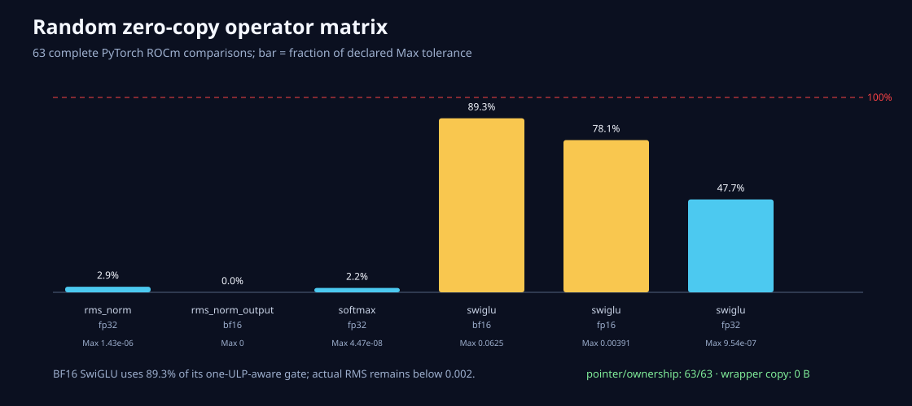

# PyTorch零复制算子随机矩阵

三个随机seed覆盖63条完整输出对照：

- FP32 Softmax：4个shape×3次；
- FP32 RMSNorm：4个shape×3次；
- BF16 RMSNorm输出：4个shape×3次；
- FP32/FP16/BF16 SwiGLU：每dtype 3个shape×3次。

全部63/63指针一致、63/63 non-owning，包装约8.64MiB随机payload，wrapper复制0字节。

| 算子 | dtype | 最大Max | 最大RMS | Max门使用率 |
|---|---|---:|---:|---:|
| Softmax | FP32 | 4.47e-8 | 2.05e-8 | 2.24% |
| RMSNorm | FP32 | 1.43e-6 | 1.01e-7 | 2.86% |
| RMSNorm output | BF16 | 0 | 0 | 0% |
| SwiGLU | FP32 | 9.54e-7 | 2.70e-8 | 47.68% |
| SwiGLU | FP16 | 0.00390625 | 0.000210 | 78.13% |
| SwiGLU | BF16 | 0.0625 | 0.001901 | 89.29% |

BF16 SwiGLU最大差0.0625是一档BF16步长，RMS仍低于0.002。最初0.05的Max门因此被真实随机用例
推翻并改为0.07；报告没有把低精度结果写成bitwise相同。

此节点也修复了一个潜在错误：旧HIP Softmax接受低精度Tensor后仍按`float*`读取。现在HIP Softmax
明确只接受FP32；低精度Softmax在专用Kernel实现前会提前失败。caller-owned接口不会偷偷cast/copy。

rocprof/PyTorch混合注入仍不可用，因此这些是数值、指针和生命周期证据，不是速度报告。
