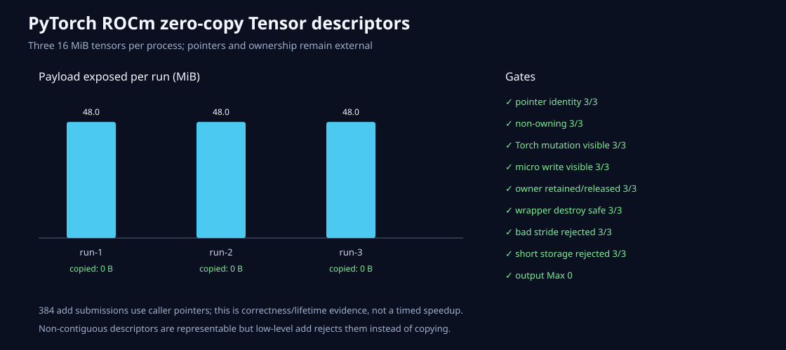

# PyTorch ROCm零复制Tensor描述符

三张PyTorch Tensor（left、right、output）各16MiB。microLLM wrapper保存同一个`data_ptr`、可访问
字节数、shape、element-stride、dtype和device，并在Python层持有owner引用。创建和销毁wrapper都
不复制、不释放PyTorch显存。

三次独立进程全部通过：

- 9/9指针（3张×3次）逐个相同；
- wrapper 9/9报告non-owning；
- 每次暴露48MiB，三次合计144MiB，wrapper复制0字节；
- Torch输入从1改成10后，microLLM输出从3变成12，两个方向的可见性Max均为0；
- wrapper持有owner时weakref存活，`close()`后owner可释放；
- 销毁output wrapper后，Torch仍能在原指针写入并读回42；
- non-contiguous stride和不足4字节storage均为3/3明确拒绝；
- 两轮各64次add，共384次零复制提交。



这组是正确性、生命周期和“没有wrapper payload copy”的证据，不是吞吐加速报告。由于上一节点
已稳定复现rocprof/PyTorch LLVM注入冲突，本节点没有重复假装得到Kernel trace，性能claim保持false。

复现：

```bash
HIP_VISIBLE_DEVICES=0 PYTHONPATH=python \
MICROLLM_LIBRARY="$PWD/build/hip-release/bindings/capi/libmicrollm.so" \
/tmp/microllm-torch-rocm-venv/bin/python \
  benchmarks/single_gpu/pytorch_zero_copy_tensor.py \
  --profile /tmp/zero-copy/profile.jsonl \
  --report /tmp/zero-copy/report.json --overwrite
```

边界：第一版caller-owned写算子是FP32 contiguous `add_out`。非连续描述符可以被表示，但算子会
拒绝，绝不偷偷复制。BF16/FP16、任意offset、完整算子族和Custom Op零复制注册仍需后续门。
