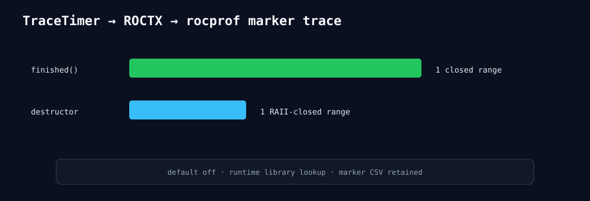

# ROCTX marker correlation

The default-off TraceTimer marker option is visible to rocprofv3 marker tracing.
`microllm.test.finished` and `microllm.test.destructor` each appear exactly once;
both ranges have closed start/end timestamps. Raw marker API/domain stats are retained.

