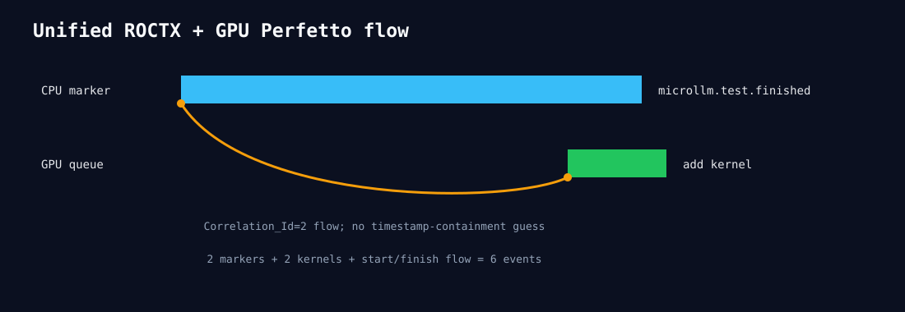

# Unified ROCTX and GPU Perfetto timeline

rocprof captures two ROCTX ranges, 244 HIP API rows, and two GPU kernels. The
`microllm.test.finished` range contains the `hipLaunchKernel` host call; that call and
the HIP add kernel share the exact correlation ID. The exporter emits six events: two
marker spans, two kernel spans, and one start/finish flow. It does not equate a marker
ID with a kernel ID and does not require the asynchronous kernel timestamp to remain
inside the host range.

Open `unified-perfetto.json` in Perfetto UI.

