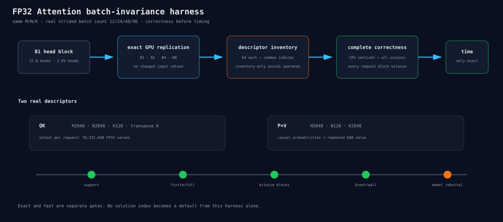

# 真实 Attention batch descriptor 的 solution 门

## 旧工具为什么不能直接用

普通 Linear 把 batch 乘进矩阵行数 `M`。Attention 不一样：QK 和 P×V 的 `M/N/K` 保持不变，
请求 batch 会把 hipBLASLt 的 strided batch count 从 12 改成 24、48、96。

旧 row-invariance benchmark 测的是 M2048/4096/8192/16384；旧 Attention tuner 只测 B1。
二者都没有复现 Experiment 308 的真实 descriptor，拿它们的 winner 直接进模型会答错问题。

## 新 benchmark 怎样工作

```text
造一个B1的12-head输入块
→ 在GPU上完整复制成B2/B4/B8
→ 每个batch count单独查询64个solution
→ 取共同index
→ CPU sentinel
→ 完整B1与default误差
→ 所有请求块逐元素位级比较
→ 只有通过者才做Event/wall计时
```

QK 使用 `M2048 N2048 K128` 和转置K；P×V 使用 `M2048 N128 K2048`。GQA的K/V按真实2个
KV head重复到12个query head。P×V输入是合法causal probability，不用任意随机矩阵代替。

`--inventory-only true`只建立descriptor并输出交集，避免能力探测时先分配大输入。正式模式读取
所有输出，不以采样代替完整门。summary区分`best_exact_index`和`admitted_index`：若最差batch
speedup低于0.95，即使数值exact也只能进入反驳实验，不能准入默认。



## 小型门

HIP smoke使用T16、2 heads、B1/B2，验证真实batch count、candidate交集、CPU sentinel、完整输出、
位级重复和correctness-before-timing。正式T2048数据作为下一独立结果节点提交。

完整回归：CPU 376/376、ASan/UBSan 374/374、PyTorch-enabled CPU 379/379、MI300X/gfx942
HIP 196/196、RCCL 53/53。
