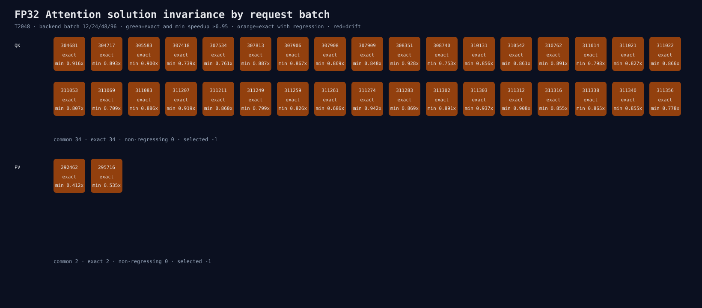

# Attention solution：能变一致，但不能免费

## 用简单的话说

我们找到了能让不同batch使用同一种加法顺序的方案。QK的34个共同方案全部能做到，P×V的2个也
全部能做到。

但是“答案更整齐”不代表“速度更快”。最好的QK方案在B4慢约8.4%；最好的P×V方案在B1慢约46.5%。
因此没有一个方案可以直接成为默认。

## 为什么还做一次模型实验

P×V只是Transformer的一小段，算子慢46.5%不一定让完整模型慢46.5%。反过来，算子exact也不保证
151,936个logit都更好。下一步只把最佳exact方案作为反事实开关，完整测量后接受或删除。

