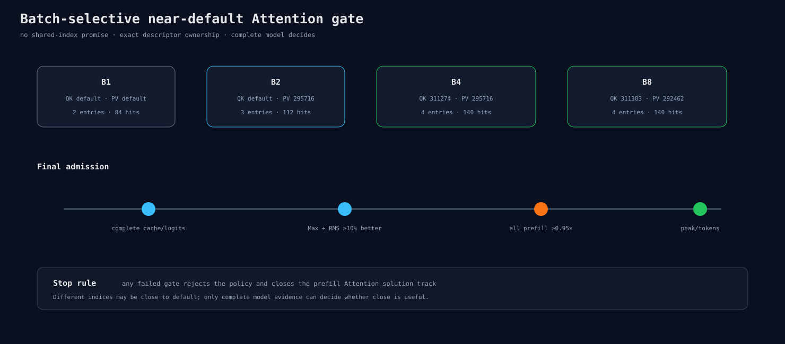

# Batch-selective Attention 最后反驳 runner

## 策略

保持上游Q/K/V projection exact，并按Experiment 309的当前batch最快候选注册：

| Batch | QK | P×V |
|---:|---:|---:|
| B1 | default | default |
| B2 | default | 295716 |
| B4 | 311274 | 295716 |
| B8 | 311303 | 292462 |

B1不改，避免same-index方案的0.535× P×V反例。每个process只注册当前descriptor，因此route entries/hits
分别是B1 2/84、B2 3/112、B4/B8 4/140，每增加一次warmup就翻倍。

## 证据门

16个precision进程导出BF16 cache与151,936 logits；16个performance进程反向排列policy和batch。
这个策略不承诺core bitwise，因为不同batch使用不同index。准入只看：

- 全局logit Max和RMS都至少改善10%；
- 每个batch full prefill ≥0.95×；
- peak、allocation、生成token没有隐藏退化。

合成测试覆盖B1无flag、B4双flag、不同entries/hits以及三重summary门。正式数据留给下一结果节点。
