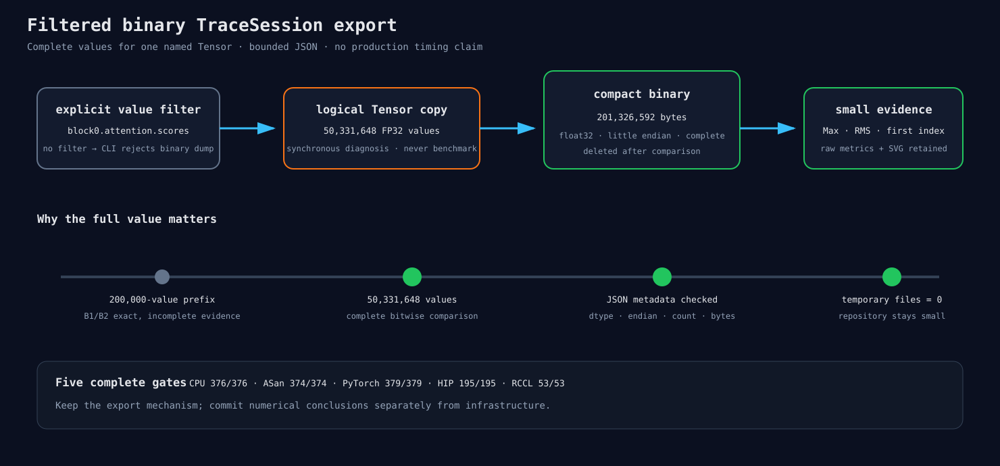

# 只导出被点名 Tensor 的完整二进制 Trace

## 为什么 JSON 不够

DeepSeek T2048 的一个 block-0 Attention score 有 50,331,648 个 FP32 数，约 192 MiB。
如果把每个数写成十进制 JSON，文件会膨胀到数 GB，而且解析更慢。只保存前 200,000 个数也不行：
本次 pilot 的前缀完全相同，但完整矩阵在 B4/B8 的第 3 个数已经不同。

这就像检查一本很厚的书：只拍前几页很轻便，却不能证明后面没有错字。

## 新接口

`TraceOptions.binary_value_directory` 是空值时，所有旧行为不变。设置后，只有 value filter 命中的
Tensor 会额外写完整二进制；每条 JSON record 增加：

```json
"binary_values": {
  "file": "hf-cached-prefill-12-...scores.f32.bin",
  "dtype": "float32",
  "byte_order": "little",
  "count": 50331648,
  "bytes": 201326592
}
```

CLI 对应 `--trace-binary-directory`，并强制同时提供 `--trace-output` 与非空
`--trace-value-filter`。浮点 Tensor 以逻辑 FP32 值写出，Int32 保持 Int32；非连续 view 仍按
逻辑顺序导出。

## 安全边界

- 这是同步数值诊断，不能拿它的耗时与生产推理比较；
- 文件名由 run ID、record sequence 和清理后的 record name 组成；
- JSON 保存 dtype、字节序、count 和 bytes，runner 在读取前逐项检查；
- 当前正式环境只支持 little-endian，其他主机明确拒绝；
- runner 每比较完一个 batch 就删除临时 Tensor，只保留小型差异指标；
- 没有 filter 时 CLI 拒绝二进制目录，防止一次写出所有层。

## 测试

- CPU TraceSession：未命中的 record 不写文件；命中的 FP32 文件逐字节读回；JSON metadata 对齐；
- HIP TraceSession：设备上的 add 输出写回完整 FP32 并逐元素相同；
- CLI：没有 trace output/filter 的二进制请求必须失败；
- runner：小型二进制检查 exact、首个 bit/value 差异、Max/RMS 和 summary 选择逻辑；
- 正式 runner 同时核对 stdout record/byte 计数和 JSON/文件大小。

完整回归结果：CPU 376/376、ASan/UBSan 374/374、PyTorch-enabled CPU 379/379、
MI300X/gfx942 HIP 195/195、RCCL 53/53。



## 下一步

使用 `audit_prefill_attention_core.py` 完成 B1/B2/B4/B8 两进程矩阵。大文件不进入 Git，
只有 raw 指标、summary、analysis、verification 和 autoresearch 风格 SVG 会进入结果节点。
