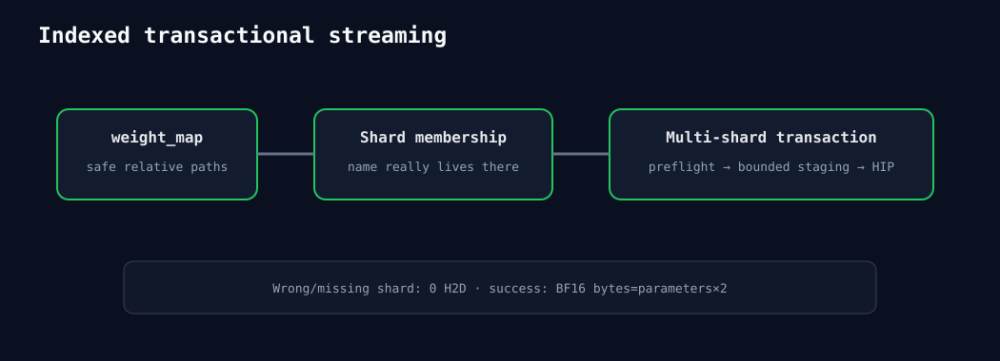

# 2026-08-26 — indexed safetensors流式装入HIP模型

新增公开只读`SafetensorsIndex`元数据API，解析并验证weight_map安全相对路径。HIP模型读取所有声明shard
header，检查tensor实际所在shard与index一致，再调用多分片事务流。错误在任何H2D前返回；正确BF16
indexed加载H2D=参数量×2、D2H=0。

