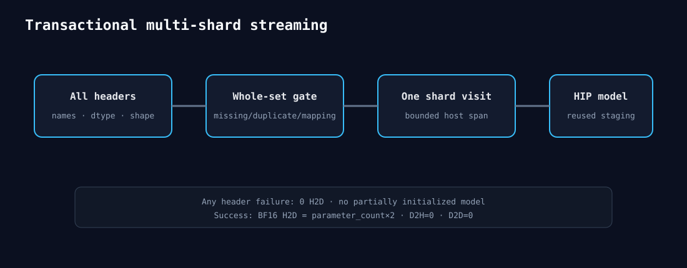

# 2026-08-26 — 多分片safetensors直接流式装入HIP模型

单文件流式逻辑提升为多分片共同事务：先读取全部header，统一检查mapping、missing、unexpected、shape和
跨shard重复名；严格模式失败时H2D仍为0。通过后只按shard顺序访问payload，复用每种dtype的最大staging
Tensor，不构造完整CPU `StateDict`。单文件API也复用这条路径。

BF16测试证明H2D字节精确等于参数量×2，D2H/D2D为0；完整MI300X HIP标签197/197通过。

