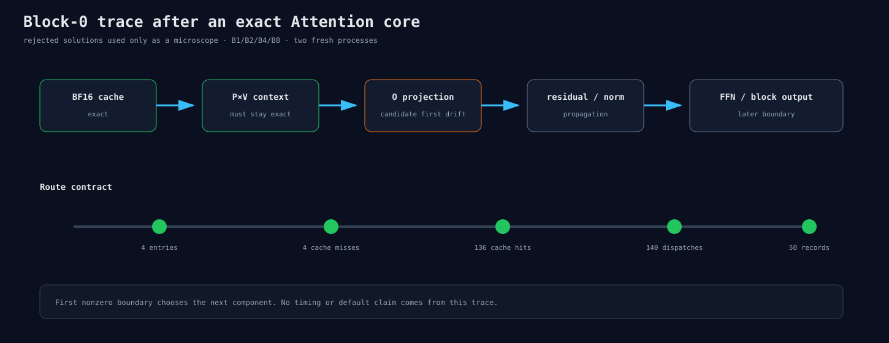

# Exact Core 之后继续追踪 Block 0

Experiment 310的same-index QK/P×V route虽然不能优化模型，但它能让block-0 context跨batch exact。
新runner复用已经验证的17个post-cache边界，只增加四个显式solution flag和更严格route计数。

```text
exact cache → exact context → O projection → residual
→ FFN norm → FFN output → block output
```

B1/2/4/8各两个fresh process，保存前两个完整输入行。所有trace都是同步数值诊断，不参与性能结论。
若O projection首差，下一节点只研究O；若context仍不exact，runner会直接推翻前提。



合成合同检查Q/K/V/QK/P×V四个index、4 entries、4 cache misses、136 hits after cache和140 dispatch。
