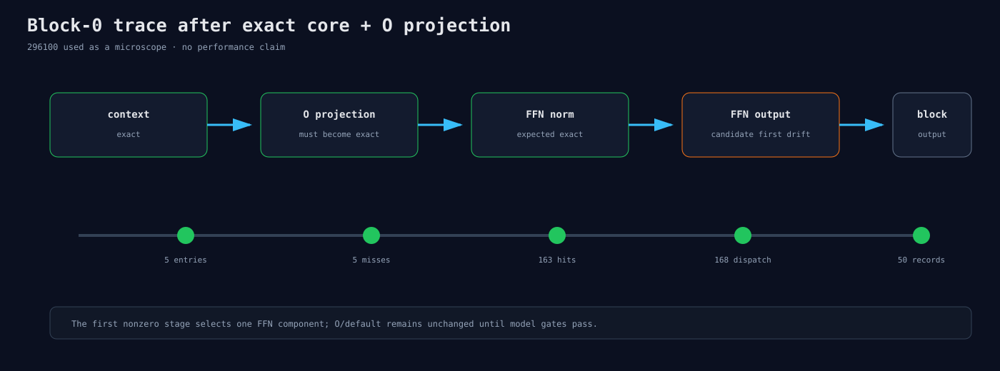

# Exact O 之后继续定位

新runner在exact Q/K/V/QK/P×V控制上再加入O=296100，复用17个block-0边界。route合同提升为5个
entries、5 misses、163 cache hits和168 dispatch。

目标不是证明296100更快，而是检查：

```text
context exact → O exact → residual exact → FFN norm exact
→ FFN output是否成为第一处差异
```

B1/2/4/8各两个fresh process；所有值完整，trace不参与性能。


