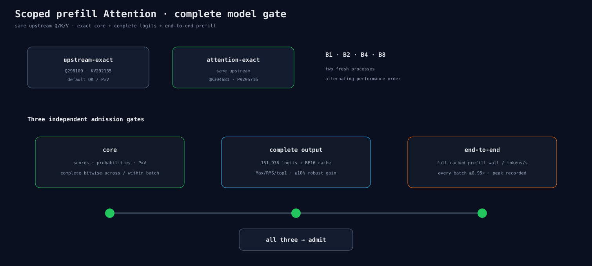

# Prefill Attention 完整模型反驳 runner

## 比较什么

两个policy都使用已经证明cache exact的Q=296100、K/V=292135：

- `upstream-exact`：Attention QK/P×V保持default；
- `attention-exact`：再加QK=304681、P×V=295716。

这样实验只回答“Attention exact pair改变了什么”，不会把上游Q/K/V修复混进收益。

## 一次precision进程留下四类证据

1. Block 0 BF16 K/V cache；
2. 151,936个完整last logits；
3. candidate的完整scores、probabilities、P×V二进制；
4. registry entries/cache/hit/miss/dispatch计数。

candidate B1二进制保留到同一run的B2/B4/B8比较完成，随后全部删除。相同文件先按4 MiB块做快速
位级检查，只有发现差异才计算Max/RMS，避免exact case重复解码上亿float。

## 性能门

default/candidate与B1/2/4/8在两个process中交错顺序。指标是full cached-prefill的
`mean_decode_prepare_ms`和由`batch×2048/time`得到的tokens/s，同时记录peak、backend allocation和
生成token。每个batch必须保持≥0.95×。

最终准入是三个条件同时成立：core exact、完整logit Max/RMS至少改善10%、所有batch性能过门。

合成contract已经覆盖CLI flag、140×(warmup+1)命中、三重准入与SVG生成。正式模型数据留给下一独立
结果节点。
