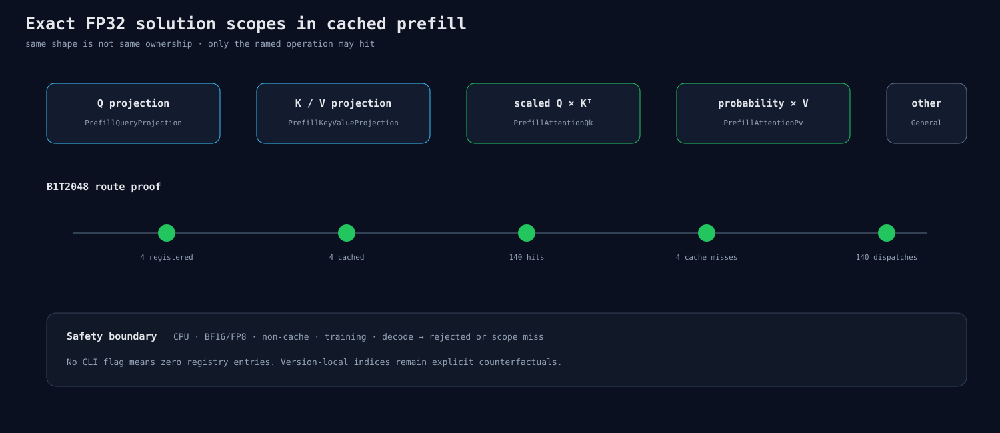

# Cached-prefill QK 与 P×V 的独立 solution scope

## 为什么只看 shape 不够

一个模型里可能有多个形状相同的 GEMM。若只用 M/N/K 注册solution，给QK选择的index可能误命中
projection、O projection、训练或decode。那样即使结果变快，也不知道到底改了什么。

FP32 key原来已有`PrefillQueryProjection`和`PrefillKeyValueProjection`。本节点再加入：

- `PrefillAttentionQk`；
- `PrefillAttentionPv`。

模型只在full cached prefill设置这两个scope。普通forward、训练、decode和旧的graph-free prefill flag
仍使用原合同。Attention内部从QK scope派生P×V scope，同时保留同一Stream/workspace。

## CLI边界

新增两个显式研究参数：

```text
--fp32-prefill-attention-qk-solution-index
--fp32-prefill-attention-pv-solution-index
```

它们只接受HIP、cached decode、full prefill、FP32 Attention权重。CPU、BF16/FP8、非cache或其他workload
都会在加载权重前拒绝。没有参数时registry为空，默认路径不变。

## 证据

- CPU key测试证明Q projection、K/V projection、QK、P×V和General互不相等；
- HIP用同一T512 shape注册QK scope，P×V scope只产生miss，QK才hit；
- CLI二进制合同包含输入flag和输出字段，并拒绝CPU请求；
- B1T2048实模pilot注册/缓存4个算法，获得140次hit/dispatch和4次cache miss：28层×(Q/K/V/QK/P×V)。



这个pilot只证明接线，没有比较速度或logits。304681/295716仍不是默认。
