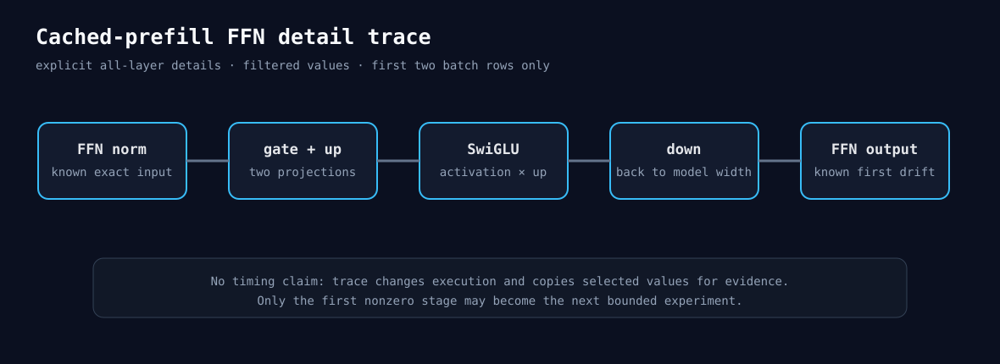

# 2026-08-26 — cached-prefill FFN显微镜

Experiment 315说明继续挑Linear solution没有意义，下一步要回答“FFN聚合输出之前，第一处差异到底在哪”。

`FeedForward::forward_tensor`现在有一个内部的prefill-row trace模式。它只在cached-prefill存在trace，
且显式value filter点名FFN内部阶段或开启all-layer details时使用。gate、up、SwiGLU activation和down
会先恢复成`[B,T,...]`，B大于2时只保留前两行。这样B8 T2048也不会把八个请求的巨大中间Tensor
全部写入证据，也不会为查看Block 0而展开其余27层。

安全边界：

- 普通推理、训练、decode和未开启detail的prefill不增加记录；
- filter决定是否真的保存值；
- trace只用于数值诊断，不用于计时；
- CPU测试比较有无trace的完整输出，并检查B3只保留两行；
- 已有Attention core trace仍保持输出一致。

提交门：CPU 377/377、ASan/UBSan 375/375、PyTorch-enabled CPU 380/380、MI300X/gfx942 HIP
196/196、双卡RCCL 53/53。HIP中一个需要交替可见设备的既有测试按环境规则跳过，不计失败。

