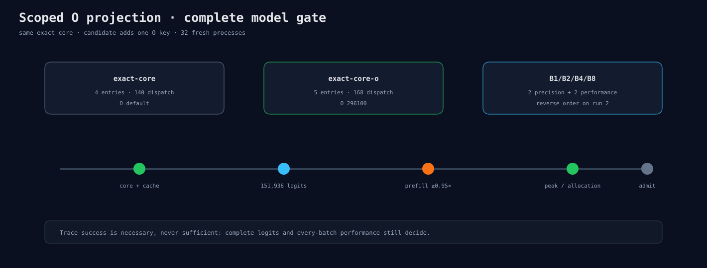

# O Projection 完整模型门

runner复用Experiment 310的32进程流程。baseline固定Q/K/V/QK/P×V；candidate只增加O=296100。
precision仍同时导出完整block-0 core，performance仍在第二轮反向排列。

route期望：baseline 4 entries/140 dispatch，candidate 5/168；一次warmup时分别翻倍到280/336。

准入条件不变：core/O因果通过、完整logit Max/RMS至少改善10%、所有batch prefill≥0.95×，并报告
peak/allocation/token。结果policy在输出中重命名为`exact-core`与`exact-core-o`。

