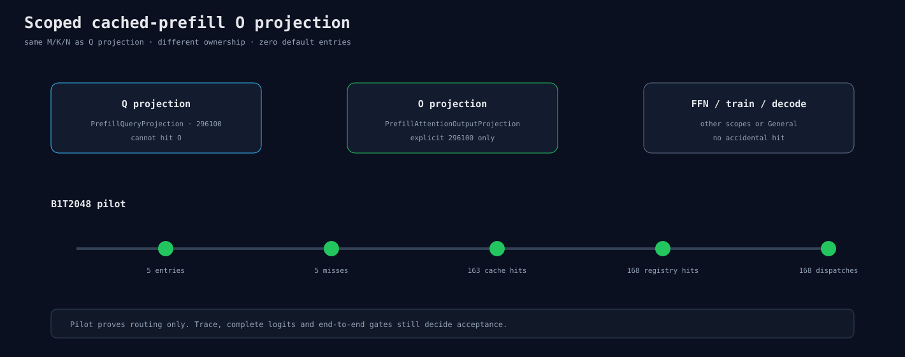

# Cached-prefill O Projection 独立scope

新增`PrefillAttentionOutputProjection`，只由Attention的O Linear在full cached prefill使用。
CLI参数为：

```text
--fp32-prefill-attention-o-solution-index
```

它与Q projection虽然同为M×1536乘1536×1536，但key的scope不同，不能互相命中。CPU、非cache、
BF16/FP8、训练和decode沿用拒绝/未命中合同。

B1T2048 pilot同时注册Q/K/V/QK/P×V/O五类key：5 entries、5 cache misses、163 cache hits、168
registry hits/dispatch，正好是28层×6。候选296100仍只是显式反事实。


