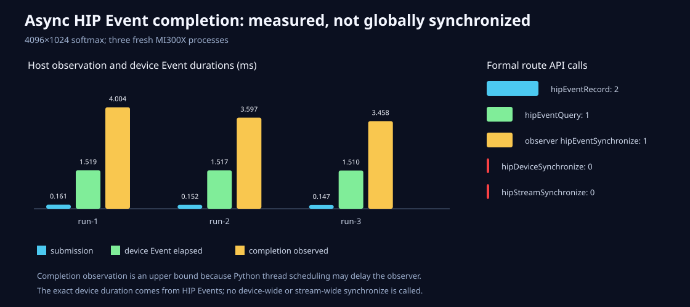

# Python怎样等一个HIP Event，而不是等整张卡

日期：2026-08-26
状态：已在MI300X/gfx942验收

## 问题

Python函数调用HIP Kernel后可以很快返回。如果decorator马上写“结束”，它只量到提交；如果为了
简单直接调用`hipDeviceSynchronize`，又会把别的Stream也堵住，改变本来要观察的程序。

## 最小接口

- C ABI新增不透明`ml_event*`：创建、默认Stream记录、query、Event synchronize和Event elapsed；
- Python新增`microllm.Event`；
- `hip_event_profile_scope(...)`在进入/退出时记录两个timing Event；
- 退出context只表示提交结束，不等待GPU；
- `observe_async()`启动非daemon观察线程，只执行`hipEventSynchronize(finish_event)`；
- Future的`result()`会传播观察线程错误，`wait()`幂等且只写一条JSONL；完成后的`close()`
  幂等释放两个Event，并拒绝提前销毁pending Event；
- JSON同时保存提交时长、完成被host观察的上界和HIP Event设备时长；
- 异常路径优先保留原异常，并尽量收口Event记录。

## 测试中发现的旧问题

HIP Release编译时，`capi_test.c`原来使用标准`assert`。`NDEBUG`会把表达式本身删除，因此以前的
Release测试可能连API调用都没有执行。它已改成始终运行的`CHECK`宏；CPU/HIP Tensor、错误路径和
新Event生命周期都在Release真正执行。

## 三次真机证据

4096×1024 softmax在3/3进程中提交时Event都未完成。独立观察线程记录的HIP Event设备时长为
1.510–1.519ms，主线程在完成被观察前执行了2.929–3.426ms host工作，输出误差为0。

rocprof HIP API trace显示每个正式range内正好2次Event record和1次query；观察线程各执行1次
`hipEventSynchronize`。三次全进程合计`hipDeviceSynchronize=0`、`hipStreamSynchronize=0`。

原始证据与复现命令见[结果目录](../../benchmarks/results/2026-08-26-python-hip-event-completion/README.md)。

## 没有扩大结论

host观察时间会受GIL和线程调度影响，只是上界；Kernel时间仍以HIP Event/rocprof为准。Python接口
当前绑定C API默认Stream，不把它写成显式多Stream支持。下一步若增加Python Stream，应证明等待
一个Event不会阻塞另一条有意保持繁忙的Stream。

## 完整回归与一次非稳定失败

最终回归为CPU 381/381、ASan/UBSan 378/378、PyTorch-enabled CPU 384/384、单卡HIP标签
199/199、RCCL标签55/55。后两组新增的两项是此前被错误标成仅CPU的C/Python API门。

RCCL第一次完整复跑有一次`GatherWeightedOverlapSmoke`返回launcher通用失败，结果54/55；该项立即
单独复跑通过，第二次完整55项也全部通过。没有足够证据把它写成Event改动导致的回归，也没有用
一次成功把它删掉。当前结论是非稳定环境/启动抖动，若再次出现应保留rank stderr并单独归因。
