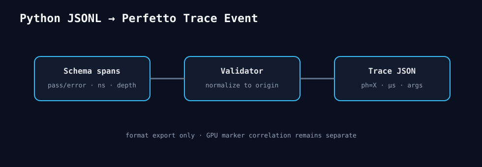

# 2026-08-26 — Python profile导出Perfetto

`export_perfetto(input_jsonl, output_json)`校验schema并原子写Chrome Trace Event JSON。span转为`ph=X`，
保留thread、depth、run ID、status、exception和metadata。时间归一到最早span并转换为微秒。

这只是格式导出，不声称GPU相关；rocprof marker合并仍是独立缺口。

