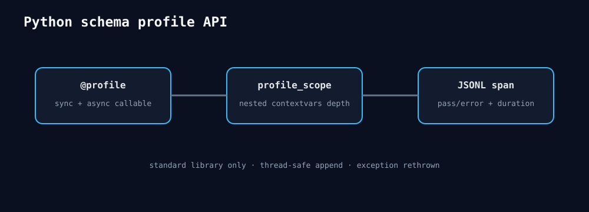

# 2026-08-26 — Python `@profile` 与上下文管理器

```python
from microllm import profile, profile_scope

@profile(output="trace.jsonl", phase="decode", metadata={"batch": 2})
def decode_step():
    with profile_scope("attention", output="trace.jsonl", phase="decode"):
        ...
```

同步/异步decorator都支持；嵌套depth使用`contextvars`，异常写`status=error`和类型后原样抛出。输出是
schema-versioned JSONL，使用标准库且不要求加载C共享库。它测Python wall span；GPU Kernel结论仍必须用
HIP Event/rocprof，不能把decorator时间冒充设备时间。


