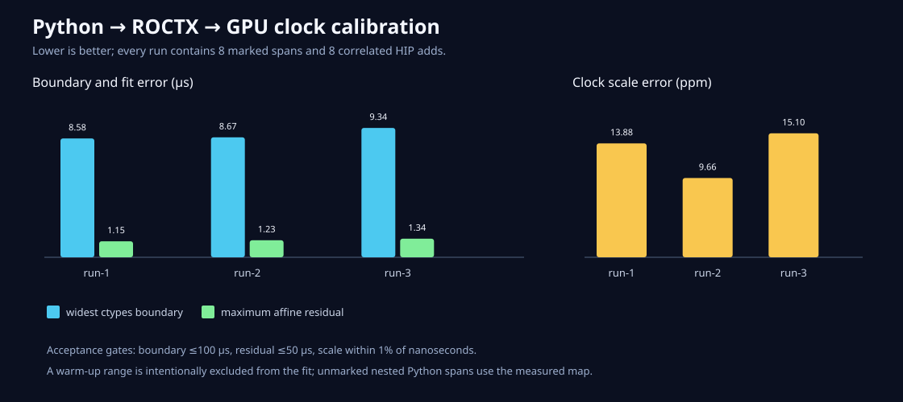

# Python、ROCTX和GPU怎样使用同一条时间轴

日期：2026-08-26  
状态：已在MI300X/gfx942验收

## 先把问题说简单

Python会说：“我的工作从数字A开始。”rocprof会说：“GPU Kernel从数字B开始。”虽然两个数字的
单位都像纳秒，它们的零点和走速不能靠猜。直接相减，可能画出一张很好看但位置错误的图。

我们需要同时看一件事情的两只钟：

```text
读Python时钟 → ROCTX push → 再读Python时钟
                     ↓
             rocprof记录range开始

读Python时钟 → ROCTX pop  → 再读Python时钟
                     ↓
             rocprof记录range结束
```

ROCTX动作一定发生在两次Python读数之间。取每个小区间的中点，8个range提供16个对应点。程序
拟合`rocprof_time = scale × python_time + offset`，并检查比例、边界宽度和拟合残差。

## 实现边界

- `profile_scope(..., emit_roctx=True)`和`@profile(..., emit_roctx=True)`可选发出唯一range；
- JSONL同时记录进程、原生线程、span ID、range名和push/pop四个边界时间；
- ROCTX运行库仍在运行时加载，CPU环境缺少它时普通profiling不会崩溃；
- `calibrate_python_rocprof_clock`至少要求两个成功range，时钟比例必须在1%内；
- 首次ROCTX调用会包含初始化，所以正式runner先做一次不参与拟合的warm-up；
- 最大调用边界必须不超过100µs，最大拟合残差不超过50µs；
- `merge_rocprof_perfetto(..., hip_api_csv=..., python_jsonl=...)`把全部Python span放入
  测得的rocprof时间轴，并只生成有launch API证据的Kernel flow；
- 一个range可以包含多个launch/copy API；API与Kernel用精确ID关联，每条
  marker/API/Kernel证据链获得自己的flow ID；不假设marker ID等于Kernel ID。

## 三次正式结果

| 运行 | 比例误差 | 最大残差 | 最宽边界 | 关联add | Trace Event |
|---|---:|---:|---:|---:|---:|
| run-1 | 13.88 ppm | 1.154µs | 8.583µs | 8/8 | 85 |
| run-2 | 9.66 ppm | 1.232µs | 8.667µs | 8/8 | 85 |
| run-3 | 15.11 ppm | 1.340µs | 9.342µs | 8/8 | 85 |

正式复跑还修正了一项解释：不开HIP API trace时，marker与Kernel的ID恰好相同并不足以证明关系。
当前三次结果都开启`--hip-trace`，只接受“range包含host API，host API与Kernel精确同ID”的链条。



原始证据和复现命令在[结果目录](../../benchmarks/results/2026-08-26-python-roctx-gpu-perfetto/README.md)。

## 这次没有证明什么

Python span仍是host wall span。如果函数只提交异步GPU工作就立刻返回，它的结束时间不是GPU完成
时间。下一项应该记录HIP Event完成，而不是在decorator里偷偷加入全局同步。当前正式证据也是
单Python进程；多进程若要共用一张图，应分别校准或证明系统单调时钟契约。
