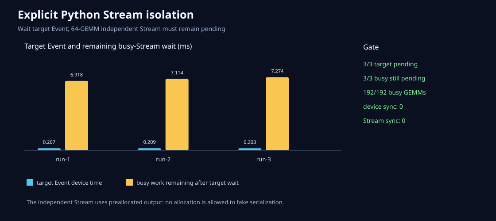

# Python显式Stream：只等自己的工作

日期：2026-08-26
状态：已在MI300X/gfx942验收

## 为什么默认Stream还不够

上一节点证明可以只等一个Event，但所有Python算子仍在默认Stream。真正的并发接口还要回答：如果
A和B是两条队列，等A会不会影响B？

## 接口

- C ABI新增不透明`ml_stream*`：创建、销毁和单Stream synchronize；
- Event新增指定Stream的record/wait；
- add、multiply、matmul、softmax增加显式Stream入口；
- multiply/matmul增加caller-owned输出入口，实验不在热区分配；
- Python新增`Stream`，四个算子接受`stream=`，并公开`multiply_out`和`matmul_out`；
- `hip_event_profile_scope(..., stream=...)`在指定Stream记录前后Event；
- C-only安装consumer也创建Stream并完成Event依赖，证明符号进入可搬迁SDK。

ABI仍是兼容的v1加法扩展，共导出36个`ml_*`符号。

## 可推翻实验

```text
Stream A: 1次预分配matmul → target Event
Stream B: 64次预分配matmul → busy Event
只等待target Event
查询busy Event必须仍未完成
最后单独等待busy Event并检查结果
```

若等待A后B已经完成，可能是B太短、分配导致隐式同步，或Event等待错误地扩大到了设备。实验因此
固定64个2048方阵GEMM、复用同一输出，并用HIP API trace拒绝device/Stream synchronize。

三次运行全部得到不同的Stream ID 1/2；A耗时0.203–0.209ms，等完A后B仍需6.918–7.274ms；
192/192个B Kernel存在，输出最大误差`2.57e-8`，全进程两类宽同步调用均为0。



原始证据和复现命令见[结果目录](../../benchmarks/results/2026-08-26-python-stream-isolation/README.md)。

## 下一边界

当前绑定的是microLLM自己创建的Stream。PyTorch或其他框架传入的native Stream、跨语言所有权和
每个算子的caller-owned输出覆盖仍需独立契约。不要从两个基础GEMM队列直接推导模型服务并发收益。
