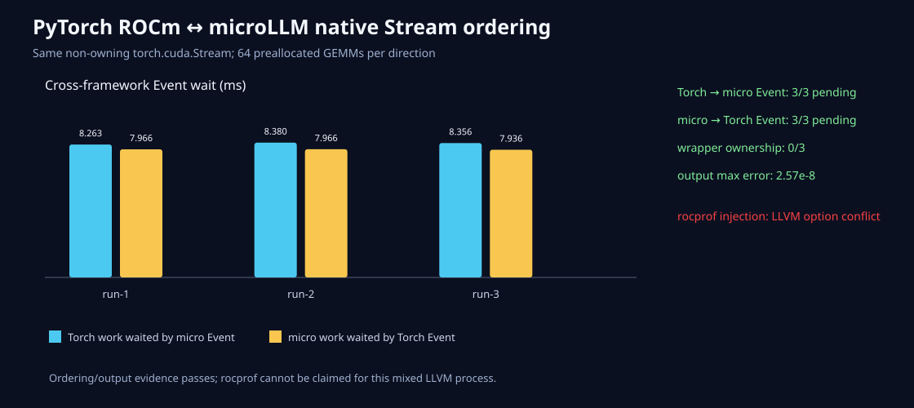

# PyTorch的Stream，microLLM只借用不接管

日期：2026-08-26
状态：双向顺序已验收；rocprof混合进程注入失败

## 所有权契约

- `ml_stream_from_external(device, native_handle)`只创建wrapper；
- `ml_stream_destroy`销毁wrapper，不调用`hipStreamDestroy`处理外部句柄；
- native handle必须非0且属于声明的HIP设备；
- Event record/wait、算子和单Stream synchronize都能使用owned或external wrapper；
- Python `Stream.from_external(...)`暴露`owning=false`和原指针；
- 外部框架必须让原Stream活到全部工作/Event完成。

C ABI增加三个符号后共有39个`ml_*`导出。CPU拒绝伪造external Stream；HIP C/Python测试也先用
owned Stream取指针、创建non-owning alias，再证明销毁alias后owner仍可同步。

## 真正的PyTorch ROCm双向门

同一个`torch.cuda.Stream.cuda_stream`执行：

```text
Torch 64 GEMM → microLLM Event record → microLLM等待并检查Torch输出
microLLM 64 GEMM → Torch Event record → Torch等待并检查microLLM输出
```

两个Event在记录点均未完成。三次运行的两方向等待分别为8.263–8.380ms和7.936–7.966ms，输出
最大误差`2.57e-8`，wrapper 3/3不拥有句柄。



## 一个推翻原计划的工具失败

原计划用rocprof同时证明HIP API/Kernel时间线。但rocprof注入PyTorch时与其LLVM组件重复注册
`spirv-expand-step`，SIGABRT后信号处理器还会挂起。启用或关闭`--hip-trace`都复现；20秒外层
timeout才终止。原始失败已保留，当前不声称混合进程rocprof性能证据。

这不推翻Event顺序和输出证据，但阻止“统一混合时间线已完成”的结论。可替代实验应升级/隔离工具
链，或让PyTorch自身profiler导出trace，再做时钟校准；不能隐藏失败直接复用纯microLLM数据。

## 下一边界

Stream已经共享，Tensor内存还没有。下一步应增加带shape/stride/dtype/device/所有权的非拥有
TensorView C API，并先覆盖生命周期和错误shape，再尝试PyTorch零复制Custom Op。
