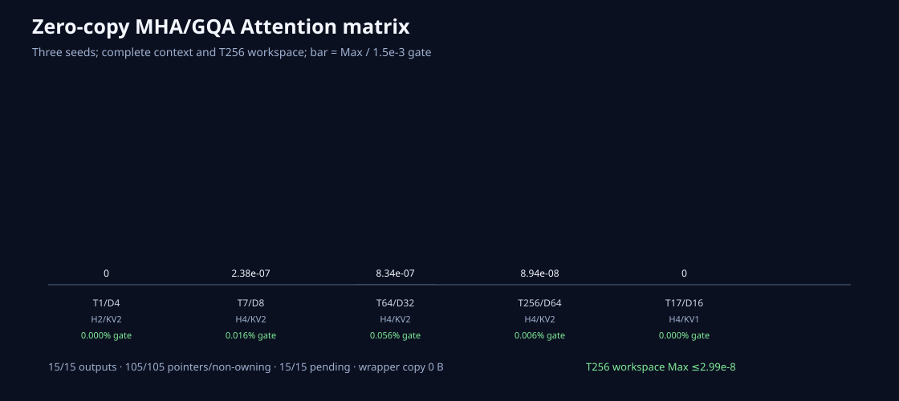

# Attention的workspace也必须由调用者看得见

日期：2026-08-26
状态：FP32 MHA/GQA caller-owned前向已验收

## 接口

`causal_gqa_attention_out`要求调用者提供：

- output `[B,H,T,D]`；
- scaled-query workspace `[B,H,T,D]`；
- expanded-K/V复用workspace `[B,H,T,D]`；
- probabilities workspace `[B,H,T,T]`；
- Q `[B,H,T,D]`、K/V `[B,KV,T,D]`；
- repeats、scale和Stream。

所有Tensor必须FP32、contiguous、同设备。四个可写Tensor互不alias，也不能alias Q/K/V。C API在栈上
构造workspace元数据，底层Storage仍指向PyTorch；不会接管或复制payload。

## 为什么短路径也要求workspace

T&lt;256使用融合Kernel，payload workspace不会被写。T256进入scale→QK→causal Softmax→PV路径，
workspace承载中间值。统一接口在两条路径都验证shape和alias，避免shape变化时突然越界。

## 三进程矩阵

MHA/GQA覆盖repeats 1/2/4、B1/B2、T1/7/17/64/256、D4–64。15/15 context输出Max不超过
`8.35e-7`、RMS不超过`6.80e-8`；T256三个workspace Max不超过`2.99e-8`。105个外部指针/ownership
全部通过，约7.56MiB payload、wrapper copy 0，Event 15/15 pending。

## 下一边界

这是前向FP32 Attention，不是训练零复制。Backward仍返回新Tensor；RoPE/Embedding/loss也缺caller
output。低精度online Attention有不同布局和workspace，不能复用这个接口名称偷渡。
