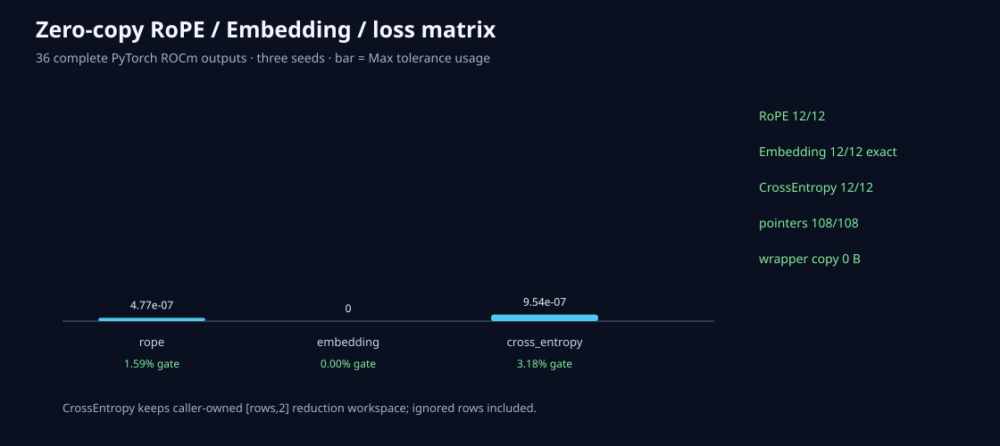

# RoPE、查表和loss也使用调用者的内存

日期：2026-08-26
状态：FP32前向caller-owned输出已验收

## 新接口

- `rope_out`：output与input同shape/dtype/device，禁止alias；
- `embedding_out`：output shape=`indices.shape + [width]`；
- `cross_entropy_out`：caller提供FP32 scalar和`[rows,2]` FP32 workspace；
- 三者都接受owned或native Stream。

HIP RoPE/Embedding当前只支持FP32，复用已有Kernel。CrossEntropy也明确要求FP32 logits和Int32 targets。
不支持的低精度不会在C API里cast。

## 随机矩阵

三seed×12 case。RoPE覆盖位置offset/base和多个序列/head宽度；Embedding覆盖二维indices与重复index；
CrossEntropy覆盖ignore-index和4096类。36/36完整输出通过，108/108指针/ownership通过，wrapper copy 0。

最大误差：RoPE`4.77e-7`、Embedding`0`、CrossEntropy`9.54e-7`。CrossEntropy scalar只占一个值，
所以Max和RMS相同；不能用RMS较大误判为大量元素漂移。

## 下一边界

前向主要家族已有caller output，但backward仍分配新梯度Tensor。下一阶段应从Softmax/RMSNorm/SwiGLU/
RoPE/CrossEntropy backward开始，要求PyTorch全部叶子梯度和caller地址同时对齐。
