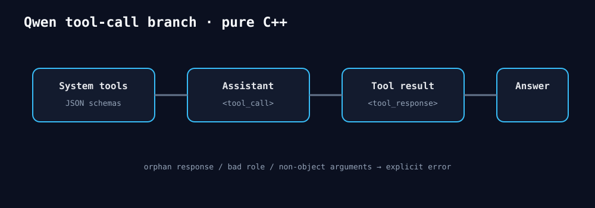

# 2026-08-26 — Qwen tool-call/tool-response模板

`ChatMessage`新增零依赖ToolCall列表；Qwen renderer把schema放入system tools段，将assistant调用与tool响应
渲染为明确标记。名称JSON转义，arguments必须是object边界，孤立tool response和非法role直接拒绝。
原有basic prompt字节保持不变。

