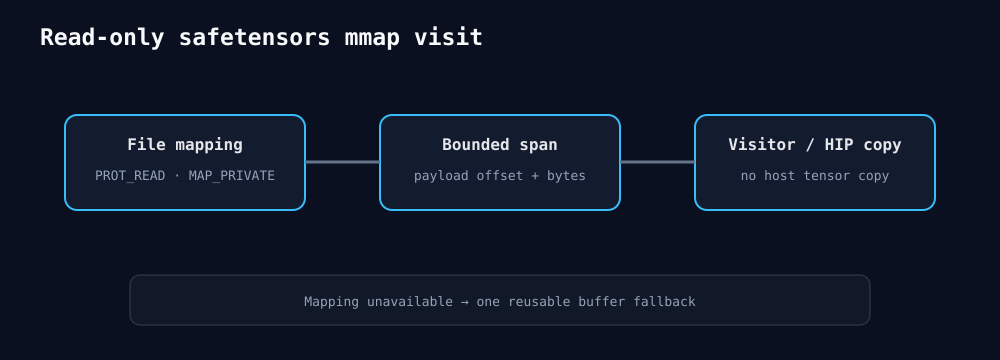

# 2026-08-26 — safetensors只读mmap payload访问

`visit_safetensors`在POSIX主机使用`PROT_READ|MAP_PRIVATE`映射整文件，按已验证offset给回调一个有界span，
不再为每个tensor复制到host vector。返回report记录是否mmap、tensor数和payload字节。mmap不可用时保留
原先单个最大buffer fallback，API仍跨平台。

