# 从 0.1917× 到 1.0×：在 MI300X 上从零优化一个 C++/HIP LLM 引擎

> 这是一篇会随着实验继续生长的博客。绿色不是“计划成功”，只有实际测量并通过
> 正确性门的改动才会出现在绿色 running-best 上。

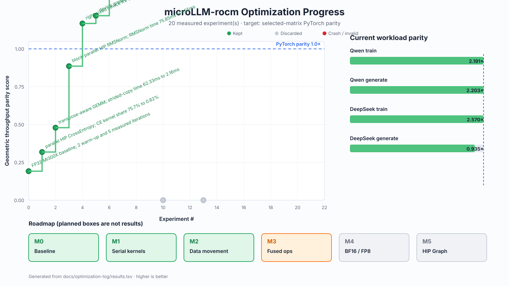

## 0. 我们到底在优化什么

microLLM-rocm 已经可以：

- 用纯 C++/HIP 构造 Tensor、算子和自动求导图；
- 在 MI300X 上加载官方 Qwen2.5-0.5B；
- 运行 DeepSeek-R1-Distill-Qwen-1.5B；
- 让 logits、生成 token、loss 和参数更新与 PyTorch 对齐；
- 使用两张 GPU 做 RCCL 数据并行正确性实验。

但“输出正确”与“像成熟框架一样快”是两个完全不同的终点。

在固定 FP32、多步、排除热身的 MI300X 对比中：

| Workload | microLLM | Python/PyTorch | microLLM/PyTorch |
|---|---:|---:|---:|
| Qwen train | 7.30 token/s | 51.32 token/s | 0.1422 |
| Qwen generate | 18.77 token/s | 70.18 token/s | 0.2675 |
| DeepSeek Distill train | 5.79 token/s | 26.23 token/s | 0.2209 |
| DeepSeek Distill generate | 10.02 token/s | 62.40 token/s | 0.1606 |

四项几何平均只有：

```text
0.191660× PyTorch
```

经过十四个保留实验，当前重复进程 score 已到 `2.478439×`。这不是估计值：它来自同一张
MI300X、同一组模型权重、同样的 2 次热身和 5 次正式测量。

因此，本专项的故事不是“我们已经超过 PyTorch”，而是：

> 一个正确但很慢的教学引擎，怎样经过可反驳的系统实验，一步步长成一个在固定
> AMD GPU 矩阵上接近成熟框架的引擎？

这里的最终 `1.0×` 只表示固定 GPU、模型、dtype、batch、context 和 token 的 selected
matrix parity。它不代表所有模型、所有 shape 或所有 AMD GPU。

## 1. 从 autoresearch 学到的不是“让 Agent 随便改代码”

[karpathy/autoresearch](https://github.com/karpathy/autoresearch) 的核心不是一句
“AI 自动研究”，而是一个非常克制的实验系统：

```text
固定时间预算
固定评价指标
一次做一个实验
成功保留
失败回退
结果持续写入表格
用图展示 running best
```

它的 `progress.png` 里，灰点是被丢弃的实验，绿点是保留的实验，绿色阶梯线是
running best。真正有价值的不是曲线看起来不断改善，而是失败点没有被删除。

microLLM 的问题更复杂。模型质量实验可以使用一个 `val_bpb`，系统实验至少需要：

- 四项吞吐；
- 四项峰值显存；
- logits、loss、gradient 和 generated token；
- Kernel、copy、allocation 和 launch 时间线；
- reference、readable 和 optimized 三条路径。

所以我们借用实验循环，不照搬指标。

## 2. 为什么要先固定测量，而不是马上写 Kernel

最早的一次官方模型对比只测了第一个训练 step，结果看起来 microLLM 比 PyTorch
快约 3 倍。如果停在这里，我们可能会写出一篇错误的“自研框架击败 PyTorch”。

加入两次 warm-up、再测五步后，结果变成：

```text
Qwen train       microLLM 7.30   PyTorch 51.32
DeepSeek train   microLLM 5.79   PyTorch 26.23
```

原来的“领先”只是 PyTorch 首次 Kernel 初始化成本。

因此本项目固定：

```text
load
→ 2 complete warm-up iterations
→ reset peak allocator counter
→ 5 measured iterations
→ only measured interval enters throughput
```

setup、warm-up 和 measured 必须分别报告。不能把不喜欢的时间藏起来，也不能把
一次首次启动写成 steady-state。

## 3. 先画出当前系统，而不是凭感觉优化

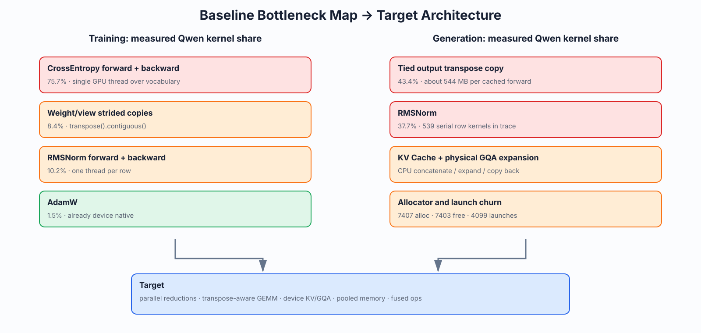

优化起点的训练路径：

```text
token
→ Embedding
→ [RMSNorm → QKV → RoPE → QK → Softmax → PV → O]
→ [RMSNorm → gate/up → SwiGLU → down]
→ output head
→ CrossEntropy
→ backward
→ AdamW
```

优化起点的生成路径：

```text
token
→ 每层计算 Q/K/V
→ K/V 搬回 CPU
→ CPU 拼接旧 cache
→ 搬回 GPU
→ GQA 再搬回 CPU 展开
→ 再搬回 GPU
→ Attention
→ tied output weight 整体转置复制
→ 完整 logits 搬回 CPU 做 argmax
```

程序能输出正确 token，但这条数据路线显然不适合高性能 GPU。

## 4. Baseline profiler 告诉了我们什么

### 4.1 Qwen 推理

代表性 rocprof：一次完整 forward、一次 warm-up generate、一次 measured generate。

| Kernel | Calls | Total | Share |
|---|---:|---:|---:|
| strided transpose copy | 323 | 119.25 ms | 43.43% |
| RMSNorm | 539 | 103.45 ms | 37.67% |
| largest hipBLASLt shape | 792 | 17.89 ms | 6.52% |
| readable batched matmul | 538 | 6.58 ms | 2.40% |

另外还有：

```text
hipMalloc 7404
hipFree   7403
hipMemcpy 2712
ordinary Kernel launch 4099
```

结论非常反直觉：GEMM 不是第一热点。继续只调 GEMM，端到端不会发生根本变化。

### 4.2 Qwen 训练

| Kernel | Share |
|---|---:|
| CrossEntropy backward | 49.52% |
| CrossEntropy forward | 26.21% |
| strided transpose copy | 8.43% |
| RMSNorm backward | 7.48% |
| RMSNorm forward | 2.76% |
| AdamW | 1.49% |

这说明训练第一刀应该砍 CrossEntropy，而不是 AdamW。

## 5. 第一个结构性错误：GPU 上的串行 reduction

当前 CrossEntropy forward/backward 由一个 GPU 线程循环完整词表。Qwen 词表是
151,936，三个 token 就需要一个线程反复执行几十万次 max、exp 和 sum。

RMSNorm 也类似：一个线程处理整行 hidden。Qwen width 896，DeepSeek width 1536。

正确的 GPU 思路应是：

```text
一行交给一个 block
→ 每个线程处理多个元素
→ wave reduction
→ block reduction
→ 必要时第二阶段 reduction
```

Step 01 和 Step 03 分别处理这两个问题。它们必须先保留简单 CPU 参考，再新增
readable parallel HIP 和 optimized candidate。

## 6. 第二个结构性错误：把 view 变成 544 MB 的复制

Qwen 使用 tied embedding。输出 logits 时，Embedding weight 既当输入表，又当输出
投影矩阵。

优化前的实现：

```text
[151936, 896]
→ transpose view [896, 151936]
→ contiguous copy
→ GEMM
```

每个 token 产生约 544 MB 转置副本。训练 backward 中每个 Linear 权重也会执行
类似转置复制。

真正的解决办法不是缓存一个永久副本——那会让 tied weight 更新一致性变复杂——
而是让 GEMM 接受 transpose/stride 描述。hipBLASLt 可以把 transpose 当作 layout，
不移动数据。

Step 02 的验收不是“Kernel 变快”，而是 profiler 中整个权重 strided copy 消失，
同时 logits 和梯度保持一致。

这个问题可以把 GEMM 想成读一张表。过去为了“横着读”，程序先把整张大表抄成
另一张表；现在我们只告诉 GEMM：“请交换行号和列号来读原表”。数字没有搬家，
只是读取公式变了。

## 7. 第三个结构性错误：KV Cache 不是 Cache

真正的 Cache 应当：

```text
初始化时分配一次
每步原地写一个 position
过去的数据地址不变
```

当前 Cache 每步重新创建更大的 Tensor，并通过 CPU 拼接。GQA 又把少量 KV head
复制成所有 query head。

目标结构：

```text
K/V [B, KVH, max_T, head_dim]
length
current K/V → device slice write
query_head → 直接映射 kv_head
```

完成后，生成循环里不应有 Tensor payload H2D/D2H。只有最终需要显示文字时，才
把 token IDs 取回 CPU。

## 8. 为什么 allocator 本身也会拖慢模型

当前每个临时 Tensor 都直接 hipMalloc/hipFree。短 Qwen 推理就出现七千多次申请和
释放。

`hipFree` 还可能等待尚未完成的 GPU 工作。于是一个普通 C++ 析构函数可能变成
隐藏同步点。

Step 06 将按顺序引入：

```text
size-class cache
→ per-device pool
→ stream-aware retirement
→ workspace arena
→ stable-address graph memory plan
```

allocator 改动风险很高：复用过早会让另一个 Stream 读取已经被覆盖的数据。因此
正确性测试必须包含 Event 未完成、异常退出、多 Stream 和峰值统计。

## 9. 为什么低精度不放在最前面

FP8 不会自动修复：

- 单线程 CrossEntropy；
- 单线程 RMSNorm；
- CPU KV 拼接；
- tied weight 整体复制；
- 数千次 malloc/free。

更糟的是，当前 FP8 Linear 每次 forward 还会重新量化 weight。

因此低精度是独立 track：

```text
先完成 FP32 数据路线
→ BF16 官方整网
→ FP32 master + BF16 compute
→ cached FP8 weights
→ dynamic activation scale
→ 同 dtype PyTorch 对比
```

FP32 running-best 和 BF16/FP8 running-best 不能连成一条线。

## 10. 最终希望长成什么架构

```text
Model weights
  ├─ logical layout + transpose flags
  ├─ cached hipBLASLt plan/workspace
  └─ optional BF16/FP8 packed copy

Training
  ├─ parallel/fused CE
  ├─ parallel RMSNorm
  ├─ transpose-aware backward GEMM
  ├─ reusable grad/activation arena
  └─ device-native optimizer

Inference
  ├─ preallocated K/V
  ├─ direct GQA indexing
  ├─ fused prefill/decode Attention
  ├─ device sampling
  └─ stable-address HIP Graph
```

可选后端可以使用 hipBLASLt、Composable Kernel 或其他 ROCm 原语，但核心依然保留
CPU reference 和仓库自己的 readable HIP 路径。

## 11. Experiment 001：第一条绿色阶梯

Step 01 把 CrossEntropy 从单线程循环改成 block-parallel reduction。结果：

```text
CE Kernel share          75.73% → approximately 0.62%
Qwen train               7.30 → 24.03 token/s
DeepSeek train           5.79 → 13.30 token/s
four-workload score      0.191660 → 0.318328
```

这是一次 `keep`。它没有改变推理路径，因此两个 generation row 保持在正常波动内。

更重要的是，新 trace 把下一层瓶颈暴露出来：

```text
strided transpose copies   33.55%
RMSNorm backward           30.54%
RMSNorm forward            11.14%
```

因此下一次实验不是继续微调 CE，而是 Step 02：让 tied output 和 backward GEMM 使用
逻辑 transpose，删除完整权重复制。

## 12. Experiment 002：不抄整张表，只改变读法

这次我们给矩阵乘法增加两个布尔条件：左矩阵是否转置、右矩阵是否转置。
`false/true` 的意思不是先创建一个转置 Tensor，而是在取第 `k` 个数时直接计算正确
下标。CPU reference、可读 HIP 和 hipBLASLt 都遵守同一个公式：

```text
C = op(A) × op(B)
op(A/B) 可以是原样，也可以是逻辑转置
```

为什么测试四种组合？因为只测 tied head 的 `A × Bᵀ`，很容易把 hipBLASLt 的
行主序、列主序碰巧写对。NN、NT、TN、TT 四种都通过，才能说明接口本身成立。

自动求导也不能偷偷抄表。以 tied head `Y = H × Wᵀ` 为例：

```text
dH = dY × W
dW = dYᵀ × H
```

新的 backward 直接把这两个式子交给 transpose-aware GEMM。图测试还明确检查 forward
图中没有 `transpose` 和 `contiguous` 节点。PyTorch oracle 同时比较输出、`dH` 和
`dW`，不是只比较最后一个 loss。

固定测量结果：

| Workload | Step 01 | Step 02 | 本步加速 | 当前 PyTorch ratio |
|---|---:|---:|---:|---:|
| Qwen train | 24.03 | 38.77 token/s | 1.61× | 0.7554 |
| Qwen generate | 18.85 | 35.35 token/s | 1.88× | 0.5038 |
| DeepSeek train | 13.30 | 22.36 token/s | 1.68× | 0.8524 |
| DeepSeek generate | 10.05 | 10.15 token/s | 1.01× | 0.1626 |

```text
four-workload score       0.318328 → 0.479227
strided-copy Kernel time  62.33 ms → 2.16 ms
strided-copy calls         1302 → 624
```

DeepSeek 生成几乎没变不是坏消息。它说明收益来自真正删掉的 tied-weight 转置路径，
而不是测量噪声让所有数字一起“变漂亮”。Qwen 推理峰值从约 2.52 GB 降到 1.98 GB，
也符合“没有再创建一块大副本”的解释。

新 trace 中 RMSNorm forward/backward 已占 Kernel 时间 `64.31%`。因此 Step 03 将只改
RMSNorm，而不会顺便加入 allocator、KV Cache 或低精度。

## 13. Experiment 003：让一整组线程合作算平均值

RMSNorm 要先算一行数字的平方平均值。旧 Kernel 像让一个学生独自把整排 1536 个数
相加；GPU 虽然有许多线程，其他线程却没有参与。

新 forward 把一行交给一个 256-thread block：

```text
每个线程读取几列
→ 每个线程得到一个局部平方和
→ block reduction 合成整行平方和
→ 所有线程并行写归一化结果
```

backward 还需要 weight gradient。如果让每行都抢着原子加同一个 weight 位置，新的
瓶颈可能只是从串行循环变成原子竞争。因此我们先保存每行一个 `inverse_rms`，再启动
第二个 Kernel：一个线程负责一个 weight 列，并按行累加。这样写入位置互不争抢。

测试不是只用 3 个数。专门的 HIP gate 覆盖：

```text
rows   = 1, 3, 32
width  = 16, 384, 512, 896, 1536
data   = 0、正数、负数、较大值
check  = forward、input gradient、weight gradient、zero host transfer
```

固定端到端结果：

| Workload | Step 02 | Step 03 | 本步加速 | 当前 PyTorch ratio |
|---|---:|---:|---:|---:|
| Qwen train | 38.77 | 71.06 token/s | 1.83× | 1.3845 |
| Qwen generate | 35.35 | 57.32 token/s | 1.62× | 0.8168 |
| DeepSeek train | 22.36 | 47.91 token/s | 2.14× | 1.8269 |
| DeepSeek generate | 10.15 | 18.60 token/s | 1.83× | 0.2980 |

```text
four-workload score      0.479227 → 0.885816
RMSNorm Kernel time      75.85 ms → 1.55 ms
RMSNorm Kernel share      64.31% → 3.59%
all Kernel time         117.94 ms → 43.25 ms
```

Qwen 和 DeepSeek 的训练 ratio 已超过 `1.0`，但这里必须克制：输入只有 4 个 token，
batch 是 1，dtype 是 FP32。这只能说明固定短序列测试领先，不能说明长上下文完整训练
已经超过 PyTorch。两个 generation ratio 仍低于 1，也说明系统工作远未结束。

至此 M1 的三个串行/复制热点都完成。下一阶段转向数据路线：KV Cache、GQA 展开、
sampling 和 allocator。

## 14. Experiment 004：真正的 Cache 不能每次重抄旧作业

旧 KV Cache 名字里虽然有 Cache，行为却更像每写一个新字，就把整页旧内容重抄到
一张更大的纸上。GQA 还会把少量 KV head 复制成和 query head 一样多。

新的数据结构只分配一次：

```text
backing storage [1, kv_heads, request_capacity, head_dim]
logical prefix [1, kv_heads, current_length, head_dim]
```

每来一个 token，HIP Kernel 只写 `position` 那一小行。Tensor 的 shape 显示当前有效
长度，底层 Storage 地址不变。计算 Attention 时，query head 通过整数除法找到自己的
KV head，不再创建展开后的 K/V Tensor。

这里出现了一个很有价值的失败。第一版按模型理论最大 context 分配：

```text
Qwen peak       1.98 GB → 2.78 GB
DeepSeek peak   7.11 GB → 14.63 GB
```

速度变快不代表设计可以接受。生成请求一开始就知道最多会用多少 token，所以保留版
按 `prompt + max_new_tokens` 分配。修正后 Qwen/DeepSeek peak 回到约 1.98/7.11 GB，
Storage 地址仍然稳定。

固定结果：

| Workload | Step 03 | Step 04 | 本步加速 | 当前 PyTorch ratio |
|---|---:|---:|---:|---:|
| Qwen train | 71.06 | 72.33 token/s | 1.02× | 1.4092 |
| Qwen generate | 57.32 | 85.64 token/s | 1.49× | 1.2203 |
| DeepSeek train | 47.91 | 49.47 token/s | 1.03× | 1.8864 |
| DeepSeek generate | 18.60 | 35.79 token/s | 1.92× | 0.5735 |

```text
four-workload score  0.885816 → 1.167931
hipMemcpy calls           2712 → 600
copyBuffer calls          2269 → 253
```

进度线第一次越过 1.0，但右边四根柱子更重要：DeepSeek generation 仍只有 PyTorch 的
57.4%。因此“综合 parity”不能被写成“所有任务都超过 PyTorch”。

长一点是否还能运行？Qwen 的 1/32/128/512 新 token 实测分别约为
`53.2/97.5/90.7/68.4 token/s`，峰值显存随请求容量缓慢增加。它没有证明完整 32K
context，但排除了“只在一步 decode 生效”的解释。

## 15. Experiment 005：为了找一个最大值，不要搬回十五万个数

greedy 生成只需要回答：“哪个 token 的 logit 最大？”旧代码却把完整 vocabulary
搬回 CPU。Qwen 每步约 151,936 个 float，最后只留下一个 int32。

新 argmax 让 256 个线程分段寻找最大 `(value, index)`，再做 block reduction。相同
最大值永远选择较小 index，因此结果与 CPU `max_element` 一致。遇到 NaN/Inf 时设备
写 `-1`，C++ 读到后仍走原来的错误路径。

输出不是普通 CPU 整数，而是 GPU 上的 `[1,1] int32 Tensor`：

```text
GPU logits
→ GPU argmax
→ 4-byte token ID copy for returned C++ vector
↘ same GPU token Tensor goes directly into next Embedding
```

固定结果：

| Workload | Step 04 | Step 05 | 本步加速 | 当前 PyTorch ratio |
|---|---:|---:|---:|---:|
| Qwen generate | 85.64 | 93.34 token/s | 1.09× | 1.3300 |
| DeepSeek generate | 35.79 | 38.99 token/s | 1.09× | 0.6249 |

```text
four-workload score       1.167931 → 1.219170
generated-loop D2H records       9 → 1
```

为什么不顺便写 device top-k RNG？greedy 和随机采样是两种不同合同。这个实验只对
固定 benchmark 中实际使用的 greedy 路径负责；固定 seed 的随机 top-k 测试继续跑
CPU reference。把它写成“device sampling 全部完成”会夸大事实。

## 16. Experiment 006：内存池首先是生命周期问题

一个简单内存池像把用完的作业纸放回抽屉，下次要同样大小就直接拿。但 GPU 有个
麻烦：CPU 觉得 Tensor 析构了，不代表 GPU 已经读完那块内存。

第一步不是写 pool，而是补计数。热身后的五次正式运行显示：

```text
Qwen generate       12,345 次 allocate/free
DeepSeek generate   53,865 次 allocate/free
Qwen train           9,200 次 allocate/free
DeepSeek train      10,715 次 allocate/free
```

机会是真实的。保留版使用 exact-size block 和 HIP Event：析构时在默认 Stream 后面
放一个完成标记，只有标记 ready 才能复用。只要程序创建 `Stream` 或传入 external
stream，pool 就永久关闭并回到普通 `hipMalloc/hipFree`。这很保守，但不会拿异步正确性
换速度。

第一版仍然失败了：它从程序启动就缓存，连权重加载的巨大临时块也不释放，导致
Qwen/DeepSeek inference reserved memory 约变成 3.96/14.29 GB。最终版在 warm-up
同步完成后才显式启用，只学习 steady-state 尺寸。

| Workload | Step 05 | Step 06 | 本步加速 | 当前 PyTorch ratio |
|---|---:|---:|---:|---:|
| Qwen train | 72.33 | 107.08 token/s | 1.48× | 2.0864 |
| Qwen generate | 93.34 | 134.87 token/s | 1.45× | 1.9217 |
| DeepSeek train | 49.47 | 69.77 token/s | 1.41× | 2.6603 |
| DeepSeek generate | 38.99 | 48.93 token/s | 1.25× | 0.7842 |

```text
score                  1.219170 → 1.700597
Qwen gen backend alloc    12,345 → 305
DeepSeek gen backend alloc 53,865 → 810
```

这里也有反方向证据：rocprof 插桩下单次 Qwen decode 从 50.04 降到 46.89 token/s，
因为它放大了数千次 Event API 的开销。固定的未插桩主指标明显提升，所以方案保留；
但 Event batching 被记录成下一版问题，不能删掉这条不漂亮的数据。

## 17. Experiment 007：命中缓存不等于端到端更快

最新 trace 中 projection GEMM 占比最高，于是候选缓存了 hipBLASLt operation
descriptor 和三个 matrix layout。测试结果很漂亮：同一个 key 第一次 miss，之后 hit；
NN/NT/TN/TT 和 dtype 不会串 key，数值也完全通过。

但固定矩阵不接受“代码看起来合理”：

```text
running best score      1.700597
candidate score         1.669755
Qwen generation           -6.1%
DeepSeek training          -5.2%
```

一个可能解释是 descriptor 创建原本就不是主要成本；另一个解释是长期保留 host 对象
改变了 allocator/Event 的微小时序。当前证据不能区分，也没有必要靠猜测保留代码。
候选被删除，raw JSONL 留下，进度图出现第一个灰点。

这正是 autoresearch 风格记录的意义：running best 不下降，失败实验也不会消失。

## 18. Experiment 008：一次快、一次慢时怎么办

第二个候选只缓存 hipBLASLt 官方声明可序列化的 algorithm，不缓存 descriptor。
Focused 测试仍全部通过。第一次结果低于 running best，但同一时段重新运行原版后，
候选看起来又更快。

这不是可以挑数据的理由，而是测量协议不够强的信号。我们让 baseline 和 candidate
各运行三个独立进程，每个进程内部仍是 2 次热身、5 次正式计时，再逐 workload 取
中位数：

| Workload | Baseline median | Candidate median | Change |
|---|---:|---:|---:|
| Qwen train | 107.08 | 107.39 | +0.3% |
| Qwen generate | 134.87 | 122.58 | -9.1% |
| DeepSeek train | 68.77 | 67.31 | -2.1% |
| DeepSeek generate | 49.05 | 48.94 | -0.2% |

候选被 discard。比代码更重要的产物是新规则：从此声称小于 10% 的收益，至少需要
三次 baseline 和三次 candidate 进程中位数。单次高点不能决定合入。

## 19. Experiment 009：融合也要保留短序列失败

cached Attention 原来分三步：写 scores、softmax、再乘 V。每步之间都有 Tensor、
allocator Event 和 Kernel launch。新路径让一个 block 负责一个 query head，概率只放
shared memory；sequence 超过 4096 时仍回退旧实现。

由于预期收益不大，这次直接使用三进程中位数。训练代码没改，所以 score 复用
baseline 训练中位数，不把时间漂移算成 Attention 功劳：

```text
Qwen generation      134.87 → 142.25 token/s  +5.5%
DeepSeek generation   49.05 → 53.04 token/s   +8.1%
robust score         1.695566 → 1.752183
```

交错 context 曲线比短 benchmark 更有意思：

```text
1 token      -7.8%
32 tokens   +18.5%
128 tokens  +18.5%
512 tokens  +57.9%
```

融合并非到处更快。一个 token 的工作太少，shared-memory 和融合 Kernel 启动成本反而
更高。这个失败没有被条件分支“修饰掉”；当前只声明 32–512 点的收益，prefill、
backward、BF16 也仍未完成。

## 20. Experiment 010：正确的原地操作也可能一次都用不上

梯度累加候选只有在 Storage 唯一时才 `add_`，否则继续旧的 out-of-place add。别名、
重复 backward 和完整 Transformer 都正确。

但 measured allocation 给出了最干净的反驳：

```text
Qwen train      9,200 → 9,200
DeepSeek train 10,715 → 10,715
```

原因是梯度累加时通常仍与上游节点共享 Storage，`use_count()==1` 很少成立。一次候选
训练恰好较快不能覆盖“零分配减少”这个主指标。代码被删除；下一版若继续，必须显式
计算每个节点还剩几个梯度贡献，才能安全转移所有权。

## 21. Experiment 011：少一个 Kernel 也可能更慢

Q/K/V projection 原来是 GEMM 后单独 add bias。hipBLASLt bias epilogue 可以在 GEMM
内部完成，候选也真的减少了分配：Qwen 11,145→9,345，DeepSeek 48,545→40,565。

但三进程中位数是：

```text
Qwen generation      -7.8%
DeepSeek generation  +2.1%
candidate score       1.725932 < 1.752183
```

Qwen 的融合 GEMM 路径显然付出了更大代价。这个实验再次说明不能用 Kernel 数量替代
端到端测量。代码和 API 已删除，第四个灰点保留。

## 22. Experiment 012：Kernel 快 30 倍，整机只快一点

151,936 词表的 argmax 原来只有一个 block，每个线程要检查约 594 个数。两阶段版本
让最多 256 个 block 先找局部最大，再用一个 block 汇总。

```text
argmax Kernel    2.043 ms → 0.067 ms  (-96.7%)
Qwen median      +3.6%
DeepSeek median  +0.6%
robust score     1.752183 → 1.770568
```

这是一堂很典型的系统课：Kernel 快约 30 倍，不代表模型快 30 倍，因为它原本只占
一小部分时间。rocprof 插桩下整机甚至反向变慢，说明两次 Kernel 和 scratch/Event
更容易被工具放大。代码保留，但结论只写“边缘端到端收益”。

## 23. Experiment 013：官方有 API，不代表当前 shape 有 Kernel

hipBLASLt extension 提供 GroupedGemm，看起来正适合 Q/K/V：三个权重、同一个输入、
三个输出，而且不需要复制权重。

实际 MI300X 探针：

```text
M=1 K=128 N={128,64,64}    no heuristic
M=1 K=128 N={128,128,128}  no heuristic
```

变宽和同宽控制都 fallback。继续跑模型只能测三次旧 GEMM，所以实验在 operator gate
就停止，API 和代码删除。以后可以在 BF16 或 prefill 的较大 M 重新问这个问题。

## 24. Experiment 014：BF16 不是一个全局开关

BF16 track 先实现 device-native cast 和“BF16 输入、FP32 累加/输出”GEMM。它没有
改 FP32 running-best，也没有提前声称整网 BF16。

五个 M=1 shape 把问题说得很清楚：

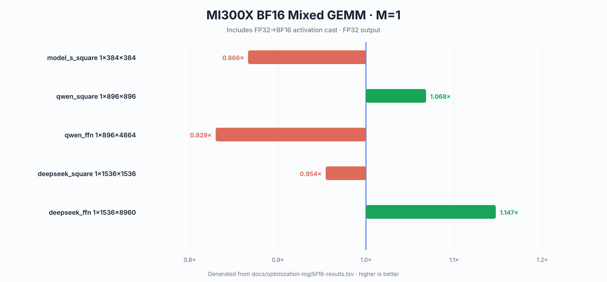

```text
1×384×384    0.87× FP32
1×896×896    1.07×
1×896×4864   0.83×
1×1536×1536  0.95×
1×1536×8960  1.15×
```

所有数字都包含 activation cast，输出保持 FP32。两个 shape 加速，三个 shape 退化，
所以当时的下一步是验证 per-shape policy 和 cached BF16 weights，而不是直接加一个
“全部 BF16”按钮。Experiment 015 随后实测并否决了这条候选。BF16 结果单独画图，
不能接到 FP32 1.770568 曲线上。

## 25. Experiment 015：算子快，不等于把它塞进模型就会快

Experiment 014 只有两个 shape 胜过 FP32。候选因此没有打开“全局 BF16”，而是只对
`896×896` 和 `1536×8960` 做精确 allow-list，并缓存对应 BF16 权重。

结果仍然失败：

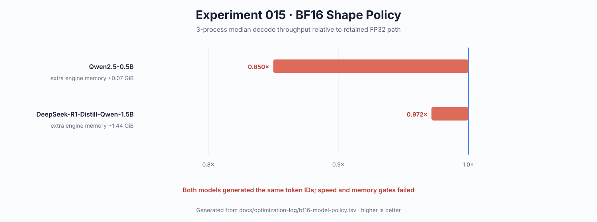

```text
Qwen median       147.41 → 125.29 token/s  -15.0%
DeepSeek median    53.36 →  51.85 token/s   -2.8%
extra memory       +73.5 MiB / +1.44 GiB
generated tokens   exact match
```

为什么“小算子加速”没有兑现？当前设计每次 Linear 仍要把 FP32 activation 转成 BF16，
并长期保存一份额外的 BF16 权重。Kernel 选择、cast 和内存代价合起来超过了两个 shape
的局部收益。因此模型 precision enum、cache 和 CLI 全部删除。

保留下来的是更小、证据更完整的能力：`bf16_matmul` 自动求导原语。前向对两个输入按
BF16 舍入并以 FP32 累加，反向使用 FP32 master tensors 计算梯度。它通过独立 PyTorch
前向/反向 oracle，但这只是一块训练地基，绝不等于“整网 BF16 已跑通”。

## 26. Experiment 016：融合连续的两个小算子

最新 DeepSeek trace 里，bias 和 split-half RoPE 分别占 4.9% 和 2.9% Kernel 时间。
Q/K projection 总是先加 bias 再做 RoPE，所以候选让一个 Kernel 直接读取原 projection
与 head-aware bias，并写出旋转后的结果；V bias 仍走原路径。

这次没有只比较历史单点，而是在同一时段独立构建旧 commit，让 baseline/candidate
各跑三进程中位数：

```text
Qwen train          112.32 → 112.43 token/s   +0.1%
Qwen generate       124.88 → 142.01 token/s  +13.7%
DeepSeek train       67.15 →  67.41 token/s   +0.4%
DeepSeek generate    52.05 →  55.50 token/s   +6.6%
fixed-reference score         1.770568 → 1.784147
```

Profiler 的因果链也吻合：总 Kernel 调用 11,804→10,684，正好少 1,120 次；add_bias
1,680→560，旧 RoPE 1,120→0，新 fused Kernel 1,120 次。`hipLaunchKernel` API 时间
77.80→65.26 ms，Qwen/DeepSeek inference allocation 分别减少 1,200/5,320 次。

融合操作还有独立 CPU reference、HIP 对照与 PyTorch 前向/输入梯度/bias 梯度 oracle，
不是只在模型里藏一个未经验证的 Kernel。候选保留，但 DeepSeek generation 仍只有
PyTorch 的 0.889×，下一轮还要继续处理剩余 GEMM 和 launch 结构。

## 27. Experiment 017：综合分变好，也要写下单项退化

Block 的第一条 residual 后面立刻接 FFN RMSNorm，但 residual 本身还要给第二次 add。
新 Kernel 因此同时输出 `{sum, normalized}`，每层少一个 launch，训练图保持原样。

```text
Qwen generation      +8.9%
DeepSeek generation  -4.2%
score                 1.784147 → 1.803226
Kernel calls          10,684 → 10,152
```

这次最值得保留的不是更高总分，而是矛盾证据：rocprof 插桩下 DeepSeek 从 28.28 提高到
29.74 token/s，三进程未插桩中位数却下降 4.2%。候选仍满足“任何单项不得退化超过 5%”
且总分提高，因此保留；但报告明确写出 DeepSeek 退化，下一轮不能把它当作已解决。

## 28. Experiment 018：用失败找到真正需要调的 shape

节点 017 的 DeepSeek 退化留下了一个具体问题：同一个 fused Norm Kernel 同时服务
896 和 1536 两种 hidden width。候选只让 width≥1024 使用 512 threads，896 路径不动。

```text
DeepSeek generation   53.20 → 58.32 token/s  +9.6%
target Kernel          6.46 →  4.83 μs       -25%
score                  1.803226 → 1.845199
```

这不是“512 总比 256 好”。目前只测了两种官方 hidden width，1024 边界只是一条有证据
的两区策略。更多 width 没测之前，不能把它包装成通用 autotuner。

## 29. Experiment 019：少一些空闲线程，反而更慢

cached Attention 固定用 256 threads，而两个模型 head width 只有 64/128。把 block 缩成
64/128 看起来很自然，但三进程中位数直接否决了它：

```text
Qwen generation      -6.6%
DeepSeek generation  -4.9%
score                 1.845199 → 1.791371
```

较大 block 可能在隐藏串行 dot-product、内存访问或 occupancy 上更有利。候选代码删除，
灰点保留。这再次说明“线程利用率看起来更高”不能替代端到端测量。

## 30. Experiment 020：全算法搜索也要过模型门

`hipblaslt-bench --algo_method all` 为 DeepSeek 的 `1×1536×1536` 找到了 explicit
solution。初次结果看起来非常快，但 100 次稳定复测只有：

```text
explicit solution    9.50 μs
default heuristic    9.87 μs
DeepSeek median      58.32 → 56.39 token/s  -3.3%
```

Kernel 确实换了，数值也正确，但端到端没有兑现。版本/shape 硬编码全部删除。这个灰点
比“调优成功”更重要：即使使用官方全搜索，仍不能跳过重复模型测量。

## 31. Experiment 021：API 调用少了，为什么还要拒绝

thread-local device cache 把 DeepSeek trace 的 `hipSetDevice` 从 30,669 次降到 1 次，
插桩 decode 也从 29.27 提高到 31.07 token/s。但未插桩四项全部下降：

```text
Qwen generate      -8.6%
DeepSeek generate  -5.2%
Qwen train         -4.9%
DeepSeek train     -1.7%
```

此外，外部库若直接改变当前 HIP device，thread-local 假设可能过期。API 数量和 profiler
都不能覆盖真实矩阵与互操作风险，所以代码删除。

## 32. Experiment 022：八块内存共用一个完成标记

exact-size pool 原来每释放一个 Tensor 就创建并记录一个 Event。新设计把默认 Stream 上
连续退休的八块内存放在同一完成边界后面；只有共享 Event ready，任何一块才能复用。

```text
Event record calls      8,993 → 1,124
Event record API time   24.39 → 1.95 ms
Qwen train/gen ratio    3.016× / 2.869× PyTorch
DeepSeek train/gen      3.126× / 1.206× PyTorch
score                   1.845199 → 2.389841
```

Kernel launch 数完全没变，说明收益来自 allocator 生命周期开销，而不是偷偷换了计算。
不满八块的尾批次会在显式 synchronize 前提交；external Stream 仍永久禁用 pool。

## 33. Experiment 023：批次继续变大，必须重跑四项

把 Event batch 从 8 调到 16 后，Event record 1,124→562。未插桩三进程结果是：

```text
Qwen train/generate      +2.6% / +8.4%
DeepSeek train/generate  -1.1% / +3.8%
score                    2.389841 → 2.470863
```

插桩 DeepSeek 反而变慢，backend allocation 也有小幅增加；这些代价都写进报告。16 被
保留是因为固定矩阵通过，而不是因为“batch 越大越好”。

## 34. Experiment 024：Event 不是越少越好

batch 32 虽然继续减少 Event，却让 block 等待更久：Qwen generation -4.8%，score
`2.470863 → 2.462231`，backend allocation 也增加。候选删除，16 成为当前测量矩阵的
局部最优，而不是拍脑袋常量。

## 35. Experiment 025：小收益也要三进程

K/V cache 原来分两次写同一 position。合并后 Qwen/DeepSeek generation 中位数分别
+0.4%/+0.8%，score `2.470863 → 2.478439`。收益很小，所以只有三进程都完成、两项都
不退化且直接测试通过后才保留。

## 36. Experiment 026：少一次 allocation 仍可能更慢

V bias 融入 cache store 后，Qwen/DeepSeek allocation 少 600/2660 次，但 generation
中位数下降 4.4%/1.0%。候选删除，说明 allocation 数也不能脱离端到端结果解释。

## 37. Experiment 027：shared memory 不是免费缓存

query 预载入 shared memory 后，Qwen +0.18%，DeepSeek -1.63%，score 下降。短 sequence
下 global query 已被硬件 cache 命中，额外 copy/sync 反而不值，候选删除。

## 38. Experiment 028：补完中间点再说局部最优

Event batch 24 的首轮四项全部低于 16，score 仅 `2.430451`。结合 8/16/24/32 四点，
当前矩阵的局部最优才可以写成 16，而不是只凭两个端点猜测。

## 39. Experiment 029：跨层融合改变调度节奏

第二条 residual 与下一层 Norm 融合后少 28 个 launch，但 Qwen -4.4%、score 降到
2.456886。数学相同不代表 allocator/Kernel 调度相同，候选删除。

## 40. 怎样读进度图

图中：

- 灰色点：完整跑过但 discard；
- 红色叉：crash/invalid；
- 绿色点：keep；
- 绿色阶梯：running best；
- 虚线：固定 PyTorch parity 1.0；
- 右侧条形：当前四项 workload ratio；
- 底部卡片：计划步骤，不代表已经完成。

FP32 主图当前有 baseline 和十四个 keep 实验共十五个绿色点，以及十三个 discard 灰点；
BF16 独立图另有一个被否决的模型策略。未来如果十个实验都失败，图上就应出现十个
灰点，而不是凭空出现一条漂亮上升曲线。

## 41. 什么才算从 0 到 1

完成一个 Kernel 不是 1，某个 shape 跑得快也不是 1。

本专项的“1”需要：

1. 固定 Qwen/DeepSeek train/generate 四项矩阵达到既定门；
2. exact tokens、loss、gradients 和 updates 仍通过；
3. 显存口径诚实；
4. 优化前后 raw JSONL 和 profiler 可追溯；
5. discard/crash 没有被删除；
6. 新学习者能沿日志重放关键实验；
7. 所有结论都写清适用 GPU、dtype、shape 和版本。

下一篇更新继续 Step 08 的 prefill/backward，或依据新 trace 选择更高收益热点。

## 42. 当前为什么暂停局部 FP32 小改动

最近的 allocator batch、Attention staging、bias/store 和跨 Block fusion 已形成连续反例。
这不表示“无法继续优化”，而表示同一类局部 M=1 改动已经饱和。下一阶段必须建立 BF16
activation island、packed weights、HIP Graph 或 prefill/backward 的新合同和新曲线。

完整边界见 [局部优化饱和审计](SATURATION.md)。在新 track 有可靠 baseline 前，不再用
旧 FP32 score 包装架构变化。

## 43. Experiment 030：不要每做一步都换一次“作业本”

第一次 BF16 模型策略失败，是因为每个 Linear 都把 activation 从 FP32 转成 BF16，算完
又回 FP32，而且长期保存 FP32/BF16 两份权重。这一次先不碰整网开关，只连接 FFN：

```text
FP32 residual
    ↓ 一次 cast
BF16 gate ─┐
BF16 up   ─┴→ BF16 SwiGLU → BF16 down
                                  ↓
                              FP32 residual
```

这就是 activation island：相邻、能接受同一 dtype 的算子住在一个“小岛”上，只在岛的
入口和出口换格式。`bf16_ffn` 接收已经是 BF16 的三份权重，不偷偷缓存第二份权重。

## 44. 小方阵通过，不代表真实模型 shape 通过

128×128 smoke 全绿后，真实 Qwen decode `M=1,K=896,N=4864` 仍被 hipBLASLt 以状态 6
拒绝。继续测 M=2/8/16/32 也失败，M=64 才成功。这里不能写死“MI300 阈值就是 64”，
因为不同 K/N、ROCm 版本和算法可能不同。

最终实现按 `(M,K,N)` 记住本机实际结果：直接 BF16 输入、FP32 输出失败时，改用 BF16
输出再在 GPU 上 cast；同 shape 的后续层不再重复撞墙。这个失败被加入 Qwen decode
shape 的 HIP test，而不是藏在实验笔记里。

## 45. 三进程结果与新的 BF16 图

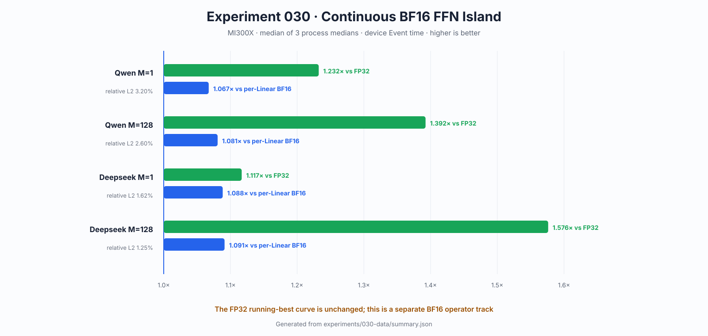

四个固定 shape 全部通过误差与零 payload transfer 门：

| Shape | 相对 FP32 | 相对逐 Linear BF16 |
|---|---:|---:|
| Qwen M=1 | 1.232× | 1.067× |
| Qwen M=128 | 1.392× | 1.081× |
| DeepSeek M=1 | 1.117× | 1.088× |
| DeepSeek M=128 | 1.576× | 1.091× |

每项都是三次独立进程中位数的中位数；每个进程先热身 5 次，再测 20 次。36 条 raw
JSONL 全部保留。rocprof 只用于数 dispatch，不用于速度，因为插桩把单次时间放大到近
一秒。去掉两条路径共同的 setup/reference 后，Qwen M=1 从 8 个 dispatch 降到 6 个，
FP32→BF16 input cast 从 3 次降到 1 次。

## 46. 为什么仍不能说“BF16 模型跑通了”

Experiment 030 当时只证明了一个 FFN 算子岛，尚未决定怎样只保存一份 BF16 inference
权重，也没有完成官方整网证据。因此它没有改动 FP32 running-best。下一节记录
Experiment 031 怎样补上这道门，以及为什么补完后仍不能声称全面 PyTorch parity。

## 47. Experiment 031：模型里只留一份 FFN 权重

新的准备 API 先把每层三个 FFN 权重全部转换成功，再一次性替换原 FP32 权重。复制期间
临时需要两份，成功后只留 BF16；如果分配或 GPU cast 失败，原 FP32 模型不变。准备后
只能调用纯 Tensor `forward_inference` 或 cached forward，训练和再次 load 会直接报错。

Qwen 72 个、DeepSeek 84 个 FFN Tensor 被替换。常驻权重分别从
`1,976,131,072→1,348,558,336` 字节和
`7,108,352,000→4,796,241,920` 字节。事务准备峰值也没有隐藏：分别是
`2,603,703,808` 与 `9,420,462,080` 字节。

## 48. 相对自己变快，不等于达到 PyTorch 门

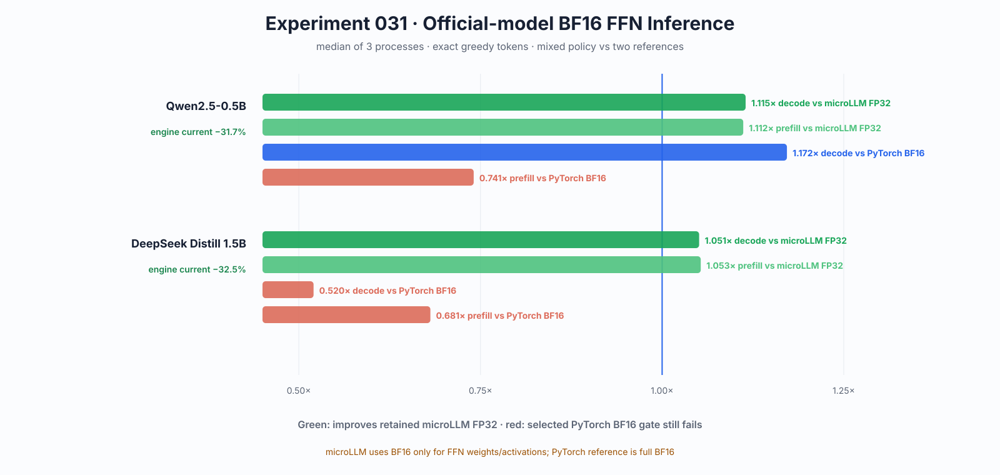

三进程 paired 中位数显示，Qwen/DeepSeek decode 相对 microLLM FP32 提高
`1.115×/1.051×`，prefill 提高 `1.112×/1.053×`，exact token 全通过。但 PyTorch
使用整网 BF16，四项对比只有 Qwen decode 为 `1.172×`；Qwen prefill、DeepSeek
decode/prefill 仅 `0.741×/0.520×/0.681×`。

所以代码保留，因为它确实更快、更省常驻内存；“≥ PyTorch”结论不成立，红条也留在图
里。下一轮应该 profile BF16 full-sequence 和 DeepSeek decode，而不是把 partial keep
写成全面胜利。

## 49. Experiment 032：热点不一定在 Kernel 里面

独立 `prefill` workload 显示，热身后仍没有启用项目已经实现的 caching allocator。
换句话说，Kernel 数学没有错，生命周期边界错了：pool 直到 decode 热身后才打开。

把“启用 pool + 重置计数”移动到 prefill 热身结束处，只改了执行阶段，不改 Tensor、
权重或模型结构。三进程结果中，Qwen/DeepSeek BF16 prefill 提高 `1.642×/1.535×`；
FP32 也提高 `1.636×/1.537×`，说明根因不是 BF16 特例。

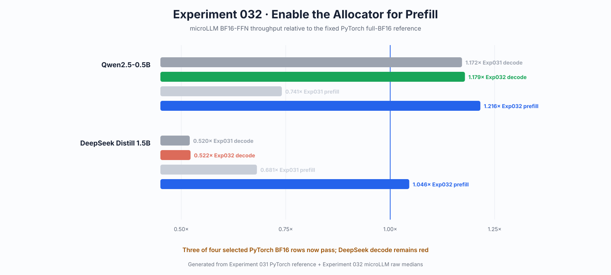

Qwen decode/prefill 和 DeepSeek prefill 现在分别达到 PyTorch BF16 的
`1.179×/1.216×/1.046×`。DeepSeek decode 仍只有 `0.522×`。四条全绿的目标尚未完成，
但下一步已经被压缩成一个明确 workload。

## 50. Experiment 033：剩下的红条时间花在哪里

用 `--workload decode` 单独抓 DeepSeek 后，10,038 个 dispatch 中，GEMM 占 Kernel 时间
67.64%，fused cached Attention 占 10.22%，BF16 cast 占 6.16%。GEMM 调用数还能手算：

```text
28 层 × 19 次 cached forward × 每层 7 个 Linear + 19 次 output head = 3743
```

每层 7 个 Linear 里，只有 gate/up/down 三个 FFN 权重是 BF16；Q/K/V/O 仍是 FP32。
PyTorch 对照却是整网 BF16。下一步因此只扩展 Attention Linear 的单份 BF16 所有权，
第一版仍保留 FP32 KV cache、Norm 和 softmax，避免一次改变两类数值边界。

## 51. Experiment 034：三个投影不要抄三次输入

直接把 Q/K/V/O 权重换成 BF16 后，Q、K、V 各自把同一个 normalized input cast 一次。
官方 pilot 中 DeepSeek decode/prefill 反而下降 `2.1%/3.8%`。这条失败没有删。

第二版先 cast 一次，再把同一 BF16 input 交给三个 projection。三进程中，Qwen
decode/prefill 提高 `2.9%/6.9%`；DeepSeek decode 提高 2.0%，prefill 下降 2.7%，仍在
单项 5% 门内；权重再省约 88 MB/308 MB。

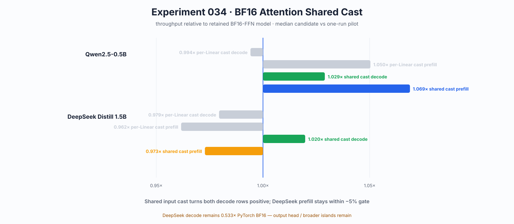

DeepSeek decode 相对 PyTorch 只从 `0.522×` 到 `0.533×`。所以 shared cast 值得保留，
但 Attention 权重 BF16 不是最终答案；下一步要重新 profile retained candidate。

## 52. Experiment 035：Kernel 变快以后，host 工作露出来了

保留 Attention BF16 后再 profile，GEMM Kernel 总时间从 160.7 ms 降到 70.5 ms，
但 dispatch 从 10,038 增到 11,214。每个 BF16 GEMM 仍在 host 创建并销毁一个
description 和三个 layout；3,743 次重复工作不在 Kernel duration 里。

这里不能直接复活 Experiment 007 的 FP32 cache。旧方案在固定矩阵上让 Qwen generation
和 DeepSeek training 越过 5% 回退门。新问题只允许缓存 BF16 mixed/output path，key 是
`(M,K,N,output dtype)`，thread-local、immutable，不碰 algorithm、FP32 或 FP8 scale pointer。

## 53. Experiment 036：相同形状的“表格说明书”只写一次

第一次 exact shape 创建 plan，以后只换数据地址并复用 description/layout。公开统计 API
可以看 entries/hits/misses，测试强制“第一次 miss、第二次 hit、clear 后归零”。

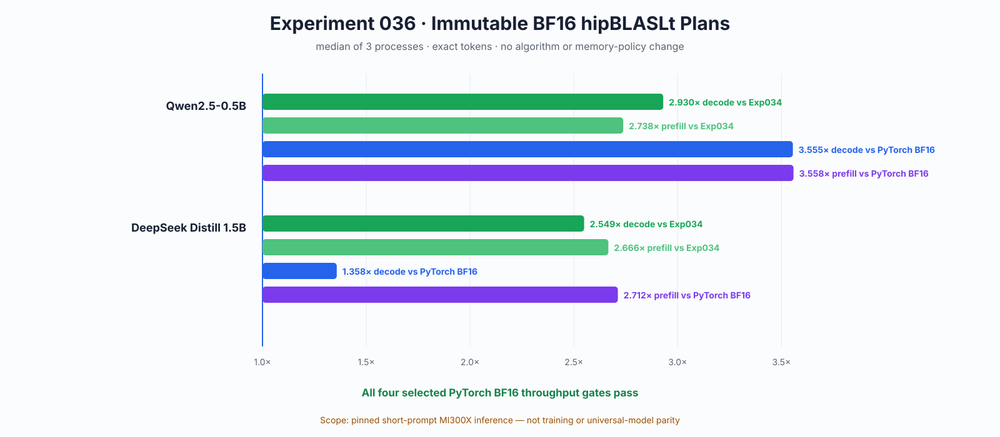

三进程中，Qwen decode/prefill 达到 `261.37/517.21 token/s`，DeepSeek 达到
`76.83/1713.01`。相对 Experiment 034 分别提高 `2.93×/2.74×` 与 `2.55×/2.67×`；
相对 PyTorch 全 BF16 四项最低也有 `1.358×`。

这让用户要求的固定 Qwen/DeepSeek 短 prompt inference 矩阵第一次 4/4 过线，但不是
“框架全面完成”。训练、长上下文、batch>1、多卡、Radeon 与其他 ROCm 版本必须建立
各自曲线，不能接在这条短 prompt 图后面。

## 54. Experiment 037：训练不能把 FP32 master 扔掉

推理可以只留 BF16 权重，训练不行。新策略只在 Linear forward 舍入到 BF16；参数、
gradient 和 AdamW moment 都是 FP32。Python 用自定义 STE-BF16 autograd 重建了整个
Transformer，不只对一个 GEMM；logits、loss 和每个参数梯度都通过。

直接让 PyTorch 参数本身变成 BF16 时，`1e-5` 更新被舍入掉，观察参数完全不变。这个
失败促使 reference 改为 PyTorch BF16 autocast + FP32 参数，与 microLLM master 合同一致。

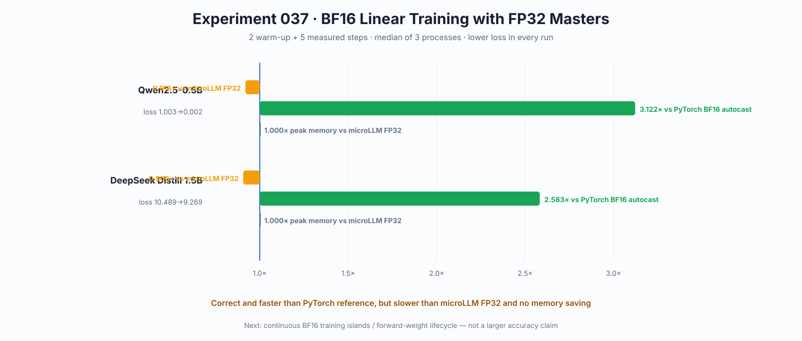

Qwen/DeepSeek microLLM BF16 训练是 PyTorch autocast 的 `3.12×/2.58×`，loss 轨迹接近；
但只达到 microLLM FP32 的 `0.918×/0.906×`，峰值显存一字节也没少。结论是训练已经
“能正确跑”，还没有成为本项目内部的性能优化。下一节点要减少 forward 中重复 cast，
同时守住 FP32 master/gradient/update。

## 55. Experiment 038：GEMM 的收益被 cast 吃掉

同一 Qwen 单步 trace 中，BF16 GEMM 从 6.39 ms 降到 5.06 ms，但新增 360 次 cast，耗时
1.91 ms。结果是总 Kernel 时间反而从 25.15 ms 增到 26.02 ms，allocation 也从 1840
增到 2201。低精度矩阵核确实更快，训练 step 却更慢，两句话可以同时成立。

## 56. Experiment 039：少 240 次 allocation 还是不够

Q/K/V 共用 input，理论上 Qwen 每 5 步少 `24×2×5=240` 次 cast/allocation，DeepSeek 少
280 次；实测精确命中。但三进程吞吐相对 BF16 baseline 是 Qwen `0.973×`、DeepSeek
`1.009×`，几何约 `0.991×`。

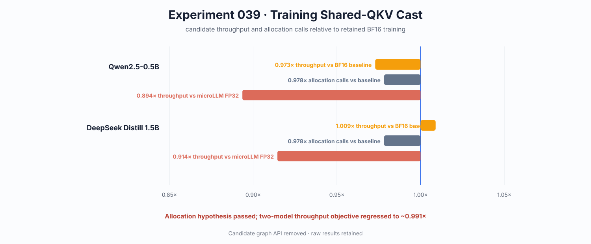

因此训练 graph 的 ValueTriple/API 和模型分支删除。推理同名 shared-QKV op 仍保留，
因为它有独立通过的证据。训练下一步必须形成更大的连续 FFN island，而不是继续堆小图节点。

## 57. Experiment 040：别在每道题前重抄一次课本

BF16 forward 需要 BF16 权重，AdamW 又必须保留 FP32 master。旧实现每次经过 Linear 都
把 master 临时 cast 一次，相当于答每道题前重新抄一本课本。新的做法是在加载权重后建立
一份 BF16 “影子课本”，以后 forward 直接读它。

难点不是创建副本，而是保证它永远不旧。AdamW Kernel 现在先更新 FP32 master，再在同一
个 GPU launch 中把新值舍入到 BF16 mirror。checkpoint 不保存这份派生数据；恢复 FP32
权重和 optimizer state 后，`load_state` 会重建 mirror。测试还故意把 mirror 填成 99，
确认恢复会纠正它。

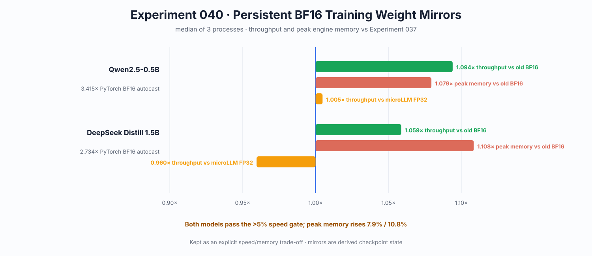

三进程中位数里，Qwen 从 `138.66` 提高到 `151.69 token/s`，DeepSeek 从 `74.06`
提高到 `78.41 token/s`。两者都超过 5% 收益门，Qwen 还达到 microLLM FP32 的
`1.005×`。代价也同样清楚：Qwen 多留约 683 MiB 镜像，DeepSeek 多留约 2.88 GiB，
峰值显存分别增加 7.9% 和 10.8%。

因此它不是“免费加速”，而是显式速度/显存选项。下一步不再复制权重，而是尝试让相邻
Linear 共用更长的 BF16 activation island；如果只是减少 cast 数却不能提高两个模型的
端到端吞吐，就像 Experiment 039 一样删除候选。

## 58. Experiment 041：先问尺子有没有变

连续 FFN island 的数值门很顺利：入口只 cast 一次，gate/up/SwiGLU 保持 BF16，专用
backward Kernel 读取 BF16 保存值但输出 FP32 梯度。tiny Transformer 的 logits、loss 和
每个参数梯度都与 PyTorch 手写 oracle 对齐。

性能第一眼却很吓人。三个 Qwen 进程只有 `18.74–18.92 token/s`，而 Experiment 040
是 `151.69`。如果立刻写结论，会得到“新 graph 慢 8 倍”。Profiler 却显示没有修改的
transpose backward、AdamW、fill 和 cast 也一起慢了。于是同一时刻重跑旧路径，结果也
只有 `18.685 token/s`：变的是共享 GPU 执行窗口，不是单独一个新 Kernel。

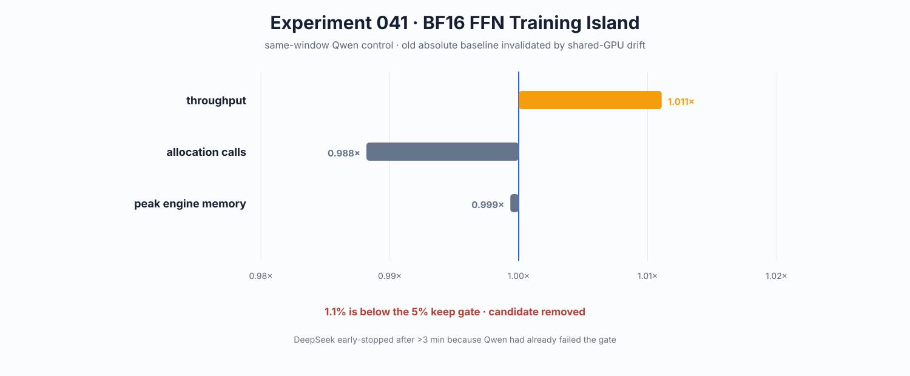

有效比较只剩同窗口的 `18.892/18.685 = 1.011×`。虽然五步 allocation 从 10,160 降到
10,040、峰值略降、参数更新正常，但 1.1% 没过 5% 保留门。DeepSeek 第一进程超过三分钟
仍未结束，而 Qwen 已经决定 discard，因此按早停协议终止。

这次最重要的优化不是代码，而是解释：旧基线与新候选若处在不同负载窗口，除法也会撒谎。
候选 API/Kernel/测试全部删除，raw、early-stop 和 profiler 聚合留下来。

## 59. Experiment 042：把一个点展开成一条 shape 曲线

此前官方训练只有 `[batch=1, context=3]`。这不是“小 shape 也能代表大 shape”，而是根本
没有第二个点。现在 C++ CLI、manifest、PyTorch 参考和比较器共同记录 batch、context 与
`batch×context×steps`，CI 还会故意检查“请求 batch=2 却静默跑 batch=1”的失败。

正式矩阵每个 shape 都跑两框架各三个新进程，并交换奇偶轮顺序：

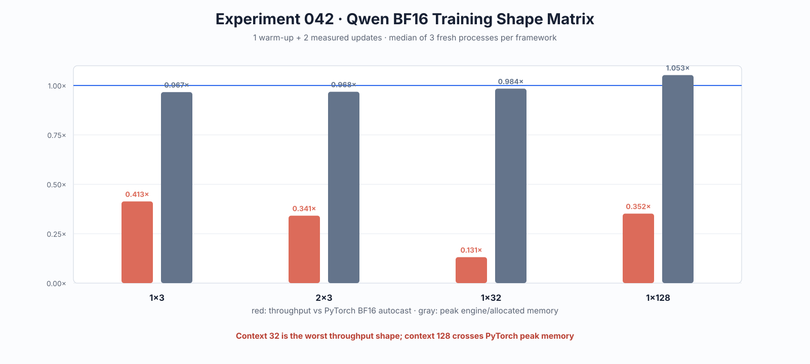

microLLM/PyTorch 吞吐比从 `1×3` 的 `0.413×` 降到 `1×32` 的 `0.131×`，然后在
`1×128` 回升到 `0.352×`。显存比则从 `0.967×` 增到 `1.053×`。所有 loss 有限，所有
观测参数更新，microLLM optimizer 区域仍没有 Tensor payload 搬运。

最反直觉的是，microLLM context 32 每步约 534 ms，context 128 反而约 195 ms。GPU 是
异步的，标成 optimizer 的 488 ms 很可能是前面计算在同步点还债，并不能直接怪 AdamW。
下一步同时 profile 32 和 128，看看是 GEMM solution、reduction、cast 还是 allocator 在
不同 M 上发生了分岔。

## 60. Experiment 043：不是矩阵小，而是看错了矩阵的方向

profile 给出了非常集中的答案。context 32 有 507 次 readable
`transpose(left) @ right`，总共 1.228 秒，占 Kernel 时间 75.75%；context 128 没有这
一项。旧 Auto 规则要求 reduction K 至少 128 才进 hipBLASLt，恰好把 K=32 的权重梯度
挡在库外。

权重梯度虽然 reduction 小，输出却很宽。例如 `896×32×4864`。精确 micro-benchmark
显示，hipBLASLt 在六个 K=3/32 shape 上快 `1.54×–21.99×`，最大误差只有 `2.4e-7`。
因此新规则不降低所有 GEMM 门槛，只识别 `transpose(left)` 且输出两边都至少 128 的
宽权重梯度；registry 仍可对 exact `(M,K,N)` 强制回退 readable。

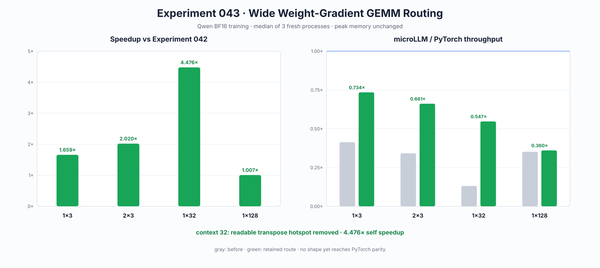

三进程官方结果中，`1×3、2×3、1×32、1×128` 分别提高
`1.659×、2.020×、4.476×、1.007×`。context 32 总 Kernel 时间从 1.621 秒降到
0.382 秒，507 次 readable transpose 热点消失；峰值显存四项完全不变。

这次仍没有达到 PyTorch parity。优化后的最好一项是 0.734×，context 128 仍只有
0.360×。但我们已经把“长 context 慢”改写成更准确的问题：哪些 backward shape 没有
进入合适的 GEMM 实现。

## 61. Experiment 044：Attention 不一定需要那两张大表

旧训练图先生成 T×T score，再生成 T×T probability；GQA 还会把 K/V head 复制到 query
head 数。backward 保存并反向走过这些 Tensor。新的 causal GQA Kernel 直接从原始
Q/K/V 计算每个因果行，在 shared memory 做稳定 softmax，然后写 context。

反向不保存 probability 表，而是重新计算一行概率，再输出 FP32 Q/K/V 梯度。多个 query
head 共享同一 KV head 时，用原子加法汇总 K/V 梯度。sequence 超过 4096 或 head width
超过 256 时，仍走可读组合路径。

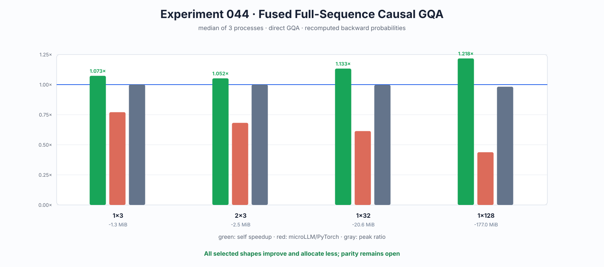

正式三进程中，四个 shape 都改善：短 shape `+5.2%–7.3%`，context 32 `+13.3%`，
context 128 `+21.8%`。context 128 峰值显存减少约 177 MiB，dispatch 少 1080 次。

这次还有一个有用的小失败：最初 trace alignment 报 14 个 missing checkpoint，但数值
checkpoint 全通过。原因是 PyTorch trace 还把融合内部写成六个旧算子。把两边都对齐到
`causal_gqa_attention` 公共边界后，数值、梯度和 trace 拓扑一起通过。

## 62. Experiment 045：测量半秒，不该先等七分钟

DeepSeek 的第一轮 shape pilot 暴露了另一个完全不同的瓶颈：每个 microLLM 进程大约
6–7 分钟后才输出，而真正 measured step 只有 0.4–0.65 秒。代码先随机生成 1.78B 参数，
把这些垃圾初值复制到 GPU，再从 safetensors 读取真正权重；大矩阵还在 CPU transpose，
随后 `to_vector()` 再复制一次。

新的未初始化模型在完整 strict load 前禁止 forward。移动到 GPU 只分配，不复制垃圾；
safetensors 直接加载到模型设备，transpose 在 GPU，StateDict 与模型所有权仍独立。
DeepSeek `load_ms` 稳定到约 65 秒，整个进程约 80 秒。它比以前快很多，但仍比 PyTorch
约 2 秒的 load 慢约 30 倍，因此不是加载优化终点。

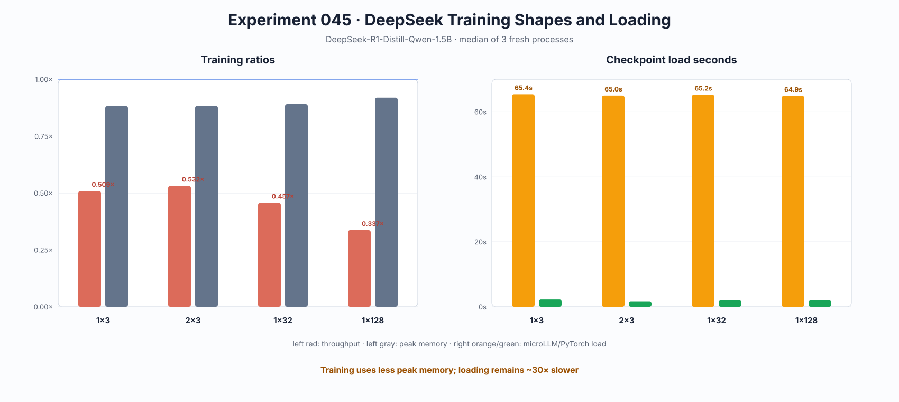

正式三进程中，DeepSeek `1×3、2×3、1×32、1×128` 分别达到 PyTorch 吞吐的
`0.509×、0.532×、0.457×、0.337×`；显存峰值低 8%–12%。这证明前两轮 Qwen 优化可以
迁移到 1.5B 架构，也把长上下文差距和加载差距明确留在图上。

## 63. Experiment 046：最大的柱子也可能不属于训练

DeepSeek `1×128` 的新 profile 从进程启动开始，覆盖 checkpoint 加载、一次 warm-up 和
两次 measured step。7,890 次 Kernel 共用 1.369 秒。第一名 AdamW 占 `32.94%`，第二名
`strided_copy` 占 `23.00%`。

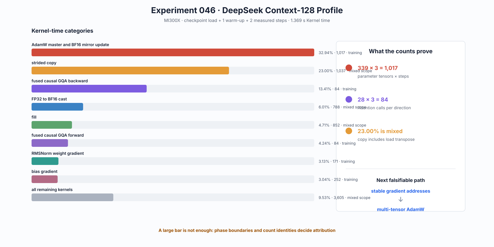

不能只看第二根柱子的高度。Experiment 045 已把 Linear transpose 移到 GPU，所以
`strided_copy` 同时记录了加载期和训练期。它没有单独时间边界。反过来，AdamW 的调用数
恰好是 `339×3=1,017`；Attention 前后向也分别是 `28×3=84`。这两组计数给出了更强的
阶段证据。

因此下一步不是泛化地“消灭 copy”，而是把每步 339 次 AdamW launch 合并。但一个细节挡在
前面：现在 `zero_grad()` 会丢掉梯度 Tensor，下一步地址可能变化。直接缓存 device pointer
会得到悬空地址。先把梯度 buffer 做成稳定资源，再做 multi-tensor optimizer，顺序不能反。

## 64. Experiment 047：地址稳定了，速度却退了

第一版让每个叶子持有自己的 FP32 梯度 buffer。`zero_grad()` 只把它标成无效，不释放
Storage；下一次 backward 的首贡献通过 GPU copy 写入，后续分叉原地相加。CPU/HIP 地址、
重复 backward、`set_grad()` 和零 payload transfer 测试都通过。

第一次性能测试用了 `2+5`，而旧 baseline 是 `1+2`。755.14 和 802.70 看起来可以相除，
协议不同却不能相除。错误协议的六条 raw 没有删除，随后用完全匹配的协议重跑三进程。

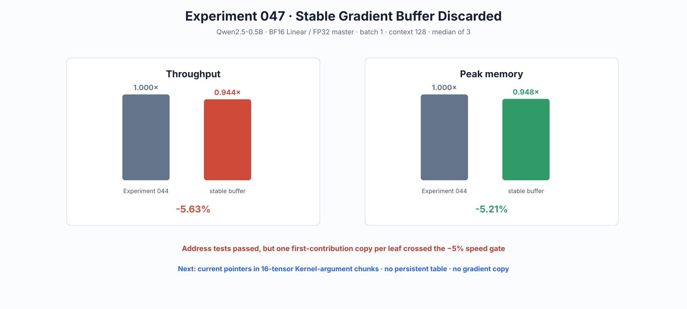

匹配后的吞吐是 `802.70→757.48 token/s`，退化 `5.63%`；峰值从 10.450 GB 降到
9.906 GB。原因很直接：为地址稳定付出了每个叶子一次完整梯度 copy 和一次 launch。
内存好看不覆盖吞吐红线，候选删除。

这次失败还推翻了一个不必要的前提。multi-tensor Kernel 不必跨 step 缓存 gradient pointer；
它可以在 launch 时接收当前地址。下一版每 16 个 Tensor 把指针、长度作为 Kernel 参数传入，
约 339 次 launch 可以降到约 22 次，不需要持久 pointer table，也不需要复制梯度。

## 65. Experiment 048：少了 271 次 launch，反而慢了 42%

第二版不缓存地址。每次 launch 把最多 16 组当前 parameter、gradient、两个 moment 和可选
BF16 mirror 指针作为 Kernel 参数。33 个不同大小 Tensor 的 CPU/HIP 参数、moment、mirror
对齐全部通过，也没有 payload H2D/D2H。

然后出现了本轮最强的反例：Qwen 的 290 次 AdamW launch 确实降到 19 次，`1×128` 却从
802.70 降到 463.00 token/s。大 Kernel 的每个 block 都承担了较大的参数体和 Tensor 映射，
launch 少不代表执行快。

于是只分组小 Tensor。Qwen 有 121 个不超过 4,096 元素的 Norm/bias，DeepSeek 有 141 个；
大矩阵恢复原 Kernel。Qwen dispatch 变成 177 次，再跑完整四-shape 三进程矩阵：

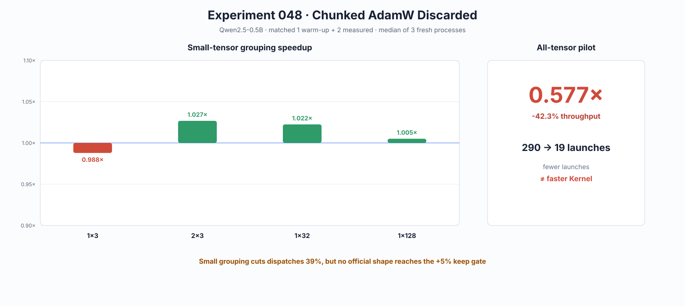

四项变化是 `−1.2%、+2.7%、+2.2%、+0.5%`，显存全部不变。39% 的 launch 减少没有转成
5% 的端到端收益，因此这版也删除。Experiment 046 的 32.94% 并不主要是“小 Kernel 太多”，
而是大参数、梯度和 moment 的内存路径。下一步测大 Tensor 向量化访存，不再围着 launch 数转。

## 66. Experiment 049：算子快 19%，模型还是更慢

新的 float4 AdamW 每线程处理 4 个连续 FP32 元素，并保留标量尾部和 16-byte 对齐检查。
独立 Event benchmark 使用 Qwen/DeepSeek 真实参数元素数。802,816 元素带 mirror 时快
`1.194×`，两个超大带 mirror shape 也快 `1.056×/1.097×`。

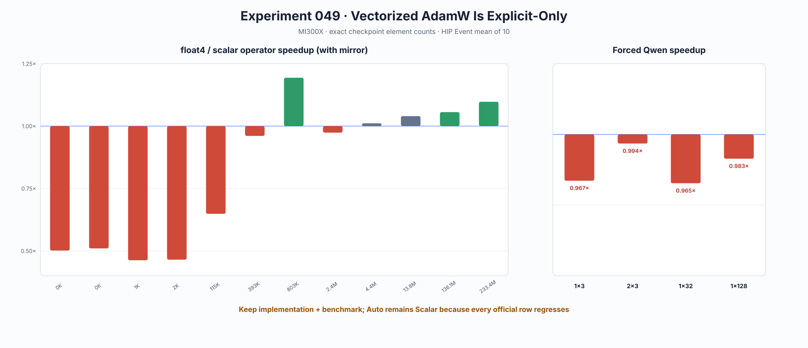

图的右边更重要。真实 embedding/output head 没有 BF16 mirror；去掉 mirror store 后，两个
超大 shape 的 float4 反而只有 `0.970×/0.980×`。width 8 在全部 shape 上更慢。`rsqrt`
变形第一次还在 zero moment 上产生 NaN；补齐 epsilon 边界后数值通过，速度仍更慢。

最后强制 Qwen 所有参数走 Vectorized，四 shape 都退化 0.6%–3.5%。所以 `Auto` 继续选择
Scalar。Vectorized 和独立 benchmark 作为显式研究接口保留：它证明框架能注册、选择、测量
优化实现，也证明局部快不能自动升级成默认策略。

## 67. Experiment 050：模型有 7 GB，不代表加载要等 65 秒

旧 loader 读到 BF16 后，先在 CPU 逐元素展开成 `vector<float>`，再传 4-byte FP32；GPU 上
还同时保留完整 StateDict 和 prepared 参数。DeepSeek 文件约 3.55 GB，却走了远大于文件的
CPU 解码、H2D 和临时所有权路径。

新路径先只读 header。名字、mapping、rank 和 shape 全部通过后，才按 payload offset 顺序
读取；一个低精度 staging 被所有层复用，cast 与 Linear transpose 直接写模型已有的 FP32
参数 Storage。若文件中途失败，模型仍是 uninitialized，不能 forward。

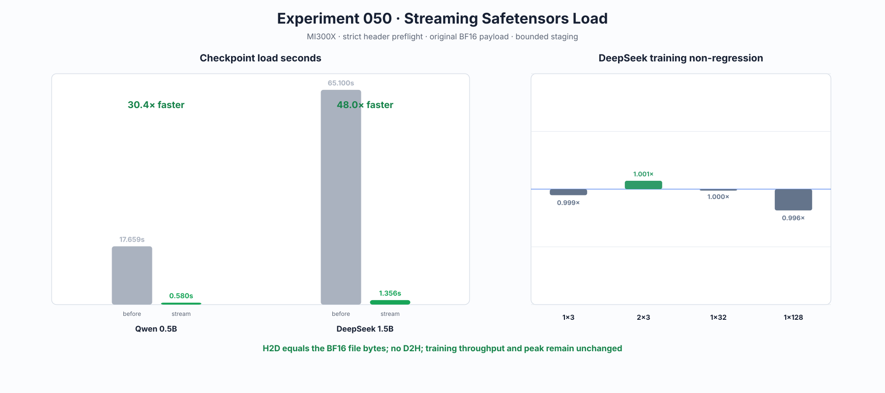

Qwen 从 17.659 秒降到 0.580 秒，DeepSeek 从 65.100 秒降到 1.356 秒。DeepSeek 同窗口
PyTorch 是 2.084 秒。H2D 字节分别是 0.988/3.554 GB，恰好等于 BF16 payload，不再发送
两倍大的 FP32。加载后 current bytes 恰好等于模型 FP32 权重；峰值只多一个最大 staging。

最后重跑 DeepSeek 四 shape 三进程。吞吐相对旧版最多变化 0.4%，训练峰值完全相同；所以
这次是加载架构优化，不是训练计时被移动。单文件 fast path 保留，多 shard/index 仍走原子
StateDict 路径，等待全局 header 预检设计。

## 68. Experiment 051：能跑 512 token，不等于 512 token 跑得好

Qwen 和 DeepSeek 都在 T=512 完成三进程训练，loss 有限、参数更新、加载仍只传 BF16 文件
字节。可吞吐只有 PyTorch 的 `9.78%/8.32%`；Qwen 峰值甚至是 PyTorch 的 1.239 倍。

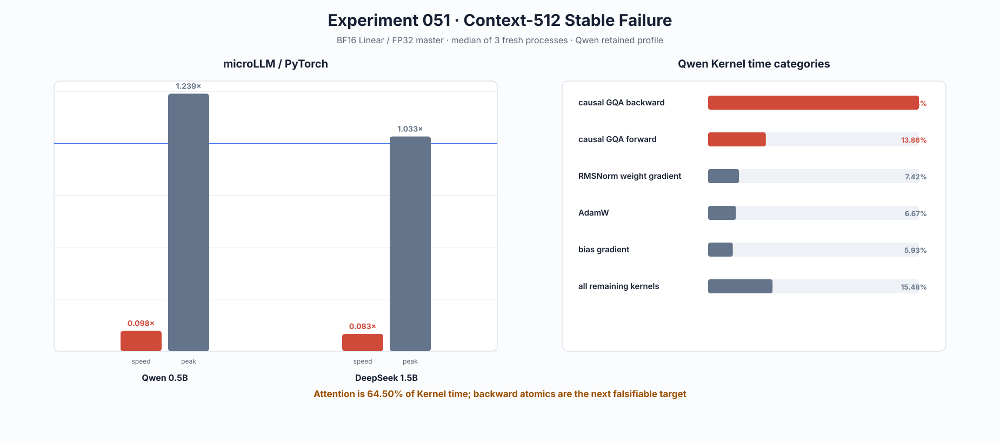

host 计时把 optimizer 标成 0.49–1.01 秒，看起来像 Experiment 046 又回来了。但 rocprof
给出不同答案：Qwen causal GQA backward 占 50.64%，forward 占 13.86%；AdamW 只有
6.67%。optimizer 只是第一个同步点，替前面的 Attention 还债。

当前 backward 每个 query row 重算 softmax，再用 atomicAdd 写共享 K/V gradient。下一版把
row probability/score-gradient 与 K/V reduction 分开，只在长序列启用额外 T×T 临时表；
它必须同时报告速度和新增显存，并保证 T=128 不退化。

## 69. Experiment 052：没有 atomic，不代表没有重复工作

候选先写两张 `[B,H,T,T]` 表，再让每个 K/V 输出元素独占写入。T=256 的 MHA/GQA
Q/K/V 梯度都与 CPU 对齐，未来 token 也没有泄漏。Qwen 每层调用临时增加约 28 MiB。

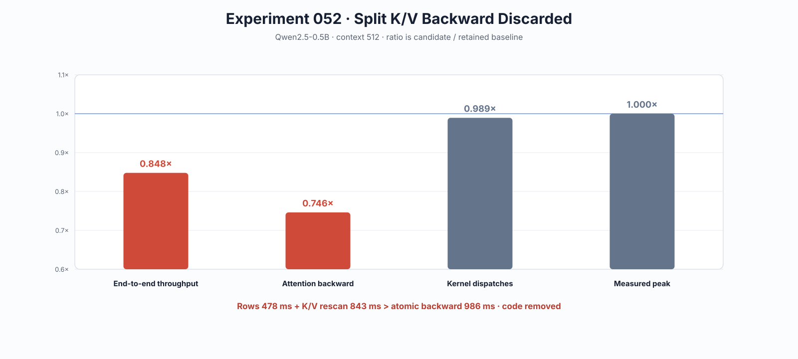

但 T=512 吞吐从 812.45 降到 688.82 tok/s。原 atomic backward 三步共 985.61 ms；新 row
阶段 478.27 ms，K/V reducer 842.58 ms，总计 1320.85 ms。每个输出线程重新扫描 query
position 和重复 head，加上 T² 写读，代价超过 atomic 冲突。

候选删除。这次把下一空间缩小到 tiled GEMM/flash-style backward；再写一个标量 rescan Kernel
已经没有研究价值。

## 70. Experiment 053：先给框架补上“成批矩阵乘”

optimized GEMM 以前只接收 2D，Attention 的 `[B,H,T,D]` 根本进不了 hipBLASLt。新布局把
前置维度展成 strided batch，并把 batch count/offset 写入 hipBLASLt layout；四种 transpose、
FP32/BF16 都与 reference 对齐。

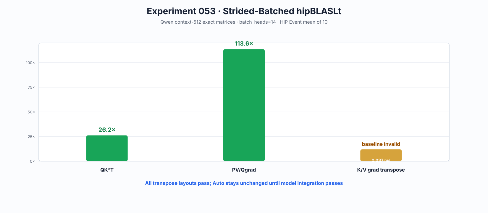

Qwen T=512 的 QKᵀ 从 4.752 降到 0.181 ms，PV/Qgrad 从 4.398 降到 0.0387 ms。
transpose-left 的 library 结果误差只有 1.04e-6，但 readable benchmark 的临时 contiguous
跨了 Stream，误差0.146，因此该 speedup 被排除。保留错误比拿 172× 数字更重要。

这一步只保留算子能力，Auto 规则不变。下一节点才用它重写 Attention backward，并重新过
T=128/T=512/显存门。

## 71. Experiment 054：把 114× 的算子接回模型

T≥256 backward 现在先重算下三角概率和 scaled score gradient，同时算 Q gradient；随后
两次 strided-batched GEMM 计算 K/V query-head 梯度，再用现有 reduction 合并 GQA heads。
第一次 T=256 测试发现上三角没清零，batched GEMM 读到了“未来”；补零后 Q/K/V 全量通过。

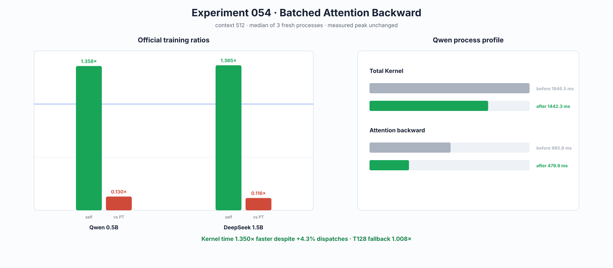

Qwen/DeepSeek T=512 三进程中位数提高 `35.8%/36.5%`，peak 完全不变。Qwen 总 Kernel
时间从 1.946 降到 1.442 秒；atomic backward 的 985.61 ms 变成 row 473.91 ms、batched
GEMM 1.52 ms、GQA reduction 4.49 ms。dispatch 和 HIP API 反而增加约 4%/5%，再次说明
“少 launch”不是目标，端到端设备时间才是。

T=128 保留旧路径，单进程为 `1.008×`。候选保留，但相对 PyTorch 仍只有 0.130×/0.116×；
下一热点是 forward 和 row recompute 本身，需要 flash-style tile reuse。

## 72. Experiment 055：少算一次 softmax，要付 336 MiB

T≥256 的 Autograd forward 现在保存 causal probability；backward 直接计算 `dP` 和 softmax
gradient，不再重算 QK、max、exp 和 denominator。第一次测试忘了清上三角，未来 token 进入
batched GEMM；因果测试失败后补零，才开始跑性能。

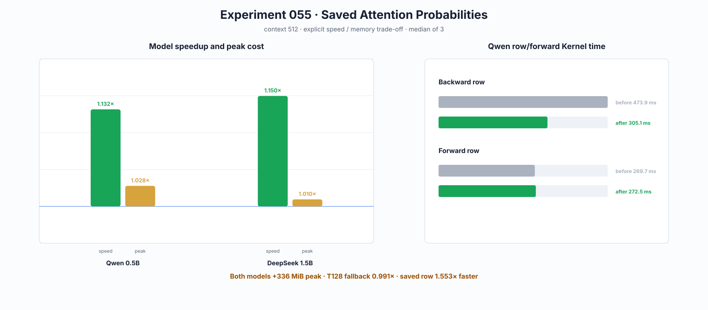

Qwen/DeepSeek 再快 `13.2%/15.0%`，但两者 measured peak 都固定增加 336 MiB。Qwen row
backward 从 473.91 降到 305.15 ms，forward 因写 probability 从269.69微增到272.52 ms；
总 Kernel 再快 1.123×。T128 不保存，单进程0.991×且peak不变。

这版保留为明确 speed/memory tradeoff，不把显存成本藏起来。forward 和 saved-row 已成为
接近的两个热点，下一步只能靠 score/context tile reuse，而不是保存更多整表。

## 73. Experiment 056：多发几个 Kernel，训练反而更快

旧 long-sequence forward 把完整 QK、softmax 和 PV 放在一个容易阅读的 HIP Kernel 中。
它 launch 少，却让每个线程顺序扫描大量 key。新路径只在 `T≥256` 且 hipBLASLt 可用时，
把 K/V 扩到 query heads、query 乘 scale，然后调用两次 strided-batched GEMM，中间保留
因果 softmax；T128 和 library-free build 不变。

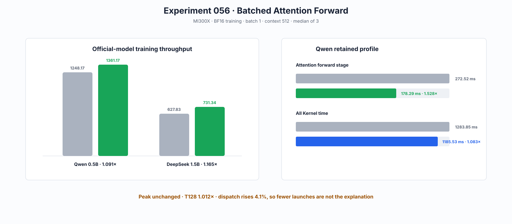

正式三进程中位数中，Qwen `1248.17→1361.17 tok/s`（`1.091×`），DeepSeek
`627.83→731.34 tok/s`（`1.165×`）；两者 measured peak 都逐字节不变。T128 是
`802.47→812.36 tok/s`（`1.012×`），证明阈值没有把短序列拖入 library setup。

rocprof 给出了能反驳“只是 host 计时波动”的设备证据：旧 forward 72 次共
`272.52ms`；新 softmax、两次 GEMM、K/V repeat 和 scale 合计 `178.29ms`，即 `1.528×`。
全进程 Kernel 时间 `1283.85→1185.53ms`。与此同时 dispatch `7055→7343`、HIP API
调用 `259593→266578`。这次明确证明：少 launch 是手段，不是目标；更合适的矩阵硬件
路径即使多发 Kernel，也能得到更快端到端训练。

候选保留。新的 top-5 依次是 saved-row backward、causal softmax、RMSNorm weight
gradient、AdamW 和 bias gradient。下一实验从新 trace 选择一个变量，而不是继续凭模块名猜。

## 74. Experiment 057：把 backward 剩下的三重循环也交给 GEMM

saved-row backward 虽然不再重算概率，但仍用普通循环算 `dP=dO·Vᵀ` 和 `dQ=dS·K`；
72 次占 `306.63ms`。新实现把 dP、dQ、dK、dV 四个矩阵导数全部交给
strided-batched hipBLASLt，手写部分只剩因果 softmax backward 和 GQA head reduction。

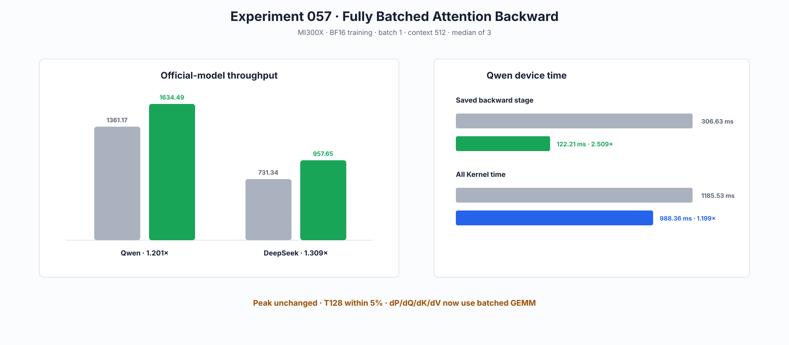

Qwen 三进程中位数 `1361.17→1634.49 tok/s`（`1.201×`），DeepSeek
`731.34→957.65 tok/s`（`1.309×`）；两者 measured peak 仍逐字节相同。T128 没进入
候选路径，单进程为 `0.987×`，没有越过 5% 回退线。

设备证据比 host 的 optimizer 区间更直接：306.63ms row Kernel 完全消失；新增 causal
softmax backward、dP/dQ GEMM、K/V repeat 和 dS scale 共约 `122.21ms`，即 `2.509×`。
全进程 Kernel `1185.53→988.36ms`。dispatch 和 API 调用仍增加约 4%/3%，所以不是
少 launch，而是把矩阵工作放到了矩阵实现上。

候选保留。Attention 的新最大柱子变成 forward causal softmax 169.89ms，backward
softmax 为108.89ms；下一节点应让一个 block 合作处理一行，而不是一个线程顺序扫描512项。

## 75. Experiment 058：一行工作不能只让一个线程干

旧 causal softmax 用一个线程负责一行。T=512 时，它独自求 max、exp、sum、归一化；
backward 也独自求 dot 和每列梯度。新路径只在 T≥256 使用一个 256-thread block 分摊列，
再用 shared-memory reduction 合并 max/sum/dot。短序列仍走旧 Kernel。

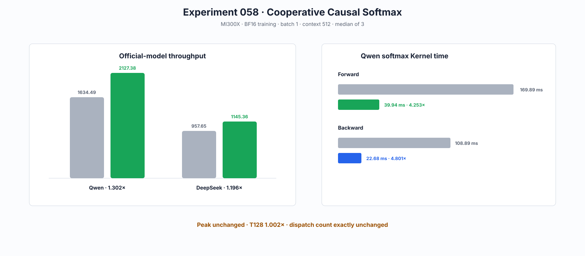

Qwen 三进程中位数 `1634.49→2127.38 tok/s`（`1.302×`），DeepSeek
`957.65→1145.36 tok/s`（`1.196×`）；measured peak 都不变。T128 是 `1.002×`。

设备时间给出了更强解释：forward `169.89→39.94ms`（`4.253×`），backward
`108.89→22.68ms`（`4.801×`），合计 `4.452×`；全 Kernel `988.36→772.84ms`
（`1.279×`）。dispatch 精确保持7631，排除了“少发 Kernel”的解释。

这一节点优化的是训练完整 step 中的 Attention 前/反向，不是 cached decode。它可能帮助
使用 composed causal softmax 的 prefill，但没有推理 benchmark 就不写成推理收益。新最大
柱子已经转移到 RMSNorm weight gradient、AdamW 和 bias gradient。

## 76. Experiment 059：换一个方向，还是同一个串行错误

RMSNorm weight gradient 让一个线程负责一个 hidden column，再串行扫描512行。候选仅在
rows≥256时改成一个block负责一列，线程分摊rows并用shared reduction合并。测试新增
rows=256 × width 16/384/512/896/1536，覆盖forward和两类gradient。

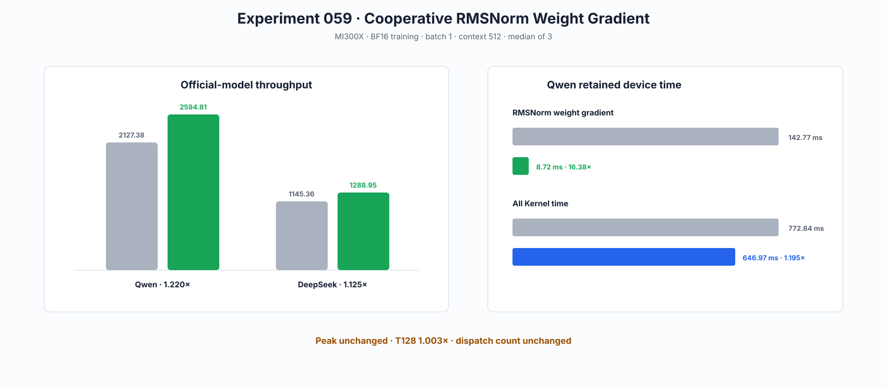

Qwen `2127.38→2594.81 tok/s`（`1.220×`），DeepSeek `1145.36→1288.95`
（`1.125×`），两者peak不变；T128为`1.003×`。目标Kernel `142.77→8.72ms`
（`16.38×`），全Kernel `772.84→646.97ms`（`1.195×`），dispatch仍精确相同。

候选保留。新最大柱子变成AdamW 128.56ms与bias gradient 118.18ms。AdamW已有多次
失败搜索，bias gradient仍有同样的跨row串行结构，因此下一节点先反驳后者。

## 77. Experiment 060：最危险的优化结果，是换一个问题后还继续引用

Experiment 036 的固定短prompt曾4/4超过PyTorch。扩到长context和batch前，先审查
benchmark。subagent第一版把active view当allocated Storage，还让microLLM计入prompt
ingestion、PyTorch使用高层generate。错误pilot没有删除，统一标invalid后重写计时边界。

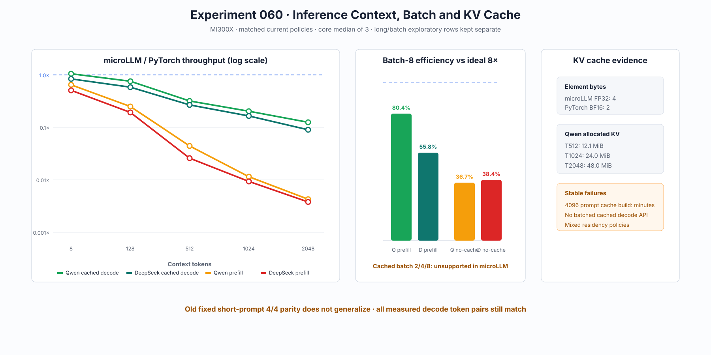

修正版核心有108条raw：两模型、context8/128/512、prefill/cached/uncached、两框架、
三进程。所有decode token一致，但旧性能解释被推翻：

```text
Qwen T512 prefill / cached decode     0.044× / 0.318× PyTorch
DeepSeek T512                         0.026× / 0.267×
Qwen T2048 warm prefill / cached      0.00435× / 0.126×
DeepSeek T2048                        0.00381× / 0.0899×
```

Cache仍非常重要：T2048相对microLLM自身uncached快81×/101×。但Cache是FP32，元素字节
是PyTorch BF16的两倍；cached batch2/4/8还没有API。batch矩阵42条pass、6条明确
unsupported，绝不拿uncached冒充cached。

最终schema还记录prompt Cache准备。Qwen T8 steady decode接近PyTorch，端到端却是
`93.26ms vs 23.74ms`，因为prepare是`82.51ms vs 12.63ms`。到4096时逐token建立Cache
已经需要分钟级。

因此这一节点keep的是测量基础设施，不是性能。它纠正仓库README/STATUS，并给下一步
明确排序：batched长prefill、full-sequence prefill-to-cache、batched KV和device batch argmax。

## 78. Experiment 061：有优化路由，不等于模型会走那条路

第一版只在公共causal GQA里加入T≥256 batched QK/PV。Qwen T512只快0.39%。profile
发现模型`forward_tensor`另写了一份repeat、QK、softmax、PV；144次readable matmul占
629.41ms。算子优化没有进入模型，局部测试再绿也没用。

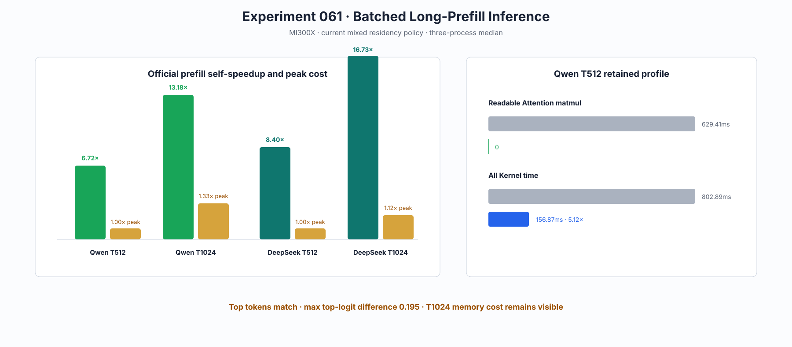

第二版删除模型内副本，直接调用公共causal GQA。三进程结果：

```text
Qwen T512 / T1024      6.72× / 13.18× faster
DeepSeek               8.40× / 16.73×
current PyTorch ratio  0.229×–0.308× at T512; about 0.15× at T1024
```

T512 peak不变；T1024因GQA head展开和batched临时表增加33%/12%。top token全部一致，
最大top-logit差0.195。T128也提高1.78×。

readable Attention matmul从629.41ms归零，只新增约1.68ms library GEMM；全部Kernel
`802.89→156.87ms`（5.12×）。候选保留，但0.15×PyTorch仍不是完成。下一根系统柱子
是prompt必须逐token写Cache；需要full-sequence prefill-to-cache，而不是继续改steady decode。

## 79. Experiment 062：prefill算完了，不能再把prompt重放一遍

旧Cache只能一次写一个token。T1024 warm-up Qwen/DeepSeek要38.5/54.9秒，T2048达到
115.6/171.2秒。新API一次full forward，把每层K/V直接写进预分配Storage并advance(T)。

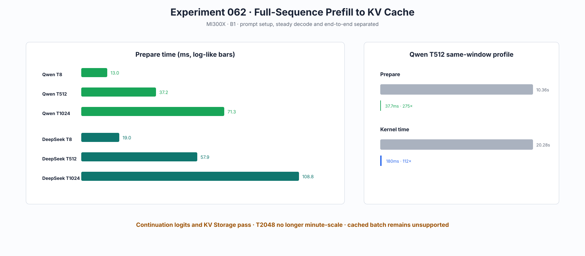

第一次实现full logits正确，继续decode却错：紧排head被整块写进capacity-strided Storage。
按head分别D2D后才通过。第二版又因返回整个`[T,V]`让T1024 peak增加33%/12%；改成只返回
last logits后，最终代价降为Qwen+11.5%、DeepSeek+3.4%。

三进程T1024 prepare为`71/109ms`，end-to-end四token为`228/351ms`；T2048 prepare
`157/231ms`。同一Qwen T512二进制显式切换token/full：prepare `10.36s→37.7ms`
（275×），Kernel time `20.28s→180ms`（112×），calls `497177→3201`。

B1长prompt已从分钟级变成毫秒级，但PyTorch prepare仍约12–27ms，steady decode也更快。
下一节点必须给KV Cache增加batch维，关闭B2/B4/B8 unsupported，而不是继续只测B1。

## 80. Experiment 063：GPU算完logits，不应把整张表搬回CPU找最大值

uncached batch reference原来每个token把`B×151936`个FP32搬回host。新last-dim argmax
一行一个block，只返回`B`个Int32。tie、非有限值、shape和零D2H Kernel合同都通过。

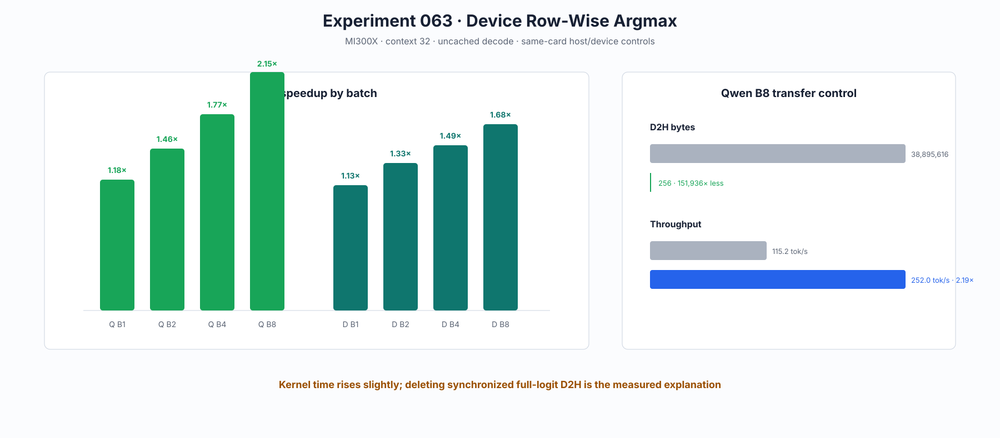

同卡host/device矩阵八点全部变快：Qwen B1→B8为`1.18×/1.46×/1.77×/2.15×`，
DeepSeek为`1.13×/1.33×/1.49×/1.68×`。Qwen B8 D2H calls仍是8，但字节
`38,895,616→256`，吞吐`115.2→252.0 tok/s`。

rocprof里device新增12次argmax、20.4ms，Kernel总时间反而略高；端到端仍2.06×。
少Kernel不是目标，删除同步大传输才是原因。cached B2/B4/B8仍unsupported，下一节点
终于可以在已有row argmax上扩展batch-aware KV Storage。

## 81. Experiment 064：batch不是把吞吐乘一个数字

旧cached B2/B4/B8在启动前unsupported。新`KVCache(batch)`把每层Storage改成
`[B,KVH,capacity,D]`；prefix和step按batch/head stride写入，cached Attention grid扩成
`B×heads`，模型接受`[B,T]`与`[B,1]`，row argmax负责每行token。

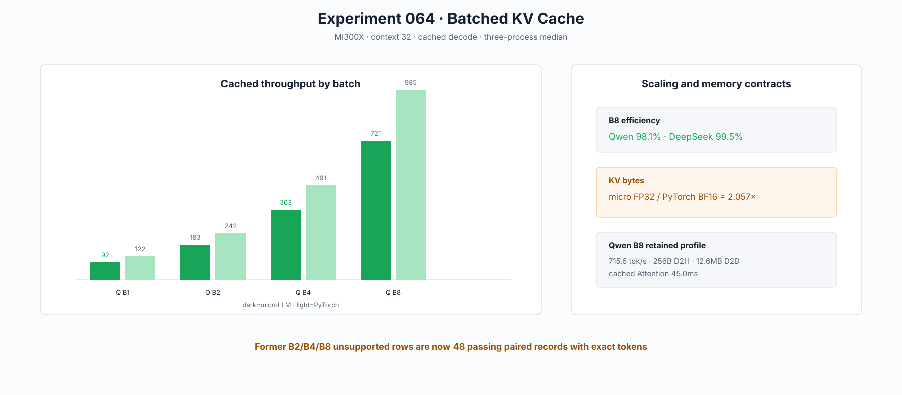

CPU用不同的两行prefix/next token逐行对齐full forward；HIP B2 prefill/step和零payload
transfer通过。正式48条全部pass：

```text
Qwen B1/B2/B4/B8     91.9 / 182.9 / 363.2 / 721.1 tok/s  efficiency 98.1%
DeepSeek             62.2 / 124.0 / 247.1 / 494.6        efficiency 99.5%
micro/PyTorch        Qwen 0.73–0.75; DeepSeek 0.59–0.62
```

Cache按batch线性增长；micro FP32仍是PyTorch BF16的2.057×。Qwen B8 profile只D2H
256B，cached Attention45ms。旧版本没有before timeline，因为它在任何Kernel前失败；
这个限制原样写进证据。下一节点自然是BF16 KV Cache，而不是再扩大FP32 Cache。

## 82. Experiment 065：把草稿本减半，先问答案有没有变

BF16 Cache只改变K/V Storage：4字节变2字节；Query、softmax、累加和输出继续FP32。
第一轮普通构建曾在DeepSeek T2048看到token分叉；审查后发现before是Release、current不是，
这组速度对比被标invalid。重新冻结前后源码并都用`-O3/gfx942`，72/72进程成功。

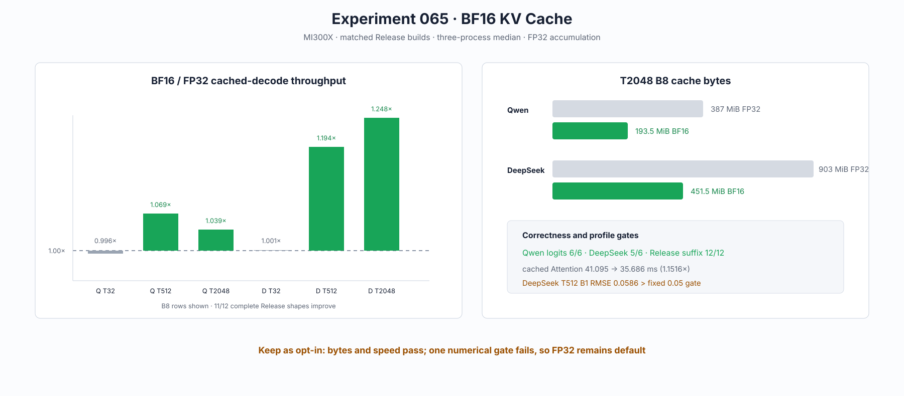

Release的12个shape中Cache全部精确减半，16-token suffix全部一致，11个shape加速。Qwen
T32 B8轻微回退0.43%；DeepSeek T512/T2048 B8分别提高19.4%/24.8%，T2048 B8 Cache
`903→451.5MiB`、整机peak下降约5%。Qwen T2048 B8 cached Attention
`41.095→35.686ms`（1.152×），全Kernel只提高1.019×，因为prefix新增96次cast。

完整logits没有全绿。预先固定`max_abs≤0.25、RMSE≤0.05`后，Qwen 6/6通过，DeepSeek
5/6通过；DeepSeek T512 B1的最大误差0.225通过，但RMSE 0.0586失败。普通构建的T2048
token分叉未在Release复现，仍作为build-sensitive反例保留。

还尝试了`bfloat162`成对读取。全pair候选把Qwen T512 B1/B8比值压到0.470/0.372；只
向量化key dot仍是0.697。减少指令却减少了context阶段活跃线程，代码删除、raw保留。

因此节点是conditional keep：API、Kernel和显存/速度能力保留，FP32仍默认。下一实验先
删除full prefill的额外cast与per-head copy，同时必须重跑同一完整logit门。

## 83. Experiment 066：复制全部归零，关键shape却慢了21%

候选用一个Kernel同时完成FP32 K/V→BF16和capacity-strided双Cache写入。算子、B2 stride、
零payload与完整logits通过；36条microLLM正式进程的D2D全部从数百/数千次变成0。

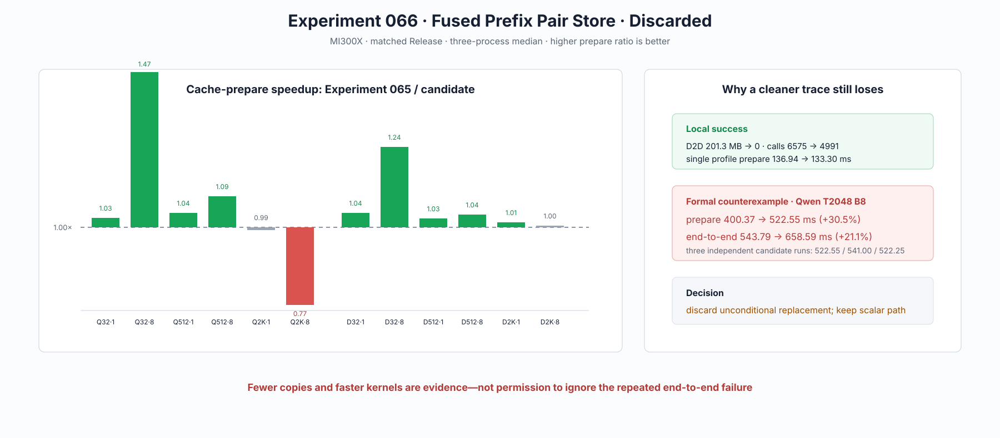

短中shape部分改善：Qwen T32/T512 B8 prepare快1.47×/1.09×，DeepSeek T32 B8快1.24×。
但Qwen T2048 B8 prepare `400.37→522.55ms`，端到端`543.79→658.59ms`，三轮都复现。
这是主指标30.5%/21.1%的稳定回退，足以否决无条件替换。

一次profile反而很好看：D2D 201.3MB→0，calls 6575→4991，Kernel
`316.20→309.21ms`，新增prefix-pair仅0.639ms，单次prepare还快2.7%。它没有覆盖正式
协议的五次重复prefill/allocator生命周期，因此不能推翻三进程结果。

候选API/Kernel/路由/测试全部删除。只留下paired step store的dtype一致性检查，以及完整
失败数据。下一次重试必须先做prefix microbenchmark、逐step allocator计数和同binary路由
对照；“copy变少”不再被当作充分解释。

## 84. Experiment 067：不是所有层都必须用同一本作业本

uniform BF16只剩DeepSeek T512 B1 RMSE失败。逐层搜索先制造了一个新陷阱：layer 0在
T512把RMSE降到0.0268，但换T32最大误差升到0.313并失败。layer 1同时通过T32/T512，
最终12-shape完整矩阵全部过门。

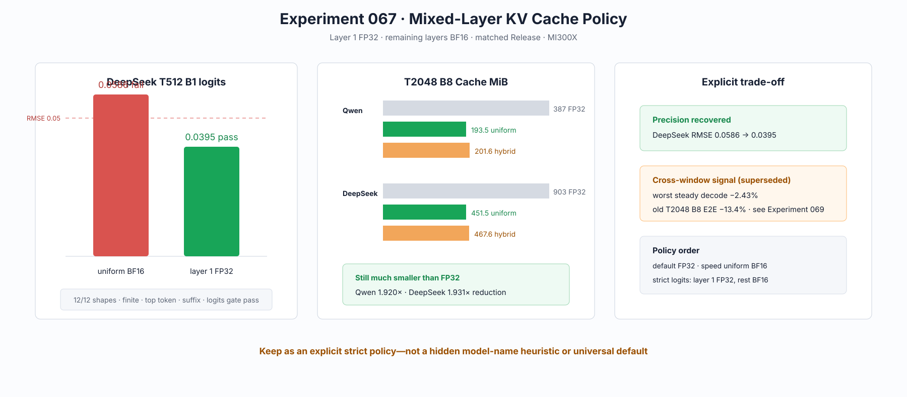

选择仅layer 1 FP32、其余BF16。DeepSeek T512 B1 RMSE`0.0586→0.0395`，max_abs
`0.2245→0.1851`；Qwen/DeepSeek 12/12 finite、top token和suffix一致。Cache仍比全FP32
小1.920×/1.931×。

代价不能隐藏。相对uniform BF16，steady decode最差回退2.43%，但DeepSeek T2048 B8
prepare慢27.9%、端到端慢13.4%。profile里138次BF16+6次FP32 cached Attention精确还原
23+1层和两轮3-step decode，全Kernel只多0.66%；长batch代价主要仍在prefill生命周期。

因此per-layer机制保留为显式strict-logit选项，不按模型名自动开启。系统默认仍是全FP32；
uniform BF16是速度/显存选项；layer 1只是原prompt上的最小配方。这里
记录的长batch代价随后被Experiment 069的同binary配对推翻，不能继续当作因果结论。

## 85. Experiment 068：只改那一个FP32层，解释仍然不成立

为避免重复Experiment 066，这次同binary开关只让strict策略的layer 1使用paired prefix；
其余27个BF16层保持reference。DeepSeek T2048 B8的D2D calls`4480→4320`、字节少
167.8MB，精度、peak和decode不变。

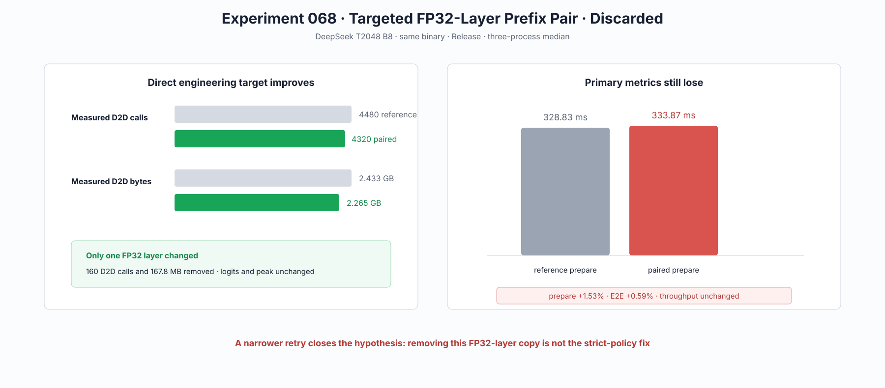

但prepare`328.83→333.87ms`、端到端`573.23→576.60ms`，仍分别慢1.53%/0.59%。候选
路由、Kernel和测试再次删除。这个更窄、同窗口反例关闭了“strict代价来自那一层copy”的
解释；下一步不再改prefix copy，而转向allocator生命周期或更高层调度。

## 86. Experiment 069：换策略时，也必须把时间窗口配对

旧表用不同时段的uniform/strict summary相除，曾认为DeepSeek T2048 B8 strict端到端慢
13.4%。新runner只运行microLLM：同一binary、每个shape三个新进程、策略顺序交替。

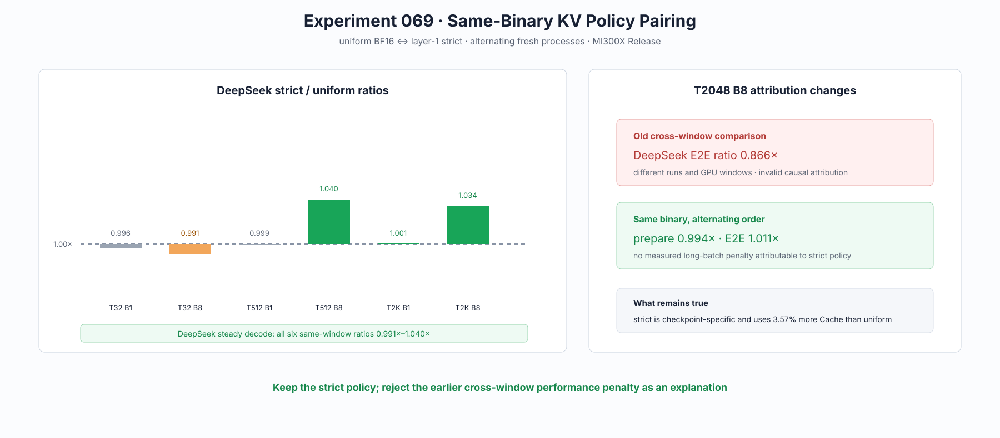

72/72记录通过。DeepSeek六点decode比为`0.991×–1.040×`；T2048 B8 prepare`0.994×`、
端到端`1.011×`，没有稳定回退。Qwen也没有跨shape一致方向。早期13.4%差异改标为
cross-window漂移，不再作为strict缺点。

strict仍然显式：layer 1来自固定checkpoint搜索，Cache比uniform多3.57%。但现在拒绝它的
理由必须是可移植性，而不是一个已被反驳的性能数字。新policy runner保留为后续小差异的
强制协议。

## 87. Experiment 070：换一句prompt，最小strict就破了

精度runner加入repeat、rotated、constant和ramp。layer 1在repeat/rotated通过，却在
constant 0/3通过；T512 max_abs 15.829、RMSE 2.995并发生token分叉。ramp也有2/5失败。

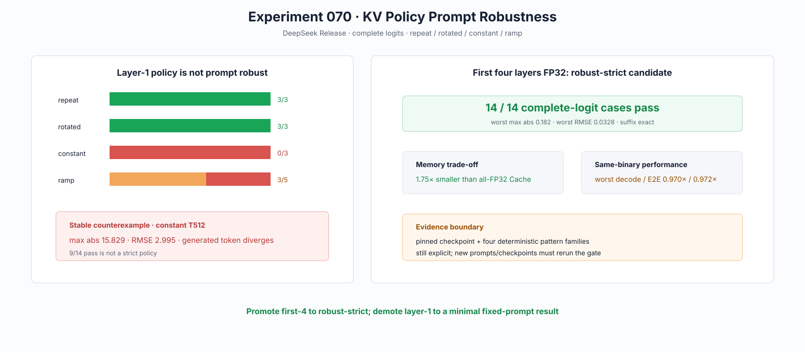

前4层FP32、其余24层BF16在14个短长/batch挑战中全部通过，worst max_abs/RMSE为
0.182/0.0328，Cache仍比全FP32小1.75×。同binary六shape性能最差decode/E2E为
0.9695×/0.9719×，peak最多增加0.75%。

因此layer 1降级为固定prompt结果，当前robust-strict升级为layers 0–3 FP32。它仍只对固定
DeepSeek checkpoint和四类模式有证据，不会被模型名自动触发。

## 88. Experiment 071：Qwen也没有免费的robust BF16 Cache

Qwen uniform BF16在repeat/rotated/ramp共11条通过，但constant T32/512/2048全部超过
logit门。first 2 FP32在T512刚好通过，搬到T2048却跳到RMSE 3.141并token分叉。

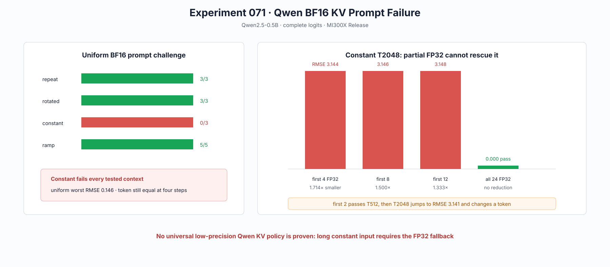

继续增加到前4/8/12层FP32，constant T2048 RMSE仍约3.14；只有全部24层FP32恢复一致。
因此Qwen uniform BF16仍是显式速度/显存路径，不是普遍strict安全；遇到该稳定失败必须
回退全FP32。成功模式和失败模式同时保留。

## 89. Experiment 072：continuous batching的第一步不是batch

真实请求会晚到、早结束、长度不同。`ReferenceScheduler`让每条请求拥有独立B=1 Cache和
RNG，按`PendingPrefill→Decoding→Completed`前进；完成立即释放Cache。CPU/HIP都与独立
`generate()`逐请求对齐。

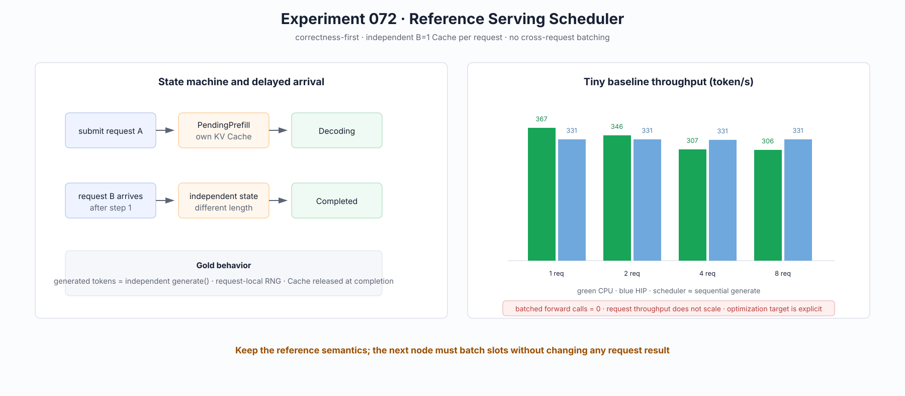

106,816参数tiny基线中，HIP 1/2/4/8请求都约331 tok/s，scheduler/sequential约0.992–0.994×，
输出全部一致。吞吐不随请求数增长，因为batched forward calls明确为0。这是下一slot-batch
候选必须超过的before，不是“服务优化完成”。

## 90. Experiment 073：兼容请求终于进入同一次forward

`generate_batch()`让不同prompt内容、相同长度/配置的请求共享`KVCache(B)`，prefill和decode
分别走`[B,T]`与`[B,1]`，GPU按row选token。CPU greedy/随机采样和HIP不同row均与独立
`generate()`对齐。

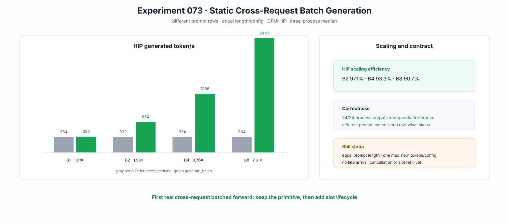

HIP B1/2/4/8为337/654/1256/2443 tok/s，相对serial reference为1.01×/1.96×/3.76×/
7.31×，B8扩展效率90.7%。CPU B8只有2.25×，说明同一接口在GPU上才真正吃到并行度。

它仍是static batch：晚到、不同长度、提前完成和slot refill没有实现。下一节点必须把
Experiment 072的生命周期与这个计算积木连接。

## 91. Experiment 074：入场分组正确，生成中还不会补位

`AdmissionBatchScheduler`按prompt长度、生成配置、seed和Cache策略稳定分组；兼容组走
`generate_batch()`，不兼容请求保留B1。CPU/HIP覆盖B3+singleton和跨drain晚到请求。

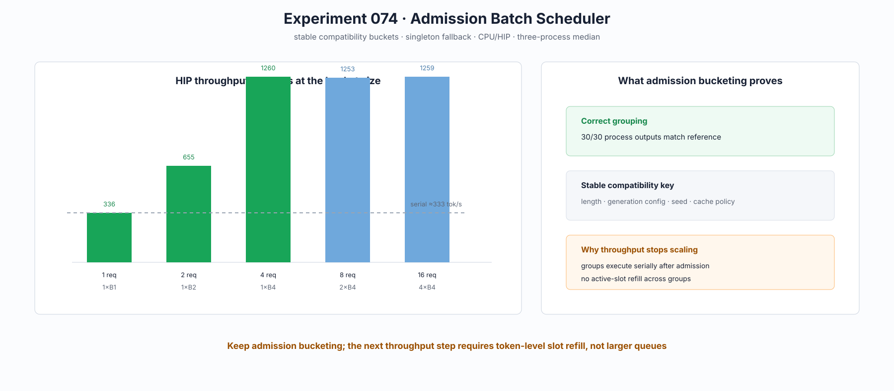

HIP 1/2/4请求为336/655/1260 tok/s。8/16请求拆成2/4个B4组后仍约1253/1259 tok/s，
说明group串行导致平台。30/30进程输出一致；下一步必须token级slot refill，不能只扩大队列。

## 92. Experiment 075：先定义slot什么时候真正空出来

调度器加入`Cancelled`终态。decode中的请求取消前Cache非零，取消后立即为0；重复取消不会重复
计数，已生成前缀保留，存活请求继续与独立生成一致。Admission分组也会把取消行排除。

这是生命周期正确性节点，不宣称加速。没有这个合同，后续“补slot”可能只是覆盖仍被旧请求
拥有的Cache。

## 93. Experiment 076：一个短prompt无法代表推理

真实Qwen/DeepSeek矩阵展开到T32/512/2048、B1/2/4/8，并分开prefill、FP32 Cache decode和
BF16代表点，共120/120进程成功。

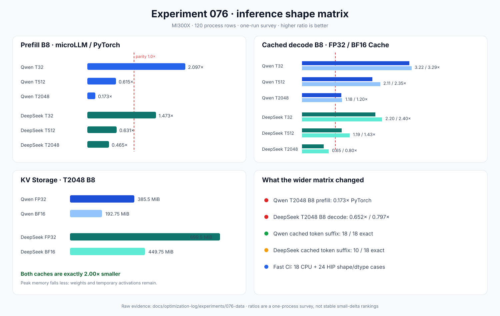

短context很好看，但Qwen T2048 B8 prefill只有PyTorch的0.173×，DeepSeek为0.465×。
cached decode扩展明显更好；Qwen T2048 B8为1.180×，DeepSeek却只有0.652×。BF16 KV全部
精确减半，代表点没有改变microLLM的8-token输出，但总峰值只下降3.4%–5.0%。

精度也不是全绿：Qwen 18/18 suffix一致，DeepSeek只有10/18；T2048在第4个token分叉。
当前两边驻留dtype政策不同，所以先记录反例，再用同dtype完整logits定位，不能把成功运行写成
全面精度对齐。

## 94. Experiment 077：最大热点原来是不该计算的logits

rocprof发现Experiment 076的prefill为全部历史位置计算`[B,T,V]`，最大单Kernel是output
head，每个进程还把约9.96 GB logits搬回CPU。这是完整logits forward，不是服务TTFT。

新增显式`full|last`模式，两边last都只投影最后hidden position；PyTorch使用
`logits_to_keep=1`。T2048 B8三进程中位数中，Qwen `43.7k→129.8k tok/s`（2.97×），
DeepSeek `50.4k→66.4k`（1.32×）。峰值下降74%/65%，D2H精确缩小2048×。

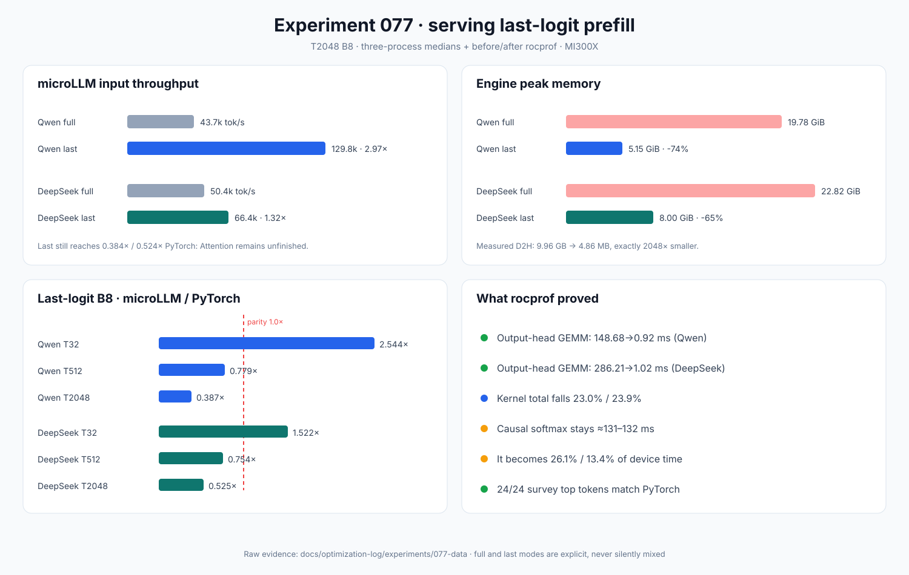

full与last完整词表max-abs不超过`3.1e-5`，24/24宽shape top token与PyTorch一致。新矩阵仍
只有PyTorch的0.39×/0.53×；softmax时间保持约131–132ms并成为真实热点。旧prefill结果保留
但改标full-logits，cached decode与KV结论不受影响。

## 95. Experiment 078：更快、更省，但不能合入

候选不再把GQA的K/V复制到每个query head，而是把共享head折进GEMM行维。机制完全命中：
repeat Kernel 192/224次降到0，Qwen/DeepSeek快4.3%/7.4%，peak少3.2%/3.5%。

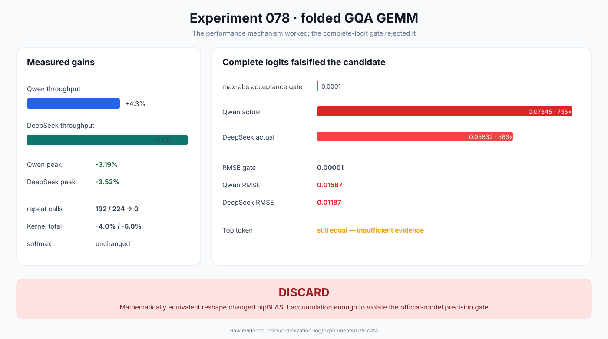

但T2048 B8的151,936个logit对照失败：Qwen max-abs/RMSE为0.0735/0.0157，DeepSeek为
0.0563/0.0119，远高于`1e-4/1e-5`门。top token仍相同，恰好说明top-1不是充分证据。

候选标记`discard`并回退。数学公式等价不代表换一个hipBLASLt shape后数值轨迹仍满足官方
模型门；下一轮改softmax时必须先跑完整logits，再跑性能。

## 96. Experiment 079：少写一次显存，规约顺序不变

T≤2048时，每个softmax线程最多处理8个值。候选把8个`exp`留在寄存器直到分母规约完成，
删除未归一化概率的一次全局写回/读回，同时完全保留规约顺序。两模型151,936个logit位级一致。

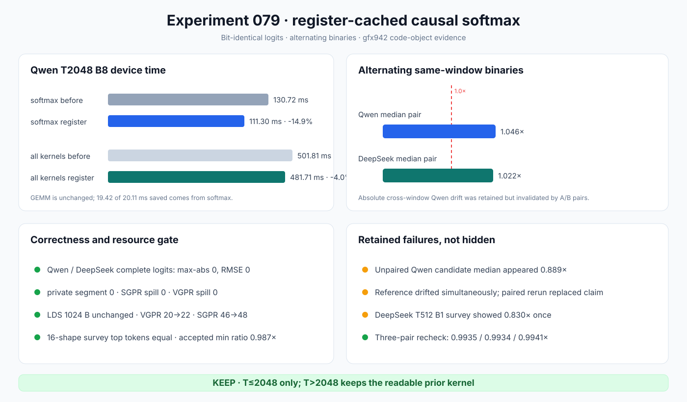

第一份cross-window Qwen median看似回退11.1%，但reference同期也漂移。交替双binary复测得到
Qwen 1.046×、DeepSeek 1.022×；Qwen softmax设备时间降14.9%，无private memory或寄存器
spill。16-shape survey唯一0.830×异常在三对复测中变为稳定0.993×，因此保留候选和异常证据。

T>2048不进入新路径。下一步要处理的结构问题是仍然物化完整`[B,H,T,T]`概率，而不是继续
在同一softmax规约里堆更多寄存器。

## 97. Experiment 080：没有T²，也可能慢三倍

本机有rocWMMA，但没有可直接链接的CK/FMHA。仓库已有把分数留在shared memory的可读fused
Attention，于是先问：只要不物化T²，是否就会更快？

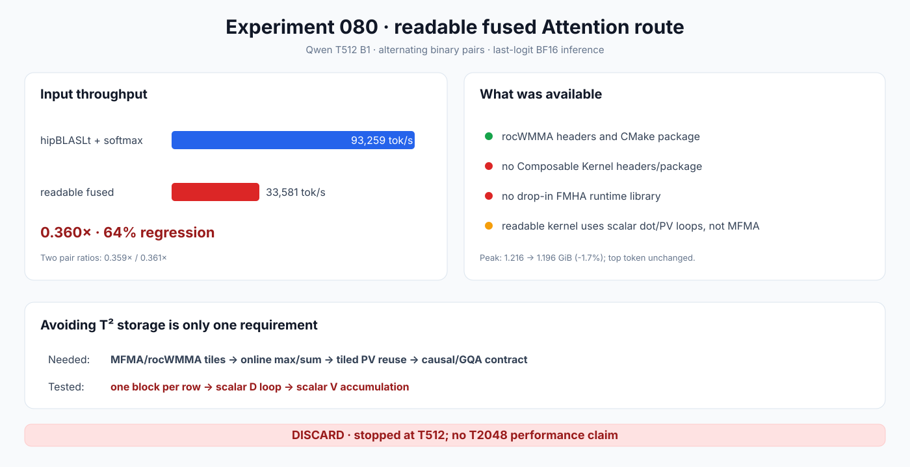

Qwen T512 B1双binary两对中，library路径约93.3k tok/s，可读fused只有33.6k，0.360×；
peak仅少1.7%。普通线程的标量D点积/PV循环完全抵消了省下的全局score Tensor。

实验在T512立即停止并回退，没有虚构T2048结果。真正的online Attention必须同时有MFMA tile、
online softmax和数据复用；“不分配T²”只是必要条件，不是FlashAttention实现。

## 98. Experiment 081：同一块T² Storage先放scores，再放probabilities

长library Attention以前同时持有QK scores和softmax probabilities两份T²。softmax完成所有
score读取后原地覆盖输入，公共out-of-place reference不变。

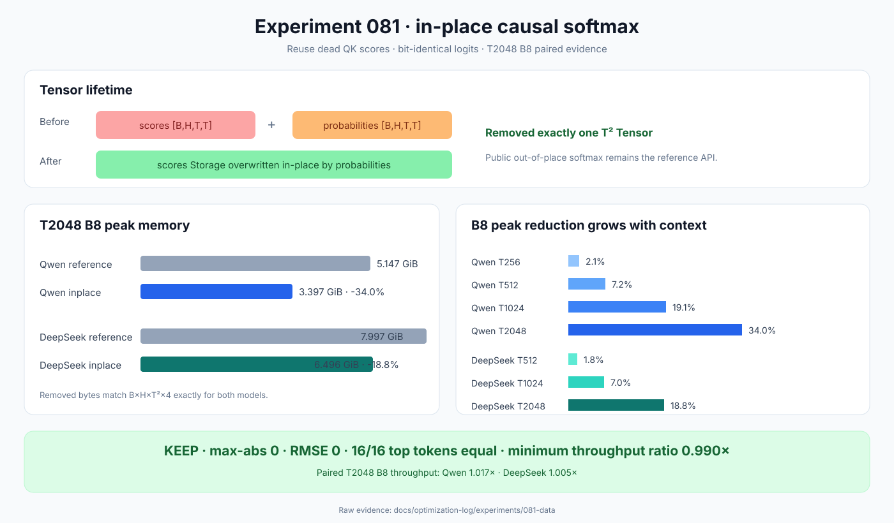

Qwen/DeepSeek T2048 B8完整logits位级一致；peak分别5.147→3.397 GiB（-34%）和
7.997→6.496 GiB（-18.8%）。删除字节精确等于`B×H×T²×4`，allocation calls也恰好每层每次
forward少一次。三对吞吐为1.017×/1.005×，16-shape最差0.990×。

它仍物化一份probability T²，但证明生命周期优化可以在不改变Kernel数学的前提下获得大幅显存
收益。彻底删除最后一份T²才需要真正的online MFMA Attention。

## 99. Experiment 082：模型写出结束符，Cache生命周期才有依据

GenerationConfig加入合法且唯一的stop token集合。token先进入输出，再让请求终止；单请求不再
发下一次decode，ReferenceScheduler在同一步释放B1 Cache并记录`StopToken`原因。

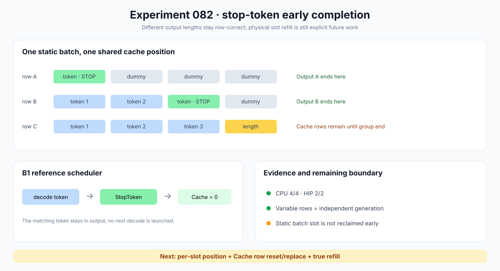

static batch允许row得到不同输出长度，CPU/HIP逐row等于独立生成。结束row用被忽略的dummy维持
当前共同position，不再追加输出或推进RNG；因此正确性完成了，但物理slot仍要等整组结束。

这个诚实边界把下一步说清：continuous refill必须加入per-slot position、Cache row reset/replace，
而不是把dummy row称作动态调度。

## 100. Experiment 083：先擦掉旧草稿，再谈新请求占slot

`KVCache::clear_row()`在CPU/HIP清空某一batch row所有层、K/V和完整capacity，不改变其他row，
也不改变当前shared position。HIP使用typed fill，H2D/D2H均为0。

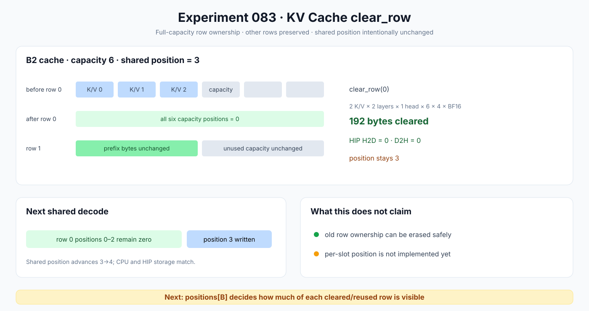

B2 BF16测试精确清192 bytes；清后旧prefix全0，其他row逐项不变，共同decode仍能写下一位置，
CPU/HIP整个Cache一致。它只解决Storage所有权，不声称已有per-slot position。

下一节点要让每个row拥有独立可见长度；否则清空的slot仍只能跟随整batch共同前进。

## 101. Experiment 084：position从一个数变成B个数

KV Cache加入`row_positions[B]`、`advance_row()`和`reset_row()`。所有row相同时旧`position()`
继续工作；一旦分叉，它明确抛错，不用max/min伪造共同位置。

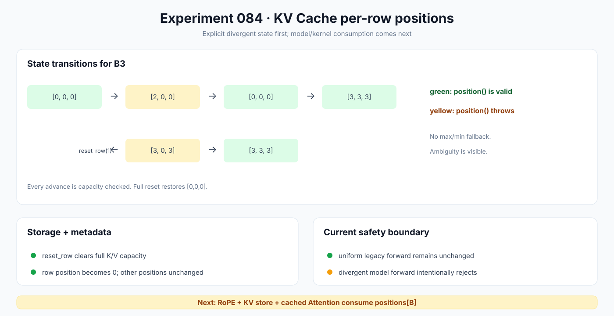

CPU/HIP覆盖`[0,0,0]→[2,0,0]→[0,0,0]→[3,3,3]→[3,0,3]→[3,3,3]`，并验证row reset
同时清Storage且零payload transfer。模型尚未消费分叉positions，旧uniform路径不变。

下一步必须把positions传给RoPE、K/V store和cached Attention；状态能表达不等于Kernel已支持。

## 102. Experiment 085：先证明每个decode token真的算过模型

把输出长度扩成1/8/32后，旧runner暴露了一个计时漏洞：prefill已经产生第一个token的logits，
`new_tokens=1`因此只测argmax，没有cached Transformer forward。Qwen T8 B1的旧数据是microLLM
400.6 tok/s、PyTorch 21,588.5 tok/s；修正为一token一forward后，冻结语义矩阵同时满足
`measured_tokens == measured_forward_steps`与`active_tokens == context + decode`。

运行中途还发生过binary重建；那72行被隔离成mixed-invalid。第二次冻结虽然36/36 shape token一致、
KV公式全过，却又发现`CMAKE_BUILD_TYPE`为空，所以只接受语义、KV和显存，不发布速度。最后使用
Release/gfx942对N8重跑24个进程记录。

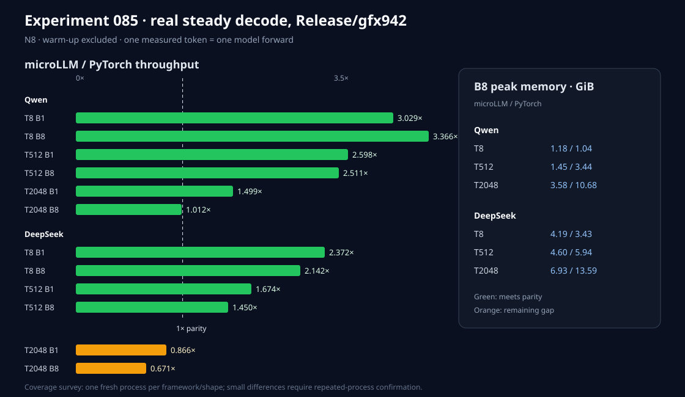

Qwen T8/T512/T2048的B1/B8吞吐比为`3.029/3.366`、`2.598/2.511`、`1.499/1.012`；
DeepSeek为`2.372/2.142`、`1.674/1.450`、`0.866/0.671`。因此“全部未追平”和“全部领先”
都不成立：剩余性能缺口精确落在DeepSeek T2048。

长batch峰值却明显占优：T2048 B8 Qwen为3.58/10.68 GiB，DeepSeek为6.93/13.59 GiB。
Release token门是10/12；DeepSeek T2048 B1/B8在第3个输出token分叉，原样保留。

下一步只profile DeepSeek T2048 steady decode，并先检查每token一次D2H选词同步、cached Attention
读取/reduction和allocator各占多少。没有trace前不把“换FlashAttention”写成既定答案。

## 103. Experiment 086：同步少了，allocator却换了一种坏节奏

DeepSeek T2048 Release trace把第一热点定在cached Attention：28层、16个warm-up/measured token
恰好448 calls，B1/B8总时间158.86/167.87 ms，估算约占measured decode wall的62.1%/60.5%。
KV store不足0.5%，argmax Kernel不足1.4%，都不是第一目标。

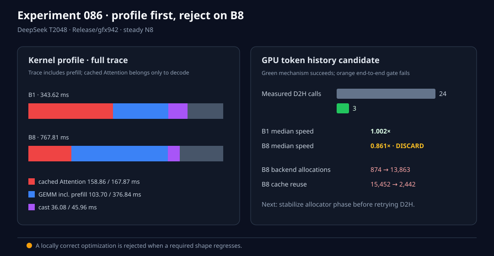

先尝试最小同步候选：argmax直接写GPU history，N8、3次measured的D2H从24降到3。B1三对
median为1.002×，但B8只有0.861×。候选改变了小Tensor分配相位，backend allocation从874
暴涨到13,863，cache reuse从15,452跌到2,442；peak和token都没变。

候选完整回退。这个失败说明当前exact-size allocator对分配数量过于敏感，会让本来正确的小优化
随机触发大规模alloc/free。Experiment 087先稳定allocator，再重试D2H；cached Attention保持
独立的设备Kernel主线，不把两个变量塞进同一次改动。

## 104. Experiment 087：同一条Stream不需要等第16次释放

旧pool只有凑满16个pending块才记录Event并允许复用。候选利用既有强合同：引擎只使用legacy
default Stream，后提交的Kernel天然排在旧Kernel之后，所以同地址可以立即按exact size复用；
一旦出现non-default Stream，pool仍永久禁用。

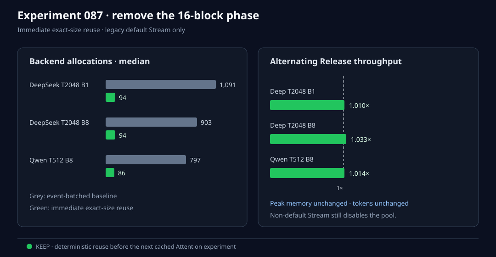

无同步的256轮fill/destroy/reuse压力门通过。DeepSeek T2048 B1/B8三对median提高1.010×/1.033×，
backend allocation从1,091/903降到94/94。Qwen/DeepSeek T512 B8反驳实验为1.014×/1.099×，
推翻了宽矩阵的一次冷态负结果。所有candidate shape只有82–94次backend allocation、0次backend
deallocation，peak、KV和baseline token不变。

这个节点保留。它没有让Attention少读一个字节，却先消除了小改动触发allocator风暴的随机性。
Experiment 088现在可以干净地只改`cached_attention_fused_kernel`。

## 105. Experiment 088：4个小测试全绿，百万logit仍然错

候选只把BF16 Key相邻两元素重解释成内部vector类型一起读取，Value和softmax不变。现有4个
focused HIP测试全部通过，但DeepSeek T2048完整cached logits立即反驳：B1 max/RMSE为
0.0565/0.0132；B8达到11.978/1.528，并从第3个输出token开始分叉。

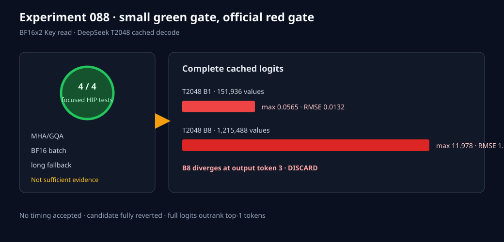

B1的8-token suffix仍相同，再次证明top-1不能替代完整logits。候选没有进入性能测量并完整回退。
下一次pair load只能从32-bit原始字中显式恢复两个公开BF16 scalar，不能继续把公开类型重解释为
内部vector类型。

## 106. Experiment 089：换掉vector类型，错误数字完全相同

候选用一个32-bit原始读取，再把lower/upper 16 bits显式写回两个公开`hip_bfloat16` scalar。
如果Experiment 088只错在内部vector转换，这次应该恢复正确。

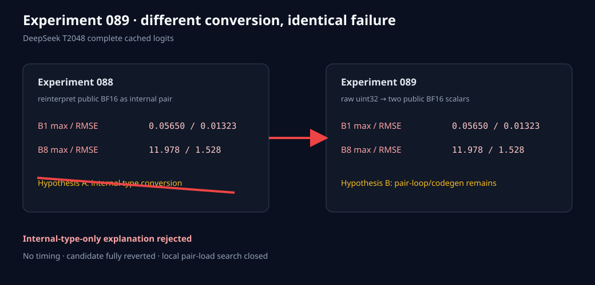

但B1/B8的max、RMSE和suffix与Experiment 088逐项相同：0.0565/0.0132与11.978/1.528。
“内部类型转换是唯一原因”被推翻；pair循环/Release codegen成为剩余解释。候选同样不计时并回退，
本地pair-load搜索关闭，直到有逐position dot或反汇编门。

Experiment 090回到D2H history。它在Experiment 086被allocator相位拖慢，而Experiment 087已经
移除了这个混杂变量，现在可以做一次干净重试。

## 107. Experiment 090：同一个候选，先修allocator后才可以保留

caller-owned argmax直接写`history[N,B]`，greedy/no-stop路径全部生成后只做一次D2H。N8、3次
measured的calls从24降到3，bytes仍是B1 96、B8 768。

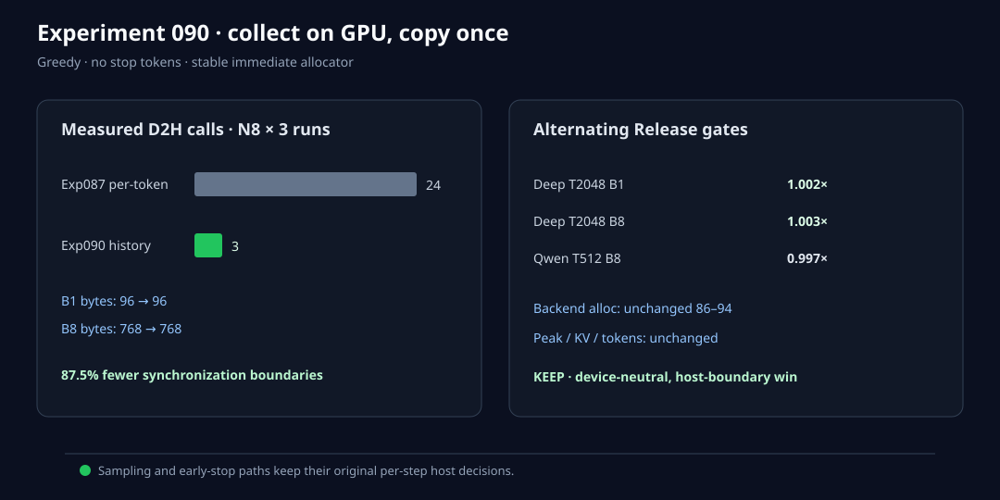

这次两边allocator都稳定在86–94次backend allocation。DeepSeek T2048 B1/B8三对median为
1.002×/1.003×，Qwen T512 B8为0.997×；peak、KV和token不变。Experiment 086的0.861×失败
没有复现，证明它来自旧allocator相位，而不是history本身。

公共`generate()`和`generate_batch()`也进入同一快路径；sampling与stop token仍保留逐步host
决策。候选保留，它减少的是同步边界，不冒充Attention Kernel加速。

## 108. Experiment 091：位级一致，但一条barrier也不能白加

候选把cached Attention的shared `exp(score-max)`先统一除以denominator，再让所有Value column
复用。DeepSeek T2048 B1/B8的151,936/1,215,488个logit全部位级一致。

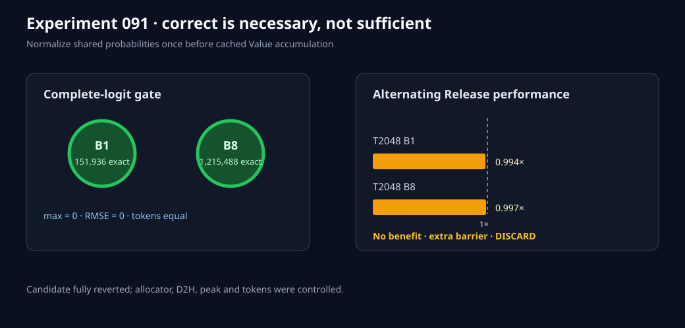

三对交替性能却只有0.994×/0.997×；allocator、D2H和peak均相同。编译器很可能已经把不变量division
处理得足够好，新增shared写回与barrier没有收益。候选回退；“数值正确”只是进入性能门的资格，
不是保留理由。

## 109. Experiment 092：两个Value一起读，精度对了但线程少了

一个线程分别维护相邻两个Value column的accumulator，每列仍按position顺序累加。百万logit位级
一致，说明这个并行重排守住了数学轨迹。

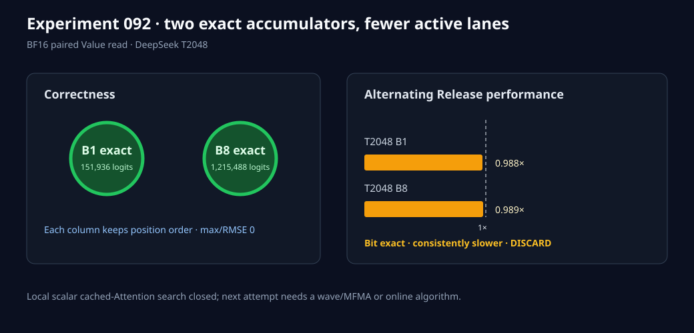

但DeepSeek T2048 B1/B8三对只有0.988×/0.989×。原Value读取已经按column连续合并，pair写法把
活跃lane减半并增加拆包，稳定变慢。候选回退。

结合088–092与更早的thread/query-staging失败，本地标量cached Attention搜索关闭。下一次必须先
建逐position score oracle，再进入wave/MFMA或online softmax的架构级改写。

## 110. Experiment 093：同一个batch终于允许不同页数

Cache早已能记录`row_positions[B]`，但模型看到分叉position就报错。新`forward_cached_rows()`
先做正确性oracle：每个row建立共享原Storage的B1 view，用自己的RoPE、写入位置和可见prefix，
再合并logits；uniform row仍走原batch快路径。

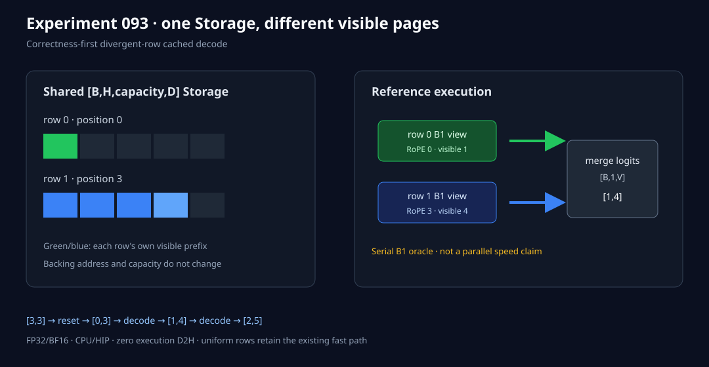

B2从`[3,3]` reset到`[0,3]`，两次decode得到`[1,4]→[2,5]`，每一行都等于对应独立B1。
FP32/BF16、CPU/HIP通过，HIP执行区间0次D2H，Storage地址不变。reset最大row后positions变
`[2,0]`，logical prefix也从5缩到2。

这条路径串行执行B个B1，明确不报吞吐。下一步先接scheduler完成真实slot refill正确性，再用同一
oracle验收positions-aware并行Kernel。

## 111. Experiment 094：空座位可以换进新请求了

上一节点能让`[0,3]`两行从不同页继续算，却还不能把一个两token prompt写进空的row 0。新接口
`forward_prefill_cached_row()`先使用已有B1 full-prefill得到新请求的K/V和logits，再把有效前缀
按layer/head在同一设备复制进共享Cache的目标row。

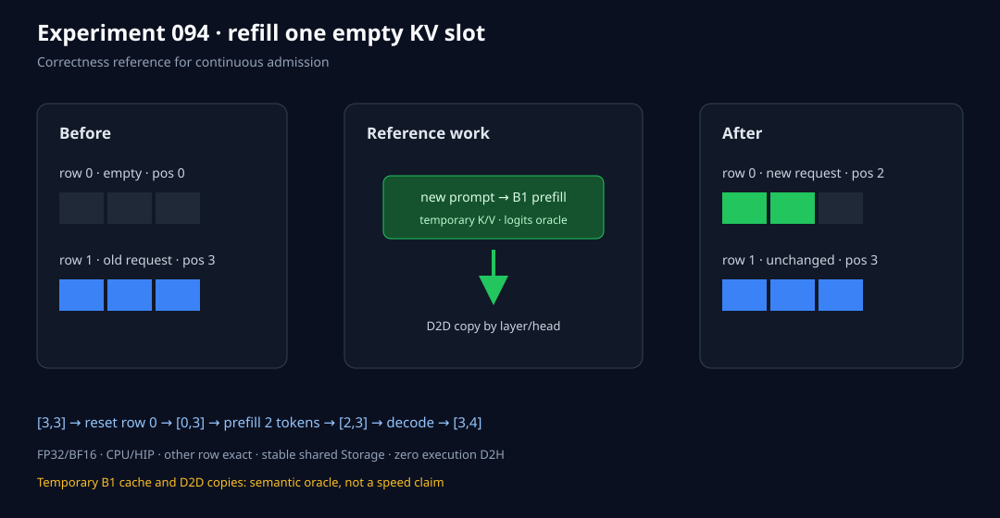

状态从`[3,3]`清空成`[0,3]`，补入两token后成为`[2,3]`，下一步decode得到`[3,4]`。FP32/BF16、
CPU/HIP都与独立B1对齐；旧row每层K/V和共享Storage地址不变；HIP执行区间0次D2H payload。
完整配置302/302，sanitizer 204/204。

这是slot admission的正确性oracle，不是性能结论：临时B1 Cache和逐head D2D copy都有成本。
下一节点可以把它与请求状态机接起来，首次跑通真正的“请求结束→清空→新请求补位→继续decode”。

## 112. Experiment 095：回答变成64 token后，长context把差距翻过来了

新增`serving`矩阵固定T1–2048、B1/2/4/8和N1/8/32/64，并把Cache预留未使用字节、每请求浪费、
active Cache占增量峰值与非Cache临时量写进summary。warmup仍与measured区间分开。

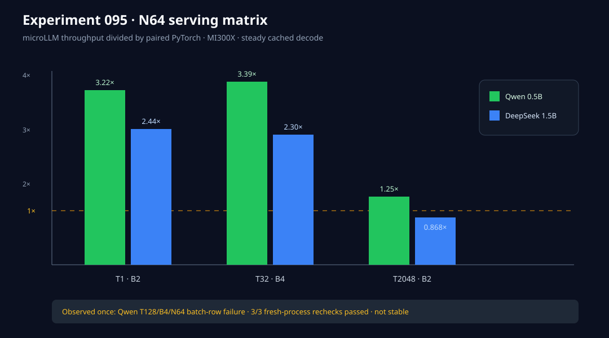

MI300X增量pilot先跑T1/32/128、B2/4、N64。成功shape中Qwen是PyTorch的2.92×–3.39×，DeepSeek
是2.09×–2.44×。T2048/B2/N64时，Qwen降到1.250×，DeepSeek翻到0.868×；两模型64 token都
完全一致，microLLM peak仍更低，KV双方分别为49.5/115.5MiB。

pilot还出现一次Qwen T128/B4 batch内部row不一致。没有删除它，但同一冻结binary随后三次独立
进程全部通过且suffix完全相同。因此它只能标成“观察一次、尚不稳定”，不能包装成稳定stride bug。
这也是多case测试的价值：既找到失败，也阻止我们过度解释失败。

## 113. Experiment 096：补位第一次跑通，也第一次证明自己更慢

固定共享KV rows的`ContinuousBatchScheduler`把pending请求放进空slot，length/stop/cancel后reset，
下一step再把新prompt写进最低空slot。A、B开始，A完成后C进入row 0，B不受影响；FP32/BF16、
CPU/HIP、随机seed和独立B1都通过。

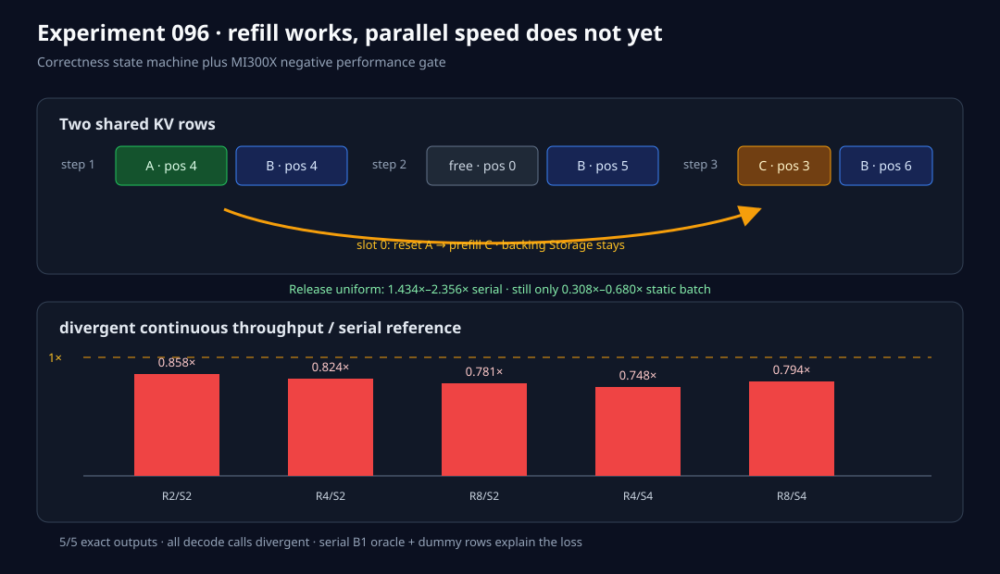

但不同prompt/生成长度的MI300X Release workload只有串行reference的0.748×–0.858×。所有decode call都
走divergent串行B1 oracle，还有1–9个dummy row；4槽Cache预留128KiB，active峰值只有24–24.5KiB。

Release uniform反驳实验则达到reference的1.434×/1.904×/2.356×，证明batch fast path有效；
不过它仍只有static batch的0.680×/0.488×/0.308×。结论因此不是“调度器无效”，而是divergent Kernel、逐row
prefill、dummy row和每step管理共同吃掉收益。下一节点必须动计算层，而不是继续盲目加slot。

## 114. Experiment 097：空slot不再跑一遍完整模型

新`forward_cached_active_rows()`只接收真实survivor token和固定row ID。inactive row的完整capacity、
position和Storage地址不变；full+uniform仍走原batch fast path。scheduler因此不再让dummy写入KV后
又清空整行。

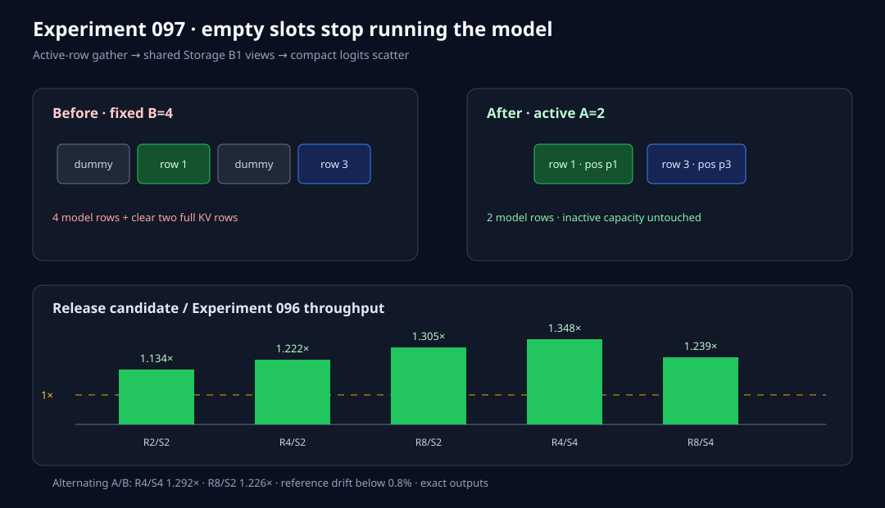

五个Release divergent shape全部加速1.134×–1.348×，continuous/reference从0.748×–0.858×提高
到0.935×–0.985×。旧dummy 1/3/9/5/9精确变成skipped，Cache与请求生命周期不变。

因为未改的uniform控制也有进程波动，又冻结096 binary做三对交替A/B：R4/S4中位1.292×，R8/S2
中位1.226×，而reference中位只漂移-0.10%/-0.72%。因此保留候选。剩余差距不再是空row，而是
多个真实divergent row仍逐个B1、logits scatter和逐row prefill。

## 115. Experiment 098：不同页数的真实请求终于一起算

active batch现在共享Embedding、QKV、FFN和output head。`positions[A]`与`cache_rows[A]`只进入RoPE、
KV pair store和cached Attention；每row有自己的角度、写入位置和可见prefix。FP32/BF16、Qwen
split-half+bias与4097 fallback都有CPU/HIP门。

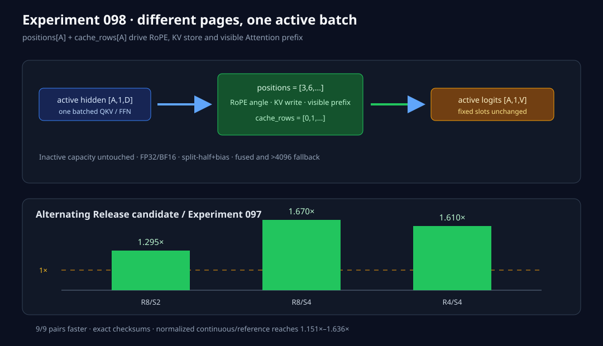

首轮Release四个shape提高18%–56%，R8/S2却下降14.6%。保留失败后冻结097做三shape交替A/B，
R8/S2中位反而提高1.295×，R8/S4为1.670×，R4/S4为1.610×；9/9逐对candidate更快，normalized
continuous/reference达到1.151×–1.636×。单轮R8/S2负面被反驳但没有从raw删除。

剩余热点已改变：position/row metadata每step仍由host创建并H2D，prefill仍逐row，固定KV容量利用率
不变。下一次必须profile新时间线，不能继续沿用旧的“cached Attention必然最大”结论。

## 116. Experiment 099：9.3%的copyBuffer，不等于scatter会赢

新增`--continuous-only true`后，trace不再混入serial、sequential和static。R8/S4与R8/S2中typed
GEMM占61.9%/62.9%，copyBuffer稳定约9.3%，positioned三Kernel只有5.84%/7.84%。应用counter还
记录32/56次H2D、9/17次D2H与159次D2D。

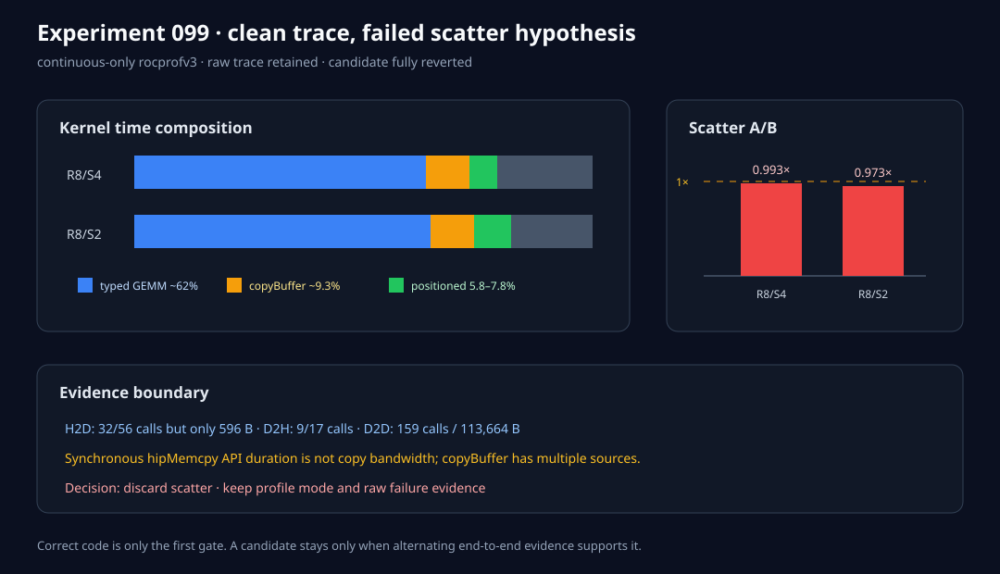

把逐row logits copy改成一次GPU scatter后，Kernel调用和输出都正确，但三对交替A/B只有0.993×和
0.973×。scatter新增row mapping H2D与compute launch；而159次D2D还包含prefill Cache复制和Tensor
materialization，不能全归因给logits回填。候选完整回退，profile模式、pftrace与负面证据保留。

## 117. Experiment 100：596字节不变，调用数减半也能赢

每个active step原来分别上传token、position和cache row。新路径先组成`[3,A]` Int32，一次H2D后
切成三个共享Storage view。R8/S4 calls从32降到16，R8/S2从56降到24，bytes都保持596；D2H、
D2D、Cache与checksum不变。

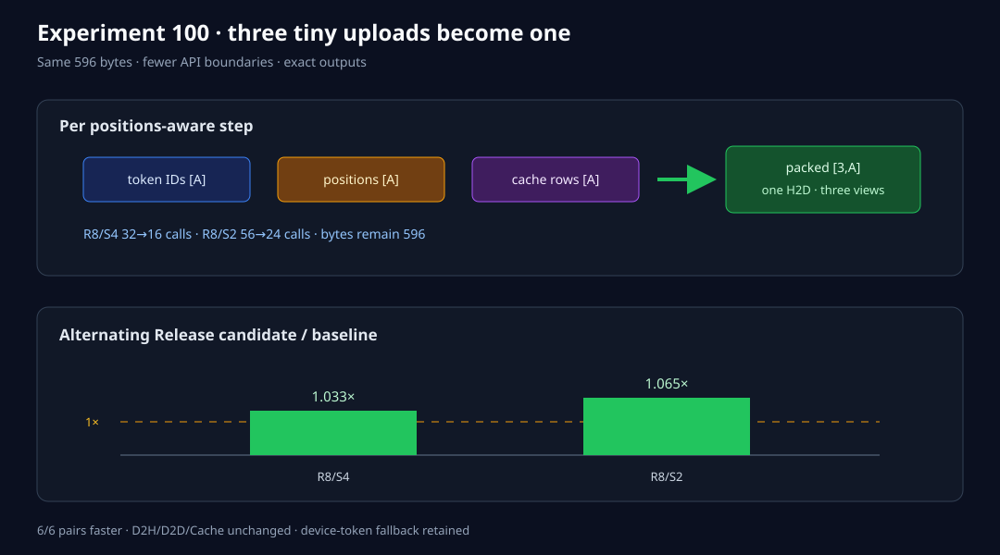

三对交替A/B中R8/S4为1.033×、R8/S2为1.065×，6/6逐对candidate更快。它说明小数据传输的主要
成本可以是API边界而不是带宽；同时也说明Experiment 099拒绝scatter不是“所有小调用都不值得合并”。

## 118. Experiment 101：八个prompt不再排队做八次prefill

相同长度pending请求现在一次执行`[A,T]`模型prefill，再把K/V映射进共享空slot。不同长度仍按最早
pending长度稳定分组，不用padding隐藏无效token。指标同时保留8个logical rows和实际physical batches。

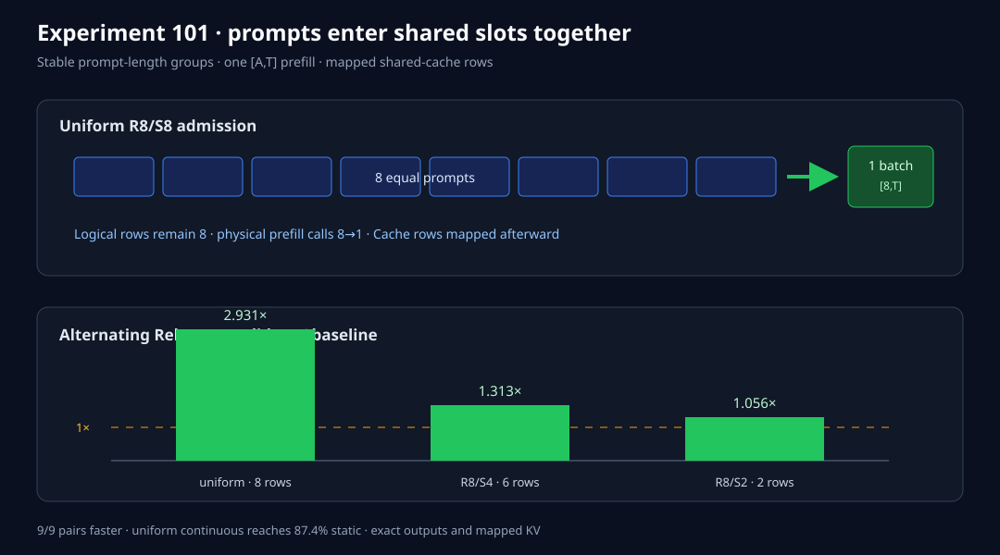

uniform R8/S8物理prefill 8→1，中位吞吐提高2.931×并达到static的87.4%；R8/S4有6行合批，提高
1.313×；R8/S2只有2行合批，提高1.056×。9/9逐对candidate更快。收益随8→6→2行衰减，直接支持
“逐row prefill是uniform主要缺口”的解释。

## 119. Experiment 102：tiny model快，不等于真实服务已经过关

官方Qwen2.5-0.5B和DeepSeek-R1-Distill-Qwen-1.5B现在直接进入continuous slot scheduler。
四组case覆盖短/2048-token长context、2/4 slots、补位和8/16-token混合输出；每组运行三个
fresh process，保存完整token、KV allocated/active、slot利用率、transfer和engine peak。

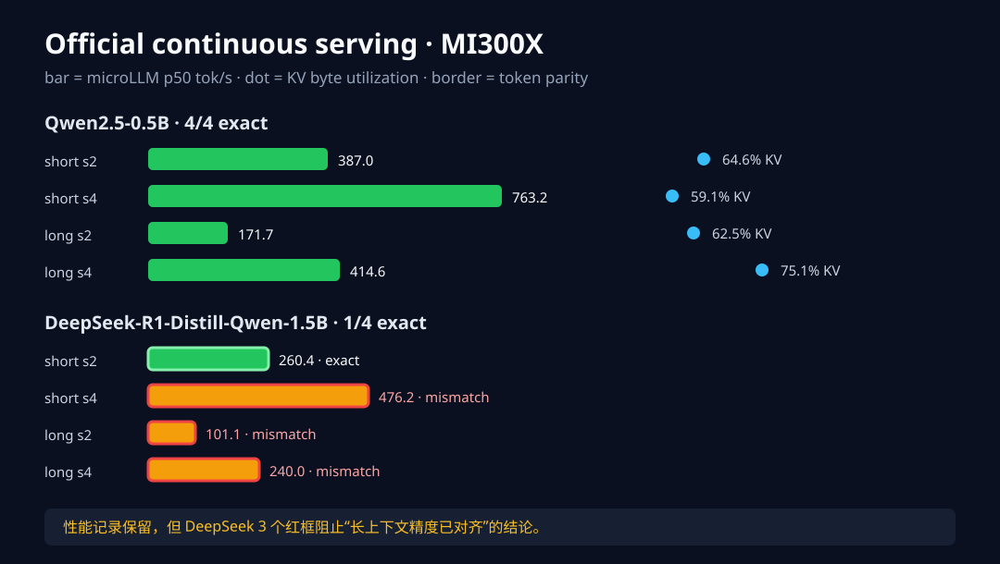

测试首先发现一个测量设计错误：模型允许32768 token时，短请求也按最大长度预留Cache。
新增request-bound capacity后，runner按本组最大的prompt+output分配，24/24记录与理论公式逐字节
一致。microLLM三进程都稳定，Qwen四组与PyTorch逐token相同；DeepSeek只有short_s2相同，另外
三组明确标红。

microLLM相对PyTorch sequential的观察服务吞吐为1.97×–12.28×，但两边scheduler和权重驻留不同，
DeepSeek还有精度失败，因此不能把这个数写成同算法加速。下一节点固定同一请求集扫1/2/4/8
slots，并从DeepSeek第一个分叉token开始定位，而不是继续放大一条漂亮TPS。
